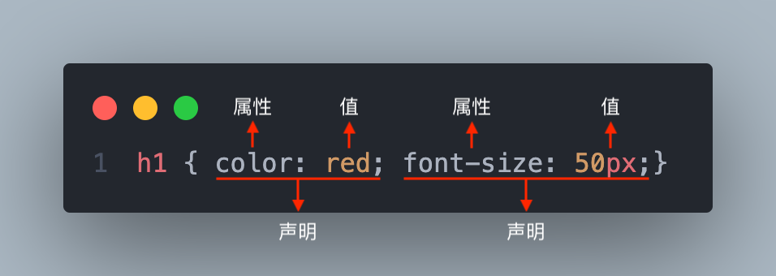
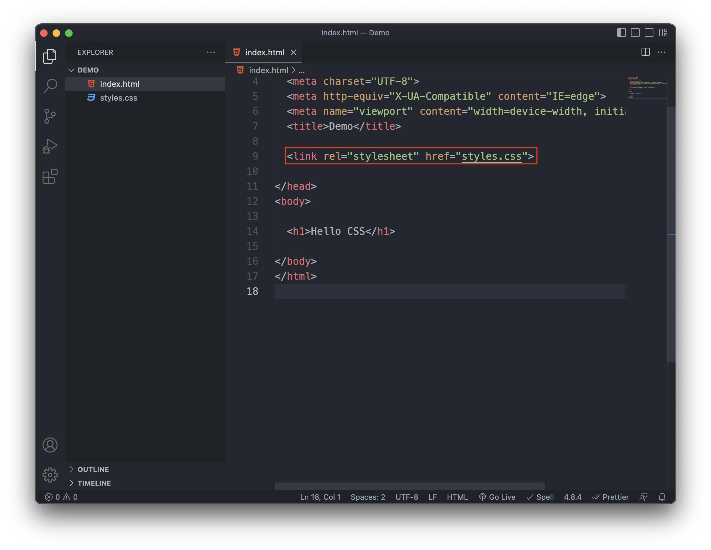
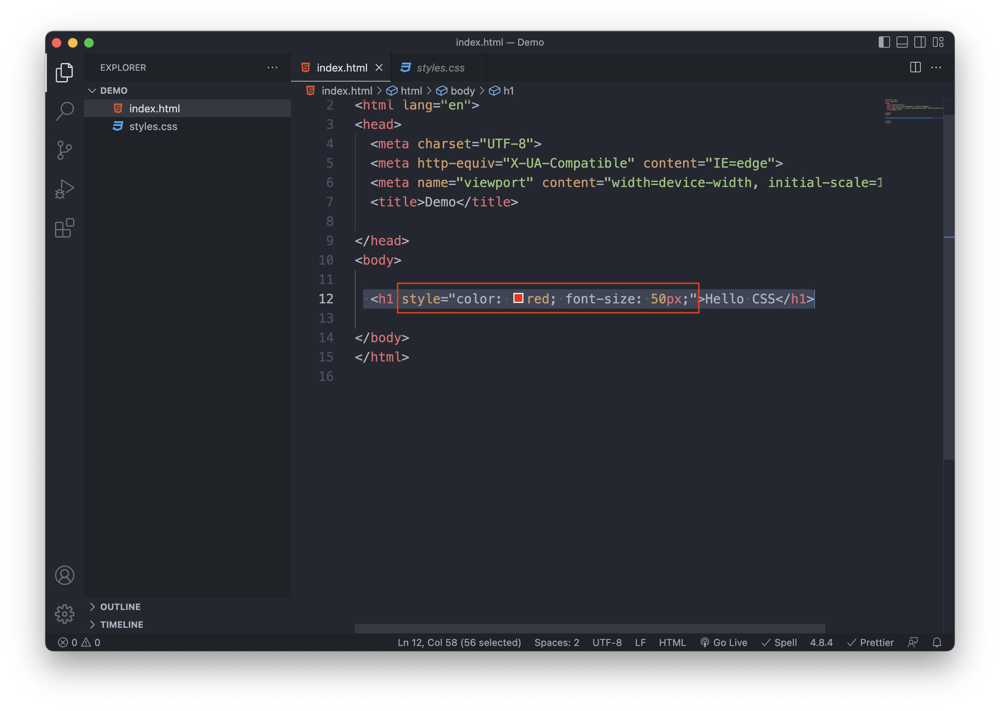
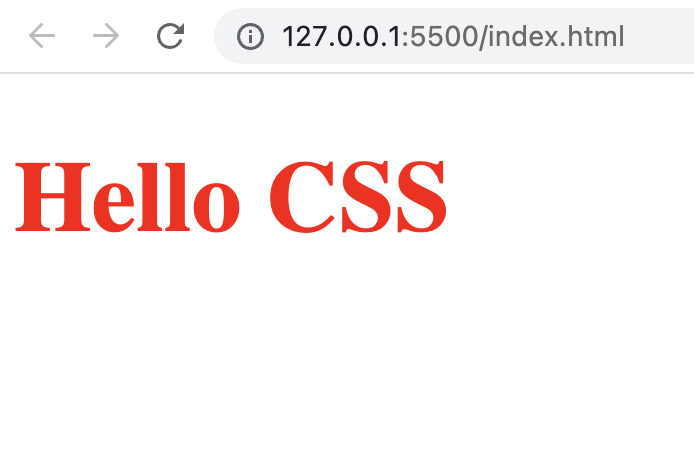
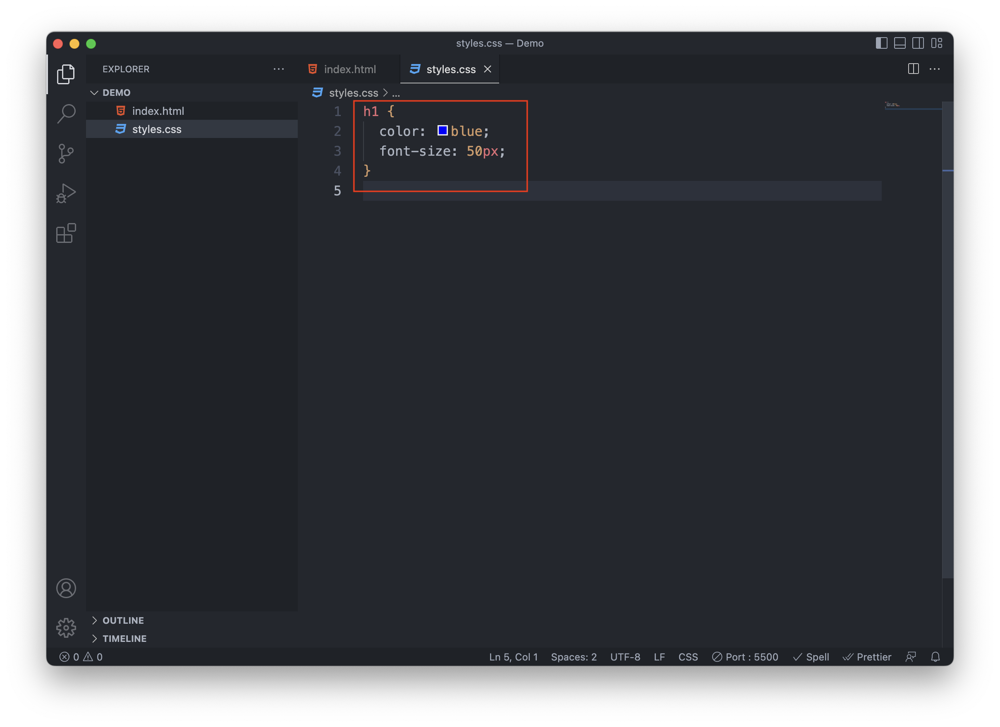
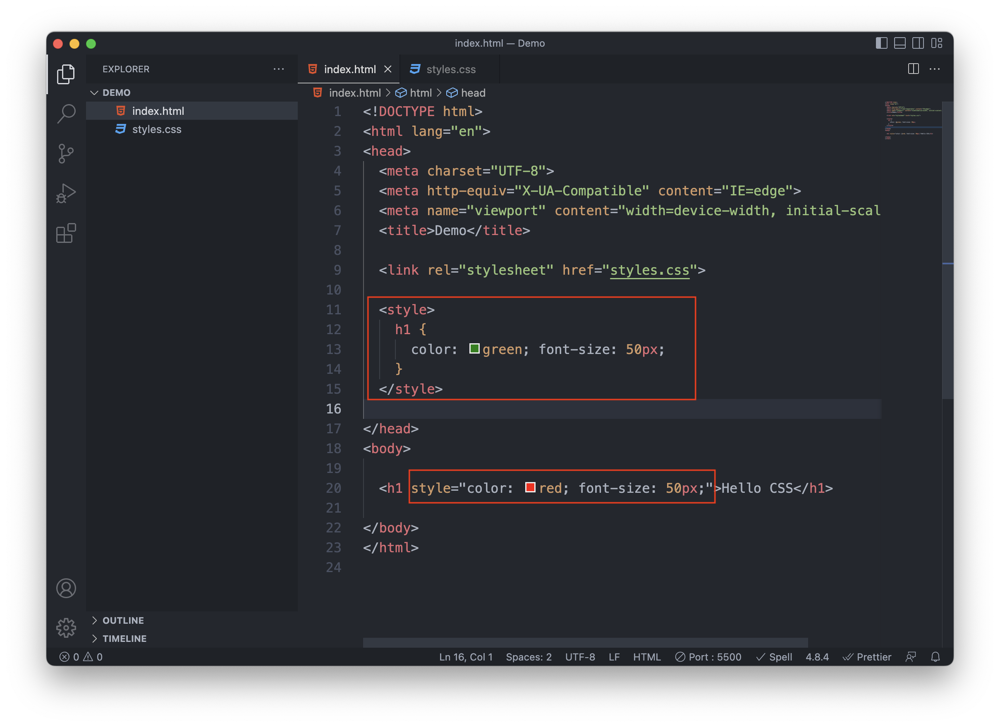
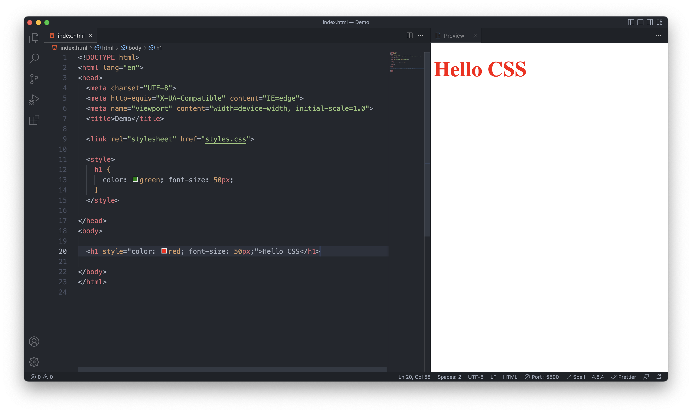
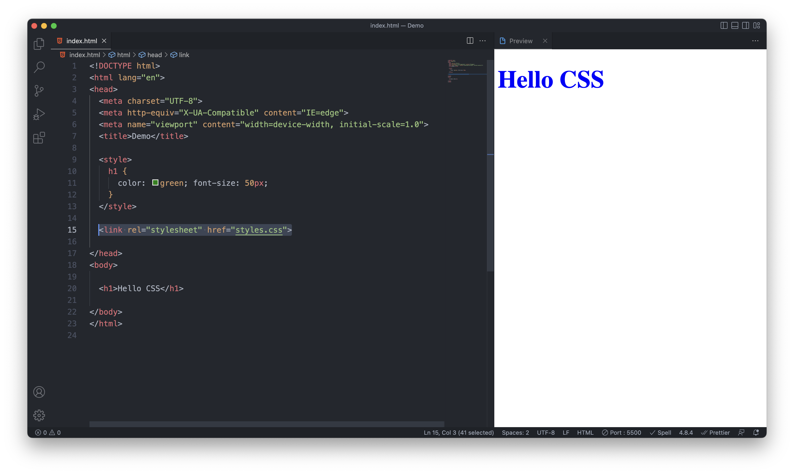

# WTF CSS 极简教程: 2. CSS 语法

WTF CSS 教程，帮助新人快速入门 CSS。

**推特**：[@WTFAcademy_](https://twitter.com/WTFAcademy_) ｜ [@0xAA_Science](https://twitter.com/0xAA_Science)

**WTF Academy 社群：** [官网 wtf.academy](https://wtf.academy) | [WTF Solidity 教程](https://github.com/AmazingAng/WTFSolidity) | [discord](https://discord.gg/5akcruXrsk) | [微信群申请](https://docs.google.com/forms/d/e/1FAIpQLSe4KGT8Sh6sJ7hedQRuIYirOoZK_85miz3dw7vA1-YjodgJ-A/viewform?usp=sf_link)

所有代码和教程开源在 github: [github.com/WTFAcademy/WTF-CSS](https://github.com/WTFAcademy/WTF-CSS)

---

这一讲，我们介绍 CSS 语法，以及在文档中应用 CSS 的三种方式。

## 语法

CSS 规则集由选择器和声明块组成，如下图所示：

 

选择器指向你要设置样式目标元素。

声明块由 `{` 开始，`}` 结束。

声明块包含一条或多条声明, 声明之间使用 `;`分隔。

每条声明都包含一个 CSS 属性名称和一个值，以 `:` 分隔。

上图代码意思是：所有 `<h1>` 元素的文本颜色为红色，文本大小为 50 个像素。

## 引入方式

在 HTML 中我们有三种使用 CSS 的方式：

1. 外部样式
2. 内部样式
3. 内联样式

### 1. 外部样式

外部样式是我们最常使用的 CSS 的方法。你可以把CSS代码写在一个外部的 `.css` 文件中：


为了把 `styles.css` 和 `index.html` 连接起来，你需要在 HTML 文档的 `<head>` 中通过 `<link>` 标签引入这个样式文件。

```html
<link rel="stylesheet" href="styles.css" />
```



`<link>` 标签里面，我们用属性 `rel`，让浏览器知道有 CSS 文档存在，并利用属性 `href` 指定 CSS 文件的位置。

### 2. 内部样式

你也可以把CSS代码直接写在HTML文件的 `<style>` 标签中，这样的样式称为内部样式。


### 3. 内联样式

如果你只想为一个元素单独设置样式，可以在这个元素的标签中使用 `style` 属性，这样的样式称为内联样式。



以上三种引入 CSS 的方式都可以达到相同的效果，使页面中的 `<h1>` 元素的文本颜色为红色，文本大小为 50 个像素。 如下图所示。


我们最常用是外部样式 ，它可以使HTML与CSS分离，更简洁。

## 层叠顺序

当多个样式应用到同一个元素时，就会产生冲突。CSS 的层叠规则决定了这些冲突的解决方式。具体来说，决定样式应用优先级的因素有：

1. 来源：作者样式表（开发者自己写的样式） > 用户样式表（浏览器用户设置的样式） > 浏览器默认样式
2. 选择器优先级：内联样式 > ID选择器 > 类/伪类/属性选择器 > 元素/伪元素选择器
3. 代码顺序：在同等优先级的情况下，后出现的样式会覆盖先出现的样式
4. `!important` 规则：添加了 `!important`的样式具有最高优先级，除非其他样式也添加了 `!important`，此时仍遵循上述三条规则。

我们看一个例子，在这个例子中，我们在外部、内部、内联样式中，分别给 `<h1>` 元素的文本颜色制定为蓝色、绿色、红色。此时产生的效果如下图所示。





可以看到，由于内联样式优先级最高，文本颜色为红色。



如果我们我们把内联样式去掉，文本会变为绿色（内部样式），因为内部样式声明更靠后。


如果我们把外部样式的声明调整到内部样式之后，文本变为蓝色（外部样式）。



## 总结

这一讲，我们知道了如何编写 CSS 样式，以及不同的引入方式，其中行内样式具有最高的优先级，并且将覆盖外部和内部样式以及浏览器默认样式。
