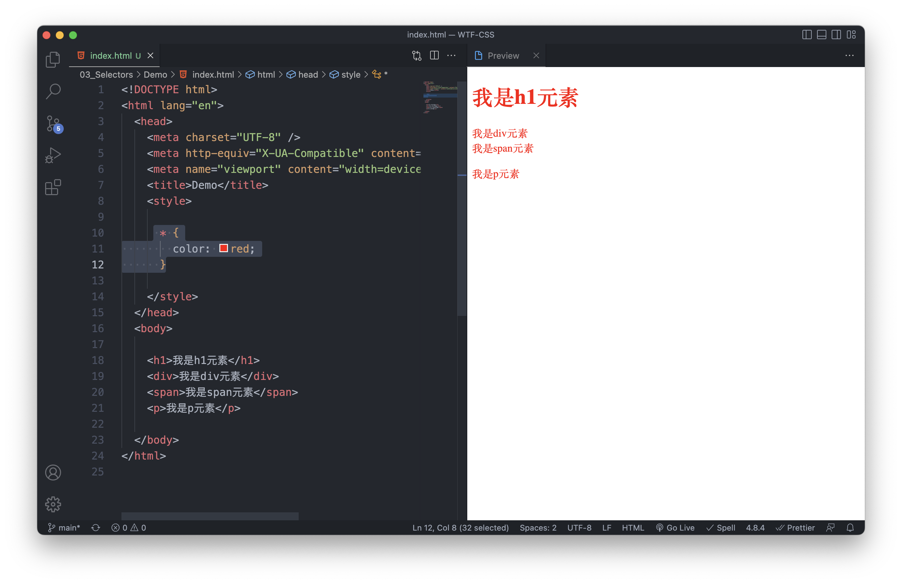
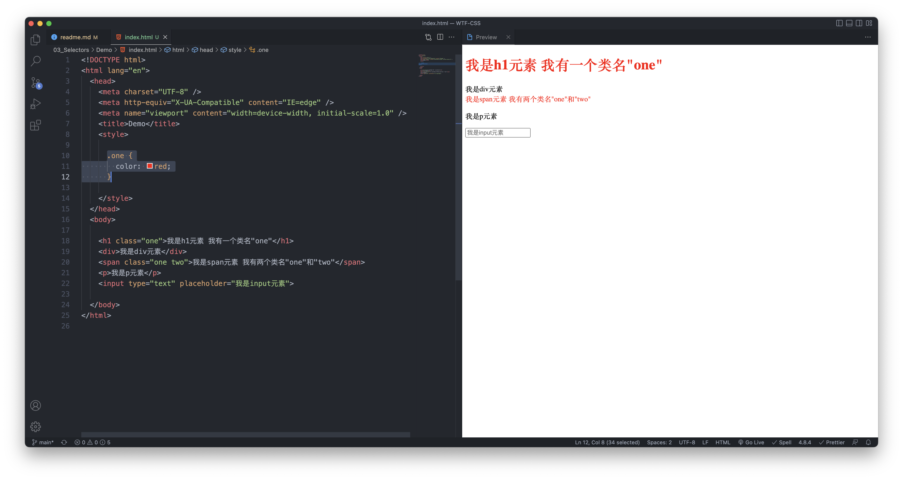
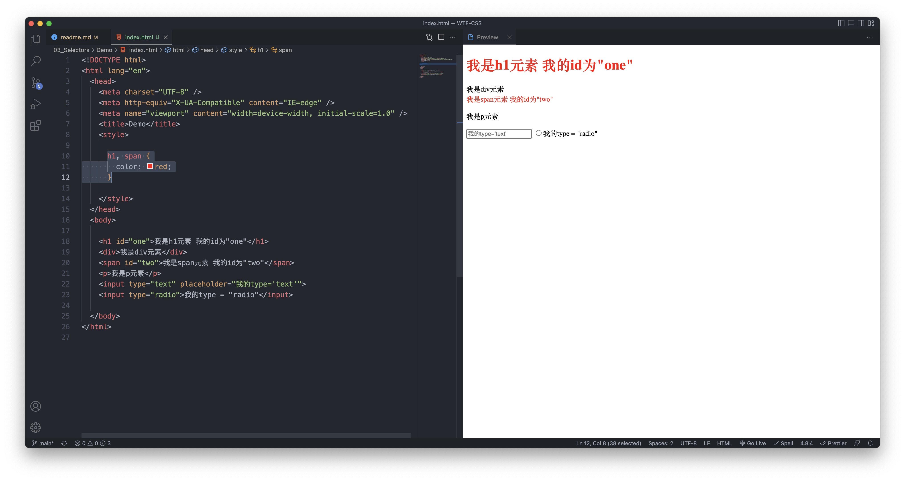
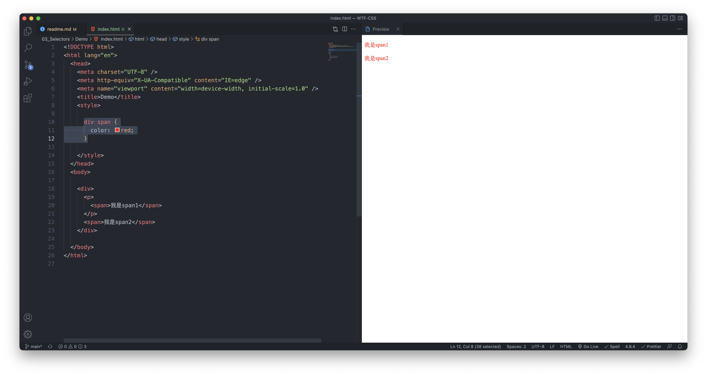
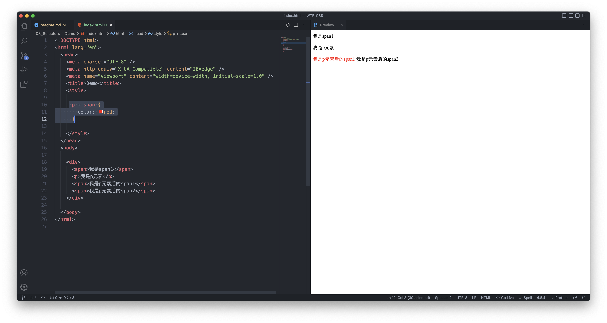

# WTF CSS 极简教程: 3. 选择器

WTF CSS 教程，帮助新人快速入门 CSS。

**推特**：[@WTFAcademy_](https://twitter.com/WTFAcademy_) ｜ [@0xAA_Science](https://twitter.com/0xAA_Science)

**WTF Academy 社群：** [官网 wtf.academy](https://wtf.academy) | [WTF Solidity 教程](https://github.com/AmazingAng/WTFSolidity) | [discord](https://discord.gg/5akcruXrsk) | [微信群申请](https://docs.google.com/forms/d/e/1FAIpQLSe4KGT8Sh6sJ7hedQRuIYirOoZK_85miz3dw7vA1-YjodgJ-A/viewform?usp=sf_link)

所有代码和教程开源在 github: [github.com/WTFAcademy/WTF-CSS](https://github.com/WTFAcademy/WTF-CSS)

---

选择器是CSS规则的关键部分，用于指定哪些元素应用某个CSS规则。

## 选择器的种类

我们可以将 CSS 选择器分为以下四类：

1. 基本选择器

2. 分组选择器

3. 组合选择器

4. 伪选择器

## 1. 基本选择器

### 1.1 通用选择器

选择页面上所有元素。

语法：`*`

示例：

```css
* {

}
```



### 1.2 元素选择器

按照给定的元素名称，选择所有匹配的元素。

语法：`elementname`

示例：

```css
/* 匹配所有 <h1> 元素 */
h1 {

}

/* 匹配所有 <input> 元素 */
input {

}
```


### 1.3 类选择器

```html
// 我有一个类名
<h1 class="one">Hello CSS</h1>

// 我有两个类名，分别为："one" 与 "two"
<div class="one two ">Hello CSS</div>
```

我们可以给元素设置 `class` 属性，class 的值是一个以空格分隔的元素的类名（classes）列表，一个元素可以有多个类名。

类选择器就是按照给定的 class 属性的值，选择所有匹配的元素。类选择器以 `.` 开头，后面跟类名。

语法：`.classname`

示例：

```css
/* 匹配所有 class 属性中含有 "one" 类的元素 */
.one {
  
}
```



### 1.4 ID选择器

```html
// 我的 ID 为 "one"
<h1 id="one">Hello CSS</h1>

// 我的 ID 为 "two"
<span id="two">Hello CSS</span>
```

按照 id 属性选择一个与之匹配的元素。需要注意的是，一个文档中，每个 ID 属性都应当是唯一的。id 选择器以 `#` 开头，后面跟 id 值。

语法：`#idname`

示例：

```css
/* 匹配 id 为 "one" 的元素 */
#one {

}

/* 匹配 id 为 "two" 的元素 */
#two {
  
}
```


#### 1.5 属性选择器

按照给定的属性，选择所有匹配的元素。属性选择器，使用 `[ ]` 选取带有指定属性的元素。

语法：`[attr]`

示例：

```css
/* 匹配 所有具有 type="text" 属性的元素 */
[type="text"] {

}
```


## 2. 分组选择器

### 2.1 选择器列表

选择器列表是将不同的选择器组合在一起的方法，常被称为并集选择器或并集组合器。选择器列表使用 `,` 分隔的列表来对选择器进行分组。

语法：`A, B`

示例：

```css
/* 同时匹配 <div> 元素和 <span> 元素。 */
div, span {

}
```



## 3. 组合器

### 3.1 后代组合器

选择前一个元素的后代节点。

语法：`A B`

示例：

```css
/* 匹配所有位于任意 <div> 元素之内的 <span> 元素。 */
div span {

}
```



### 3.2 直接子代组合器

选择前一个元素的直接子代的节点。

语法：`A > B`

示例：

```css
/* 匹配直接嵌套在 <ul> 元素内的所有 <li> 元素。 */
ul > li {

}
```


### 3.3 一般兄弟组合器

选择兄弟元素，也就是说，后一个节点在前一个节点后面的任意位置，并且共享同一个父节点。

语法：`A ~ B`

示例：

```css
/* 匹配同一父元素下，<p> 元素后的所有 <span> 元素。 */
p ~ span {

}
```


### 3.4 紧邻兄弟组合器

选择相邻元素，即后一个元素紧跟在前一个之后，并且共享同一个父节点。

语法：`A + B`

示例：

```css
/* 匹配所有紧邻在 <p> 元素后的 <span> 元素。 */
p + span {

}
```



## 4. 伪选择器

### 4.1 伪类

CSS 伪类 是添加到选择器的关键字，指定要选择的元素的特殊状态。

示例：

```css
/* 匹配选择具有焦点的 <input> 元素。 */
input:focus {

}
```


更多[伪类详解](https://developer.mozilla.org/zh-CN/docs/Web/CSS/Pseudo-classes)

### 4.2 伪元素

伪元素是一个附加至选择器末的关键词，允许你对被选择元素的特定部分修改样式。

示例：

```css
/* 匹配所有 <p> 元素的第一行。 */
p::first-line {

}
```


更多伪元素详解请阅读[MDN 教程](https://developer.mozilla.org/zh-CN/docs/Web/CSS/Pseudo-elements)

## 总结

这一讲，我们学习了非常重要的 CSS 选择器，掌握各种选择器并能灵活运用是CSS编程的关键！