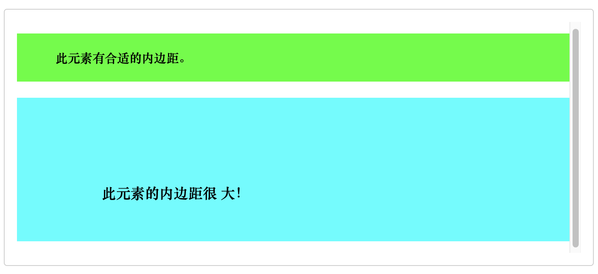
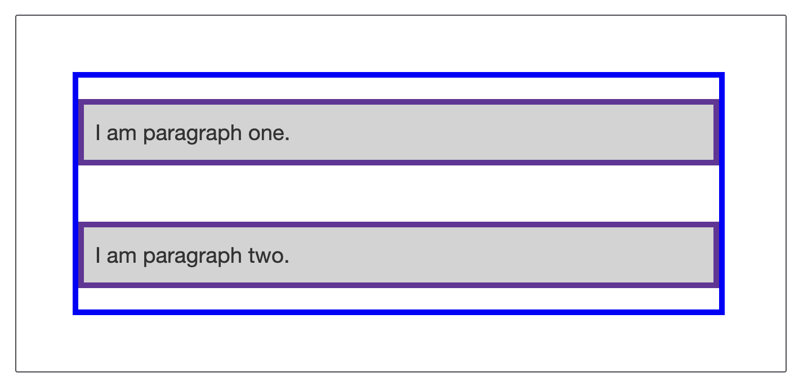
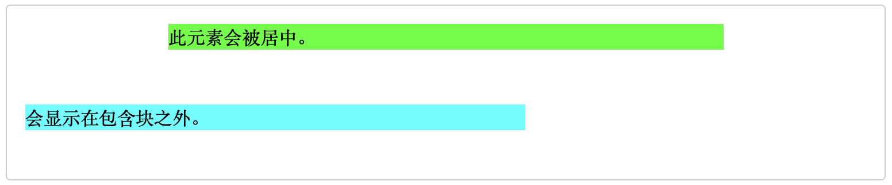
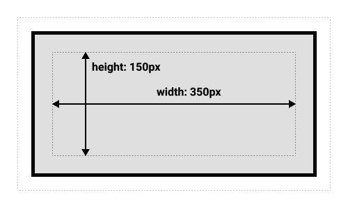

# WTF CSS 极简教程: 4. 盒模型

WTF CSS 教程，帮助新人快速入门 CSS。

**推特**：[@WTFAcademy_](https://twitter.com/WTFAcademy_) ｜ [@0xAA_Science](https://twitter.com/0xAA_Science)

**WTF Academy 社群：** [官网 wtf.academy](https://wtf.academy) | [WTF Solidity 教程](https://github.com/AmazingAng/WTFSolidity) | [discord](https://discord.gg/5akcruXrsk) | [微信群申请](https://docs.google.com/forms/d/e/1FAIpQLSe4KGT8Sh6sJ7hedQRuIYirOoZK_85miz3dw7vA1-YjodgJ-A/viewform?usp=sf_link)

所有代码和教程开源在 github: [github.com/WTFAcademy/WTF-CSS](https://github.com/WTFAcademy/WTF-CSS)

---

这一讲，我们来介绍 CSS 盒模型。在 CSS 中，所有的元素都被一个个的“盒子（box）”包围着，理解这些“盒子”的基本原理，是我们使用 CSS 实现准确布局、处理元素排列的关键。

## CSS盒模型

CSS盒模型是CSS布局的基础，它描述了元素所占空间的方式。一个盒模型包含四个主要部分，从内到外分别是：内容（Content）、内边距（Padding）、边框（Border）和外边距（Margin）。


### 内容 (Content)

内容区域就是页面上看到的实际内容，包括文本、图片等。我们可以通过 `width` 和 `height` 属性来设置内容区域的宽和高。

```css
div {
    width: 200px;
    height: 100px;
}
```

### 内边距（Padding）

内边距是内容区域到边框之间的空间。内边距是透明的，也就是说它不会被背景色或背景图片覆盖。我们可以使用 `padding` 属性来设置内边距。它的值必须大于等于0。

```css
div {
    padding: 10px; /* 上下左右的内边距都为10px */
}
```

你还可以分别设置上下左右的内边距：

```css
div {
    padding-top: 10px;
    padding-right: 20px;
    padding-bottom: 10px;
    padding-left: 20px;
}
```

#### 语法

```css
/* 应用于所有边 */
padding: 1em;

/* 上边下边 | 左边右边 */
padding: 5% 10%;

/* 上边 | 左边右边 | 下边 */
padding: 1em 2em 2em;

/* 上边 | 右边 | 下边 | 左边 */
padding: 5px 1em 0 2em;

/* 全局值 */
padding: inherit;
padding: initial;
padding: unset;
```

padding 属性接受 1~4 个值。每个值可以是 `<length>` 或 `<percentage>`。取值不能为负。

- 当只指定一个值时，该值会统一应用到全部四个边的内边距上。
- 指定两个值时，第一个值会应用于上边和下边的内边距，第二个值应用于左边和右边。
- 指定三个值时，第一个值应用于上边，第二个值应用于右边和左边，第三个则应用于下边的内边距。
- 指定四个值时，依次（顺时针方向）作为上边，右边，下边，和左边的内边距。

#### 可取值

- `length` 以固定值为内边距。
- `percentage` 相对于包含块的宽度，以百分比值为内边距。

#### 示例

HTML

```html
<h4>此元素有合适的内边距。</h4>

<h3>此元素的内边距很 大！</h3>
```

CSS

```css
h4 {
  background-color: lime;
  padding: 20px 50px;
}

h3 {
  background-color: cyan;
  padding: 110px 50px 50px 110px;
}
```




### 边框 (Border)

边框包裹着内边距和内容区域。边框是可见的，我们可以设置其宽度、样式和颜色。使用 `border` 属性可以设置边框。

```css
div {
    border-width: 1px; /* 边框宽度 */
    border-style: solid; /* 边框样式 */
    border-color: #000; /* 边框颜色 */
}
```

也可以将这三个属性合并为一个 `border` 属性：

```css
div {
    border: 1px solid #000;
}
```

### 外边距（margin）

外边距是边框到其他元素的距离。外边距是透明的。我们可以使用 `margin` 属性来设置外边距。

```css
div {
    margin: 10px; /* 上下左右的外边距都为10px */
}
```

你还可以分别设置上下左右的外边距：

```css
div {
    margin-top: 10px;
    margin-right: 20px;
    margin-bottom: 10px;
    margin-left: 20px;
}
```

#### 语法：

```css
/* 应用于所有边 */
margin: 1em;
margin: -3px;

/* 上边下边 | 左边右边 */
margin: 5% auto;

/* 上边 | 左边右边 | 下边 */
margin: 1em auto 2em;

/* 上边 | 右边 | 下边 | 左边 */
margin: 2px 1em 0 auto;

/* 全局值 */
margin: inherit;
margin: initial;
margin: unset;
```

margin 属性接受 1~4 个值 。每个值可以是 `<length>`，`<percentage>`，或 `auto`。取值为负时元素会比原来更接近临近元素。

- 当只指定一个值时，该值会统一应用到全部四个边的外边距上。
- 指定两个值时，第一个值会应用于上边和下边的外边距，第二个值应用于左边和右边。
- 指定三个值时，第一个值应用于上边，第二个值应用于右边和左边，第三个则应用于下边的外边距。
- 指定四个值时，依次（顺时针方向）作为上边，右边，下边，和左边的外边距。

可取值：

- `length` 以固定值为外边距。
- `percentage` 相对于包含块的宽度，以百分比值为外边距。
- `auto` 让浏览器自己选择一个合适的外边距。有时，在一些特殊情况下，该值可以使元素居中。

#### 示例

HTML

```html
<div class="center">此元素会被居中。</div>

<div class="outside">此元素会显示在包含块之外。</div>
```

CSS

```css
.center {
  margin: auto;
  background: lime;
  width: 66%;
}

.outside {
  margin: 3rem 0 0 -3rem;
  background: cyan;
  width: 66%;
}
```



#### 外边距折叠问题

理解外边距的一个关键是外边距折叠的概念。如果你有两个外边距相接的元素，这些外边距将合并为一个外边距，即最大的单个外边距的大小。

在下面的例子中，我们有两个段落。顶部段落的页 margin-bottom 为 50px。第二段的 margin-top 为 30px。因为外边距折叠的概念，所以框之间的实际外边距是 50px，而不是两个外边距的总和。如下图：



有许多规则规定了什么时候外边距会折叠，什么时候不会折叠。相关更多信息，请参阅[外边距重叠](https://developer.mozilla.org/zh-CN/docs/Web/CSS/CSS_Box_Model/Mastering_margin_collapsing)。现在首先要记住的事情是，外边距会折叠这个事情。如果你用外边距创建空间而没有得到你想要的效果，那这可能就是这个原因。

更多[`margin`用法](https://developer.mozilla.org/zh-CN/docs/Web/CSS/margin)。

## 标准盒模型和替代盒模型

CSS盒模型是网页设计中的基础概念，用于定义和控制元素的大小和空间。然而，早期的Internet Explorer浏览器和现代的标准浏览器对于盒模型有不同的理解，这就导致了标准盒模型和IE盒模型的出现。

### 标准盒模型
在标准的CSS盒模型中，元素的`width`和`height`属性只包括内容(content)的宽度和高度，不包括边框(border)和内边距(padding)。

举个例子，如果你设置一个元素的`width`为350px，`padding`为25px，`border`为5px，那么这个元素在页面上占据的实际空间宽度为410px（350px的内容宽度 + 2 * 25px的左右内边距 + 2 * 5px的左右边框）。

```css
div {
  width: 350px;
  height: 150px;
  margin: 25px;
  padding: 25px;
  border: 5px solid black;
}
```




### 替代（IE）盒模型

而在替代盒模型（也被称为IE盒模型或怪异盒模型）中，元素的`width`和`height`属性包括内容(content)、边框(border)和内边距(padding)。

继续上面的例子，如果你在IE盒模型中设置一个元素的`width`为350px，`padding`为25px，`border`为5px，那么这个元素在页面上占据的实际空间宽度仍然是350px。这个宽度已经包括了内容、边框和内边距。


### 改变盒模型

为了解决这种差异，并允许开发者自由选择使用哪种盒模型，CSS引入了`box-sizing`属性（默认浏览器会使用标准模型）。

```css
/* 使用标准盒模型 */
box-sizing: content-box;

/* 使用IE盒模型 */
box-sizing: border-box;
```

## 总结

这就是你需要了解的关于盒模型的大部分内容。如果以后你发现对于盒模型的布局仍有困惑，你将会回来温故这些内容。
