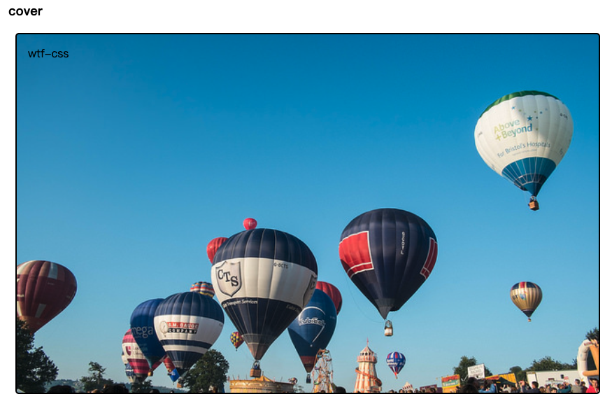

# WTF CSS极简教程: 5. 背景和边框

WTF CSS教程，帮助新人快速入门CSS。

**推特**：[@WTFAcademy_](https://twitter.com/WTFAcademy_)  ｜ [@0xAA_Science](https://twitter.com/0xAA_Science)

**WTF Academy社群：** [官网 wtf.academy](https://wtf.academy) | [WTF Solidity教程](https://github.com/AmazingAng/WTFSolidity) | [discord](https://discord.gg/5akcruXrsk) | [微信群申请](https://docs.google.com/forms/d/e/1FAIpQLSe4KGT8Sh6sJ7hedQRuIYirOoZK_85miz3dw7vA1-YjodgJ-A/viewform?usp=sf_link)

所有代码和教程开源在github: [github.com/WTFAcademy/WTF-CSS](https://github.com/WTFAcademy/WTF-CSS)

---

这一讲，我们介绍 CSS 的两种常用属性：背景（[background](https://developer.mozilla.org/zh-CN/docs/Web/CSS/background)）和边框([border](https://developer.mozilla.org/zh-CN/docs/Web/CSS/border))，通过掌握这两个属性，构建出生动丰富的界面效果。

## 背景

### 背景颜色

[background-color](https://developer.mozilla.org/zh-CN/docs/Web/CSS/background-color) 属性用于定义元素的背景颜色，接受有效的色彩值。
背景色扩展到元素的内容（content）和内边距（padding）。
颜色值通常的定义方式如下：

1. 十六进制，例如："#fff"
2. RGB，如"rgb(255, 0, 0)"
3. 颜色名称,如"black"

代码实例：

```css
div {
  background-color: #fff;
  background-color: rgb(255, 0, 0);
  background-color: green;
}
```


### 背景图像

[background-image](https://developer.mozilla.org/zh-CN/docs/Web/CSS/background-color) 属性用于定义元素的背景图像，默认情况下图像是平铺重复显示，覆盖元素背景。

代码实例：(完整代码请查看html文件)

```css
.bgi {
  background-image: url(./img/wtflogo.png);
}
```

### 背景平铺

[background-repeat](https://developer.mozilla.org/zh-CN/docs/Web/CSS/background-repeat) 属性用于控制图像的平铺行为。常用的属性值包含以下几个：

+ repeat：图像在水平方向与垂直方向重复(默认)
+ repeat-x：图像在水平方向重复
+ repeat-y：图像在垂直方向重复
+ no-repeat：图像仅平铺一次

代码实例：(完整代码请查看html文件)

```css
.bgr1 {
  background-repeat: no-repeat;
}

.bgr2 {
  background-repeat: repeat-x;
}

.bgr3 {
  background-repeat: repeat-y;
}

.bgr4 {
  background-repeat: repeat;
}
```


### 背景大小

[background-size](https://developer.mozilla.org/zh-CN/docs/Web/CSS/background-size) ，它可以设置长度或百分比值，使背景的大小以适应被填充背景的元素尺寸，常用的属性值包含以下几个：

+ 指定长度或百分比值：按指定大小渲染
+ auto：以图像的比例缩放作为背景，图像可能会重复展示
+ cover：图像扩展至足够大，使其完全覆盖整个区域，同时保持其高宽比，图像可能会被裁剪
+ contain：图像尽可能地缩放并保持宽高比例以适应整个背景区域。缩放会导致背景可能出现部分空白，空白区域会显示由background-color 设置的背景颜色。

代码实例：(完整代码请查看html文件)

```html
<head>
  <style>
    .bgs > div {
      width: 50em;
      height: 30em;
      border: 2px solid #000;
      background-image: url(./img/balloons.jpeg);
    }

    .bgs1 {
      background-size: auto;
    }

    .bgs2 {
      background-size: cover;
    }

    .bgs3 {
      background-size: contain;
    }
  </style>
</head>
<body>
  <div class="wrapper">
    <div class="bgs">
      <div class="bgs1">wtf-css</div>
      <div class="bgs2">wtf-css</div>
      <div class="bgs3">wtf-css</div>
    </div>
  </div>
</body>
```

0. 原始背景图片的完整展示

   
1. auto：以图像的比例缩放作为背景，图像会重复平铺展示

   
2. cover：图像拓展至覆盖整个区域，保持比例。图像可能无法完整展示，出现部分溢出的情况。

   
3. contain：图像尽可能地缩放并保持宽高比例，使高度或宽度完全适应整个背景区域。缩放会导致背景可能出现部分空白区域，此时容器的空白区域会显示由background-color 设置的背景颜色。
   

### 背景定位

[background-position](https://developer.mozilla.org/zh-CN/docs/Web/CSS/background-position) 用于设置背景图像的起始位置。框的左上角是 (0,0)，框沿着水平 (x) 和垂直 (y) 轴定位。常见的设置方法如下：

1. 可用任何长度单位，第二个位置(即Y轴方向)如果不声明，默认是50%(两个位置都不设置的话默认0% 0%)
2. 位置关键字（left/right/top/bottom/center），可单双使用（第二个关键字如果不声明默认是center）
3. 混合使用

代码实例：(完整代码请查看html文件)

```css
  background-position: top center;
  background-position: 20px 10%;
  background-position: top 20px;
```


### 背景附加

[background-attachment](https://developer.mozilla.org/zh-CN/docs/Web/CSS/background-attachment)属性用于设置背景图像是否固定或者随着页面的其余部分滚动。
常见的属性值如下：

+ scroll：背景图片随网页滚动而移动(默认)
+ fixed：背景图片不会随网页滚动而移动
+ local：	背景图片会随着元素内容的滚动而滚动。

代码实例：(完整代码请查看html文件)

```css
.bga1 {
  background-attachment: scroll;
}

.bga2 {
  background-attachment: fixed;
}

.bga3 {
  background-attachment: local;
}
```

具体效果建议运行html文件，可以直观对比差异

### 背景简写

background属性可以实现简写，比单个子属性声明要简洁得多，可少写很多代码。而background子属性众多，到底如何安排子属性连写顺序也是一个难题。css2 推荐一条子属性连写顺序规则：

```css
background: color image repeat attachment position/size
```

## 边框

[border](https://developer.mozilla.org/zh-CN/docs/Web/CSS/border) 可以为元素的所有四个边设置边框。也可以将border拆分为border-top, border-bottom, border-left, border-right，单独设置一条边。

border由width、style、color三个属性组成，其中width表示边框宽度，style表示边框样式（可以是实线、圆点、虚线等样式），color表示边框颜色。

具体语法如下：

```css
.solid {
  border: 3px solid red;
  // 等价于
  border-width: 3px;
  border-style: solid;
  border-color: red;
}

.dotted {
  border: 3px dotted green;
}

.dashed {
  border: 3px dashed blue;
}
```


### 圆角

[border-radius](https://developer.mozilla.org/zh-CN/docs/Web/CSS/border-radius) 属性用于设置方框的圆角。可以使用两个长度或百分比作为值，第一个值定义水平半径，第二个值定义垂直半径。通常情况下

```css
.radius {
  border: 3px solid blue;
  border-radius: 20px;
}

.top-right-radius {
  border: 3px solid blue;
  border-top-right-radius: 10px;
}

.circle {
  border: 3px solid blue;
  border-radius: 50%;
}
```


## 总结

这一讲我们介绍了背景和边框的常见属性和用法，理解并熟练运用这些属性，可以帮助你创建出更丰富、更有趣的网页设计。
