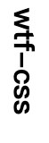
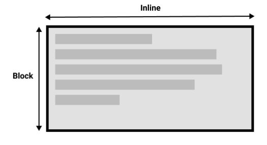
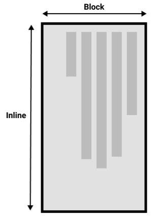
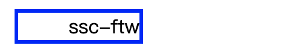

# WTF CSS极简教程: 6. 文本方向和内容溢出

WTF CSS教程，帮助新人快速入门CSS。

**推特**：[@WTFAcademy_](https://twitter.com/WTFAcademy_)  ｜ [@0xAA_Science](https://twitter.com/0xAA_Science) 

**WTF Academy社群：** [官网 wtf.academy](https://wtf.academy) | [WTF Solidity教程](https://github.com/AmazingAng/WTFSolidity) | [discord](https://discord.gg/5akcruXrsk) | [微信群申请](https://docs.google.com/forms/d/e/1FAIpQLSe4KGT8Sh6sJ7hedQRuIYirOoZK_85miz3dw7vA1-YjodgJ-A/viewform?usp=sf_link)

所有代码和教程开源在github: [github.com/WTFAcademy/WTF-CSS](https://github.com/WTFAcademy/WTF-CSS)

---

这一讲，我们介绍 CSS 的[文本方向](https://developer.mozilla.org/zh-CN/docs/Learn/CSS/Building_blocks/Handling_different_text_directions)与[内容溢出](https://developer.mozilla.org/zh-CN/docs/Learn/CSS/Building_blocks/Overflowing_content)两个模块。通过学习这两个模块，加深对页面布局的理解。

## 处理不同方向的文本
### 书写模式
CSS 中的书写模式是指文本的排列方向是横向还是纵向的，使用[writing-mode](https://developer.mozilla.org/zh-CN/docs/Web/CSS/writing-mode)设置

writing-mode的三个值分别是：
+ horizontal-tb: 块流向从上至下。对应的文本方向是横向的。
+ vertical-rl: 块流向从右向左。对应的文本方向是纵向的。
+ vertical-lr: 块流向从左向右。对应的文本方向是纵向的。

代码实例：
``` html
<style>
.writing-mode {
  writing-mode: vertical-rl;
}
</style>

<h1 class="writing-mode">wtf-css</h1>
```

效果展示：



块级显示和内联显示与文本的书写模式密切相关，切换书写模式时，我们也在改变块和内联文本的方向。

例如，horizontal-tb书写模式下块的方向是从上到下的横向的。而 vertical-rl书写模式下块的方向是从右到左的纵向的。

在水平书写模式下的两种维度



纵向书写模式下的两种维度



### 文本方向
除了书写模式，我们还可以设置文本方向。有些语言（如阿拉伯语）是横向书写的，但是是从右向左。可以使用 [direction](https://developer.mozilla.org/zh-CN/docs/Web/CSS/direction) 属性设置文本方向。

direction的常用属性值如下：
+ ltr：默认，left to right，从左到右
+ rtl：right to left，从右到左

``` html
<head>
  <title>Layout</title>
  <style>
    .direction {
      margin: 10px;
      width: 100px;
      border: 3px solid blue;
      direction:rtl;
      unicode-bidi: bidi-override; 
    }
  </style>
</head>
<body>
  <div class="direction">
    wtf-css
  </div>
</body>
```

unicode-bidi属性是用来设置或返回文本是否被重写，以便在同一文档中支持多种语言，一般都会与direction属性一起使用，决定文本方向。bidi-override属性值表示创建一个附加的嵌入层面，严格按照direction属性的值重排序。

效果如下：



## 溢出内容
我们通过设置width和height的方式来约束盒子的尺寸，但是在开发中，常常遇到内容过多导致盒子无法容纳，导致内容溢出的现象，此时可以通过设置溢出属性规定展示效果。

常见的内容溢出示例：

``` html
<div class="box">This box has a height and a width. This means that if there is too much content to be displayed within the assigned height, there will be an overflow situation. If overflow is set to hidden then any overflow will not be visible.</div>

<p>This content is outside of the box.</p>
```

``` css
.box {
  border: 1px solid #333333;
  width: 200px;
  height: 100px;
  overflow: hidden;
}
```
效果如下：


### overflow
[overflow](https://developer.mozilla.org/zh-CN/docs/Web/CSS/overflow)属性是控制元素溢出的方式，overflow的默认值为visible，所以内容溢出的时候，我们在默认情况下可以看到它们。
+ visible：默认值。内容不会被修剪，会呈现在元素框之外
+ hidden：内容修剪，其余内容是不可见的
+ scroll：内容修剪，浏览器会显示滚动条
+ auto：如果内容被修剪，则浏览器会显示滚动条

注意: overflow 属性只工作于指定高度的块元素上

实例如下：
``` css
.overflow > div {
  height: 10em;
  width: 15em;
  border: 2px solid blue;
}

.hidden {
  overflow: hidden;
}

.scroll {
  overflow: scroll;
}

.auto {
  overflow: auto;
}
```

``` html
<h2>hidden</h2>
<div class="hidden">
  <p>wtf-css</p>
  ...
</div>
<br>

<h2>scroll</h2>
<div class="scroll">
  <p>wtf-css</p>
  ...
</div>
<br>

<h2>auto</h2>
<div class="auto">
  <p>wtf-css</p>
  ...
</div>
```


### 溢出建立块级上下文
CSS 中有一个概念叫做块级上下文（Block Formatting Context，BFC）。在使用scroll或者auto的时候，你就建立了一个块级排版上下文，此时在容器之外的东西没法混进容器内，也没有东西可以突出盒子，进入周围的版面。激活了滚动动作，你的盒子里面所有的内容会被收纳，而且不会遮到页面上其他的物件。


## 总结
这一讲我们介绍了处理文本方向和内容溢出的常用属性和用法，要深入了解可以阅读文中相关链接文档。
