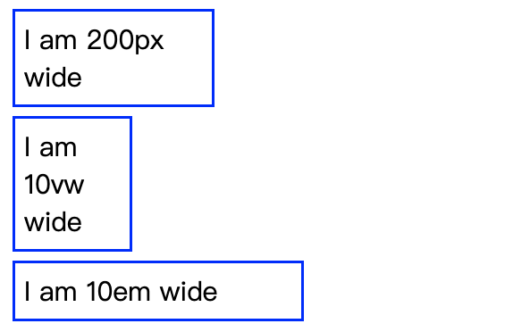
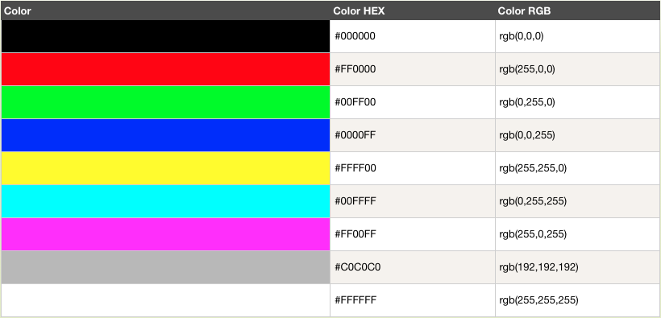
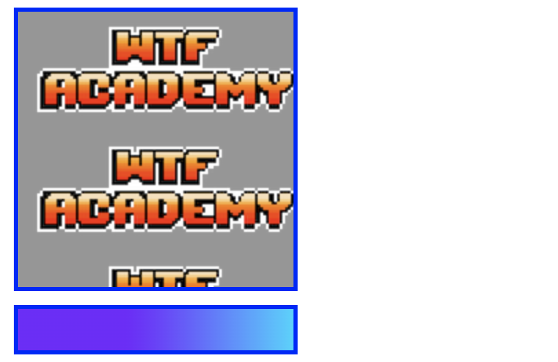
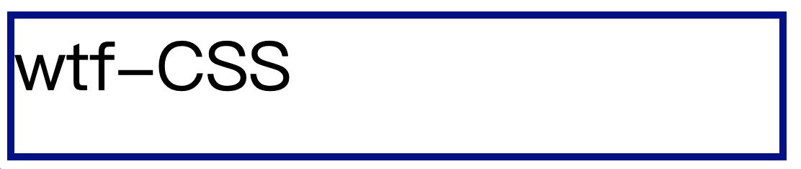

# WTF CSS极简教程: 7. 值、单位和大小

WTF CSS教程，帮助新人快速入门CSS。

**推特**：[@WTFAcademy_](https://twitter.com/WTFAcademy_)  ｜ [@0xAA_Science](https://twitter.com/0xAA_Science) 

**WTF Academy社群：** [官网 wtf.academy](https://wtf.academy) | [WTF Solidity教程](https://github.com/AmazingAng/WTFSolidity) | [discord](https://discord.gg/5akcruXrsk) | [微信群申请](https://docs.google.com/forms/d/e/1FAIpQLSe4KGT8Sh6sJ7hedQRuIYirOoZK_85miz3dw7vA1-YjodgJ-A/viewform?usp=sf_link)

所有代码和教程开源在github: [github.com/WTFAcademy/WTF-CSS](https://github.com/WTFAcademy/WTF-CSS)

---

这一讲，我们介绍 CSS 常用的[值和单位](https://developer.mozilla.org/zh-CN/docs/Learn/CSS/Building_blocks/Values_and_units)，以及掌握[调整大小](https://developer.mozilla.org/zh-CN/docs/Learn/CSS/Building_blocks/Sizing_items_in_CSS)相关的知识内容，帮助我们掌握更多在样式开发时实用的经验技巧。

## 数字、长度和百分比
### 数值类型
CSS中有多种数值类型
+ integer：整数
+ number：小数
+ dimension：由number与一个附加单位组成，例如10px, 5em，4s
+ percentage：表示一些其他值的一部分，例如50%；百分比值是相对于另一个量，例如元素的长度相对于父元素的长度

### 长度单位
在样式开发中最常用的是px与%两个长度单位，但随着终端设备分辨率的多样性提高，CSS衍生出越来越多长度单位，灵活结合这些长度单位能为网页的布局方案提供更多可能性。

其中，绝对单位包括：
1. px：像素
2. pt：点，1 pt = 1 / 72 in
3. pc：派，1 pc = 12 pt
4. mm：毫米
5. cm：厘米
6. in:英寸，1 in = 96px = 2.54cm

相对单位包括
1. %：百分比，相对父节点尺寸
2. em：M的宽度，相对当前节点字体
3. rem：M的宽度，相对根结点字体
4. ch：0的宽度，相对当前节点字体
5. ex：x的宽度，相对当前节点字体
6. vw：1%视窗宽度，相对视窗
7. vh：1%视窗高度，相对视窗
8. vmin：vw/vh最小者，相对视窗
9. vmax：vw/vh最大者，相对视窗

### 屏幕分辨率
屏幕分辨率指横纵向中的像素点数，单位是px。

在屏幕尺寸一样的情况下，屏幕分辨率越低，像素越少，单个像素尺寸也较大，屏幕分辨率越高，像素越多，单个像素尺寸也较小。

屏幕分辨率就是屏幕中显示的像素个数，分辨率1920×1080意味着水平方向含有1920个像素数，垂直方向含有1080个像素数。在屏幕尺寸一样的情况下，屏幕分辨率越高，显示效果越细腻。

无论是绝对单位还是相对单位，最终都会转化为px在屏幕中显示，因此在设计与开发时都以px为准。

### em和rem的区别
em与rem是移动端布局中特有的长度单位，rem全称是root em，指相对根节点作为参考的长度单位。
+ em：当前节点字体宽度，准确来说是一个M的宽度
+ rem：默认字体宽度，准确来说是一个M的宽度

### 视窗比例单位
在CSS3中增加了四个与viewport相关长度单位。目前浏览器对这些长度单位都有较好的兼容，这也是未来最建议在伸缩方案中使用的长度单位。
+ 1vw：1%视窗宽度
+ 1vh：1%视窗高度
+ 1vmin：1%视窗宽度与1%视窗高度中最小者
+ 1vmax：1%视窗宽度与1%视窗高度中最大者

视窗宽高在JS中分别相应window.innerWdith与window.innerHeight。使用视窗比例单位，完全可用一行代码解决移动端的伸缩方案。

代码示例如下：
``` html
<head>
  <style>
    .wrapper {
      font-size: 1em;
    }
    .px {
      width: 200px;
    }
    .vw {
      width: 10vw;
    }
    .em {
      width: 10em;
    }
  </style>
</head>

<body>
  <div class="wrapper">
    <div class="box px">I am 200px wide</div>
    <div class="box vw">I am 10vw wide</div>
    <div class="box em">I am 10em wide</div>
  </div>
</body>
```

展示效果如下：


如果调整视口大小，则vw单位的大小也会随之变化


同样，改变节点的字体大小，也会改变em单位的大小，可以自行尝试。

### 颜色
CSS中定义颜色[color](https://developer.mozilla.org/zh-CN/docs/Web/CSS/color_value)，使用十六进制（hex）表示法为红，绿，蓝的颜色值结合。可以是最低值0（十六进制00）到最高值是255（十六进制FF）

3个双位数字的十六进制值写法，以＃符号开始。




### 图片
[image](https://developer.mozilla.org/zh-CN/docs/Web/CSS/image)数据类型用于图像为有效值的任何地方。它可以是一个通过 url()函数指向的实际图像文件，也可以是一个渐变。

``` html
<head>
  <style>
    .image {
      background-image: url(./img/wtflogo.png);
    }

    .gradient {
      background-image: linear-gradient(90deg, rgba(119,0,255,1) 39%, rgba(0,212,255,1) 100%);
    }
</head>

<body>
  <div class="box image"></div>
  <div class="box gradient"></div>  
</body>
```
展示效果如下：



## 位置
[position](https://developer.mozilla.org/zh-CN/docs/Web/CSS/position_value)表示一组 2D 坐标，用于定位一个元素，可以使用关键字 (如 top, left, bottom, right, 以及center ) 将元素与 2D 框的特定边界对齐，以及表示框的顶部和左侧边缘偏移量的长度。

一个典型的位置值由两个值组成——第一个值水平地设置位置，第二个值垂直地设置位置。如果只指定一个轴的值，另一个轴将默认为 center。

``` html
<head>
  <style>
    .position {
      height: 300px;
      width: 400px;
      border: 3px solid blue;
      background-image: url(./img/wtflogo.png);
      background-repeat: no-repeat;
      background-position: 40px right;
    }
  </style>
</head>

<body>
  <div class="position"></div>
</body>
```

展示效果如下：


## 函数
在编程中，函数是一段可重用的代码，可以多次运行，完成重复的任务。

CSS函数指复杂类型或调用特殊处理的组件值类型。为单调的属性声明增加了更强大的点缀。其语法也很简单，形式为function(params)，与JS的函数调用一样。

开发中常用的函数包括在颜色部分使用的rgb()，以及从文件返回图像的值使用的url()。

这里介绍一个常用的计算函数calc()，当项目中编写CSS时无法定义的值，并且需要浏览器在运行时计算，就可以使用calc()动态计算单位，数值、长度、角度、时间和百分比都能作为参数。

单页面应用中会遇到因为滚动条的出现和隐藏导致网页跳转路由时出现左右的抖动，此时可以使用clac()解决。
```css
.elem {
	padding-right: calc(100vw - 100%);
}
```

100vw是视窗宽度，100%是内容宽度，那100vw - 100%就是滚动条宽度了，声明padding-right用于保留滚动条出现的位置，这样滚动条出不出现都不会让网页抖动


## 调整大小
### min-和 max-尺寸
在css中，可以使用max-width、max-height、min-width、min-height给一个元素设置最大或最小尺寸。
开发中，如果希望某个盒子至少有个确定的高度或宽度，可以设置min-height属性，盒子就会一直保持大于这个最小高度，但是如果有比这个盒子在最小高度状态下所能容纳的更多内容，那么盒子就会变大。

代码示例：例如，设置max-width属性，max-width属性是用于设置元素的最大宽度
``` html
<head>
  <title>Layout</title>
  <style>
    .max-width {
      max-width:100px;
    	background-color: orange;
    }
  </style>
</head>

<body>
  <p class="max-width">
    max-width为100px，最大宽度不超过100px
  </p>
</body>
```


### 视口单位
视口，指的是浏览器中看到的部分页面。在 CSS 中有与视口尺寸相关的度量单位，即意为视口宽度的vw单位，以及意为视口高度的 vh单位。使用这些单位可以实现一些东西的尺寸随用户的视口改变大小。

1vh等于视口高度的 1%，1vw则为视口宽度的 1%。你可以用这些单位约束盒子的大小，还有文字的大小。


``` html
<head>
  <style>
    .viewport {
      border: 5px solid darkblue;
      width: 50vw;
      height: 20vh;
      font-size: 10vh;
    }
  </style>
</head>

<body>
  <div class="viewport">
    wtf-CSS
  </div>
</body>
```

效果展示如下：自行拖拽视窗大小，可以发现盒子宽高与字体大小会随之变化。



## 总结
这一讲我们介绍了样式开发中常用的值、单位和调整大小的方式，更具体的学习研究可以阅读链接文档深入了解。


