# WTF CSS极简教程: 8. 特殊元素

WTF CSS教程，帮助新人快速入门CSS。

**推特**：[@WTFAcademy_](https://twitter.com/WTFAcademy_)  ｜ [@0xAA_Science](https://twitter.com/0xAA_Science) 

**WTF Academy社群：** [官网 wtf.academy](https://wtf.academy) | [WTF Solidity教程](https://github.com/AmazingAng/WTFSolidity) | [discord](https://discord.gg/5akcruXrsk) | [微信群申请](https://docs.google.com/forms/d/e/1FAIpQLSe4KGT8Sh6sJ7hedQRuIYirOoZK_85miz3dw7vA1-YjodgJ-A/viewform?usp=sf_link)

所有代码和教程开源在github: [github.com/WTFAcademy/WTF-CSS](https://github.com/WTFAcademy/WTF-CSS)

---

这一讲，我们介绍 CSS中的一些特殊元素，涉及图片、媒体、表单、表格。

## 图片
图片是网页中非常重要的媒体类型，恰到好处的使用图片可以使网页多彩生动，不再局限冷冰冰的文字。

### 插入图片

```html

```

```css
img {
  display: block;  // 设置当前图片为块级元素
  width: 100%; // 设置当前图片宽度属性为 100%(相对最近定位不为 fixed 定位的 父级，定位相关可移步 WTF CSS 12讲观看)
  height: 1016px; // 设置当前图片高度为1016像素(px)
}
```


### 图片设置为行内元素


```css
img {
  width: 200px;
  height: 100px;
}
```


img 元素默认为行内元素，并且默认有 `5px` 边距，如果有需要，则可以通过 `display` 属性指定 img 为块级元素或者行内元素或者其他等。

### 图片半透明/透明
```css
img {
  width: 200px;
  height: 100px;
  opacity: 0.5; // 通过 opacity 属性来设置 图片的透明程度
}
```

```css
img {
  width: 200px;
  height: 100px;
  opacity: 0; // 通过 opacity: 0; 来设置图片为全透明
}
```


### 图片位置
#### 图片为块级元素：
```css
img {
  margin: 0 auto;
  display: block;
  width: 200px;
  height: 100px;
}
```


#### 图片为行内元素：
```css
div {
  text-align: center;
}
img {
  width: 200px;
  height: 100px;
}
```


### 圆角图片
使用 `border-radius` 属性创建圆形图片：

#### 圆角图片
```css
img {
  border-radius: 8px;
}
```
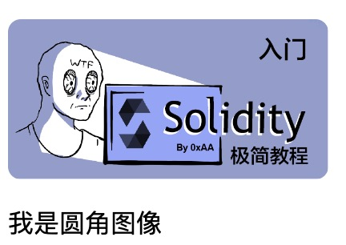
#### 圆形图片
```css
img {
  border-radius: 50%;
}
```
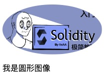

### 带阴影图片
使用 `box-shadow` 属性创建带阴影图片：
```css
img {
  box-shadow: 0 4px 8px 0 rgba(0, 0, 0, 0.2), 0 6px 20px 0 rgba(0, 0, 0, 0.19);
}
```
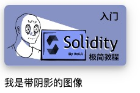

## 媒体
网站中常见媒体可以包括 `video`(视频) 及 `audio`(音频)。

### 视频
```html
<video src="xxx" controls></video>
```

```css
video {
  display: block;
  width: 100%;
}
```
视频常见css写法与图片相似，不同部分在视频控制条部分，如下所示：
```css
// 去除进度条
video:-webkit-media-controls-timeline {
  display: none;
}

// 去除观看的当前时间
video:-webkit-media-controls-current-time-display {
  display: none;
}

// 去除剩余时间
video:-webkit-media-controls-time-remaining-display {
  display: none;
}

// 去掉全部控制控件
video:-webkit-media-controls {
  display: none !important;
}
```
对比效果，注意控制控件部分：


### 音频
```html
<audio src="xxx" controls></audio>
```

```css
audio {
  display: block;
  width: 100%;
}
```
音频标签更多的是通过标签自带属性来控制，所以此处简单介绍一下。
**注意**：`audio`标签的 `autoplay` 自动播放属性在谷歌浏览器中是禁止的，需要用户手动行为来触发音频播放。


## 表单
网站中常见的登录、注册及用户信息修改或者 mint信息提交的时候会用到表单部分，通过 css 可将表单美化，生成我们想要的表单样式
```css
input[type=text], select, textarea {
  width: 100%;
  padding: 12px 20px;
  margin: 8px 0;
  display: inline-block;
  border: 1px solid #ccc;
  border-radius: 4px;
  box-sizing: border-box;
}

input[type=submit] {
  width: 100%;
  background-color: #4CAF50;
  color: white;
  padding: 14px 20px;
  margin: 8px 0;
  border: none;
  border-radius: 4px;
  cursor: pointer;
}

input[type=submit]:hover {
  background-color: #45a049;
}

textarea {
  overflow: auto;
}
```

```html
<form action="">
  <label for="fname">昵称</label>
  <input type="text" />

  <label for="lname">一句话介绍自己</label>
  <textarea placeholder="一句话介绍自己(我是文本域)"></textarea>

  <label for="country">技术栈</label>
  <select>
    <option value="1">前端</option>
    <option value="2">合约</option>
    <option value="3">后端</option>
    <option value="4">产品</option>
    <option value="5">设计</option>
  </select>

  <input type="submit" value="Submit" />
</form>
```

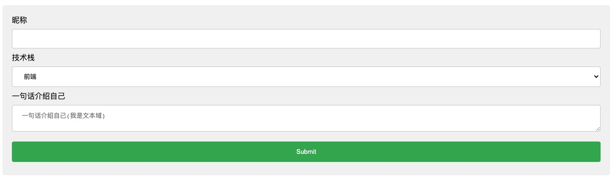

### 设置输入框的样式
使用`width`属性来确定输入框的宽度：
```css
input {
  width: 100%;
}
```

```css
input {
  width: 200px;
}
```

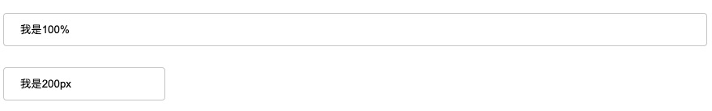

使用`border`属性来修改输入框边框：
```css
input {
  border: 2px solid red;
  border-radius: 4px;
}
```

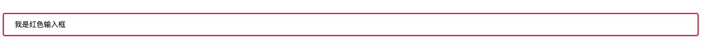

如果仅需要下边框，请使用`border-bottom`属性来修改输入框边框：
```css
input {
  border-bottom: 2px solid red;
  border-radius: 4px;
}
```

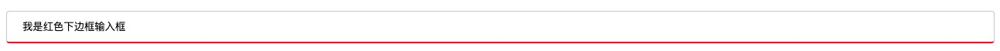

#### 彩色输入框
```css
input {
  background-color: #3CBC8D;
  color: white;
}
```

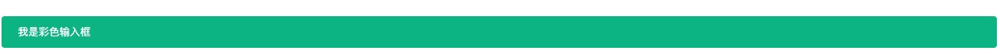

#### 设置选择菜单的样式
```css
select {
  padding: 16px 20px;
  border: none;
  border-radius: 4px;
  background-color: #f1f1f1;
}
```

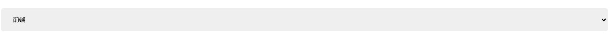


## 表格
在web中表格也是我们经常会使用的一种特殊元素，虽然现在很多第三方UI库都提供了各种功能丰富及绚丽多彩的表格组件，但是我们还是需要掌握基本的表格元素，从而可以对UI库提供的表格组件一探究竟。

### 设置表格边框

```css
table, th, td {
  border: 1px solid black;
}
```


### 设置表格宽度

```css
table {
  width: 100%; // 设置后表格宽度会跟随最近父级宽度
}
```
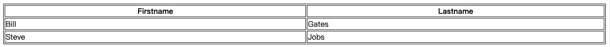

### 合并表格边框
请注意上面的表格有双边框。这是因为表格和 `th` `td` 元素都有单独的边框。如需删除双边框，请看下面的例子。

```css
table {
  border-collapse: collapse;
}

table, th, td {
  border: 1px solid black;
}
```


如果只希望表格周围有边框，则只需要给table设置 `border`属性：
```css
table {
  border: 1px solid black;
}
```


### 表格宽度、高度

表格的宽度和高度由 `width` 和 `height` 属性定义。

下例将表的宽度设置为 100％，将 `th` `td` 元素的高度设置为 50px：
```css
table {
  width: 100%; // 表格相对父级宽度，可以根据个人需求修改
}

th, td {
  height: 50px;
}
```

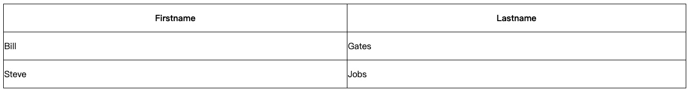


### 表格文本对齐
通过 `text-align` `vertical-align` 属性来修改表格的水平、垂直对齐方向
```css
table {
  width: 100%;
}

th, td {
  text-align: left; // 可选 left, center, right 对齐方式
  vertical-align: bottom; // 可选 top(上), center(中), bottom(下) 对齐方式
}
```
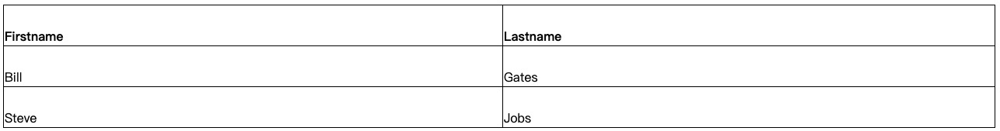

### 水平分隔线、鼠标悬停高亮效果

```css
// 指定边框方向
th, td {
  border-bottom: 1px solid #ddd; // 也可以设置 border-top/left/right，指定显示上、左、右边框
}
// 鼠标高亮
tr:hover {
  background-color: #f5f5f5;
}
```
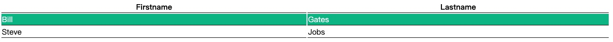

## 总结
这一讲我们介绍了图片、媒体、表单、表格的一些简单用法，日常中多加练习，多探索，去解锁更多用法来丰富自己的web站点。