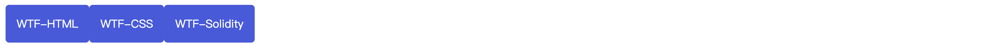
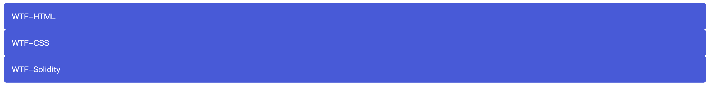
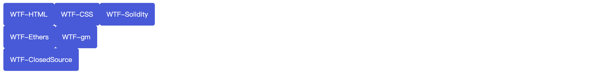
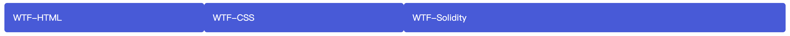
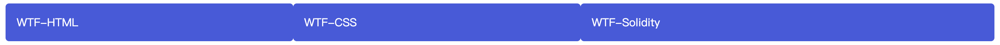

# WTF CSS极简教程: 10. Flex 布局

WTF CSS教程，帮助新人快速入门CSS。

**推特**：[@WTFAcademy_](https://twitter.com/WTFAcademy_)  ｜ [@0xAA_Science](https://twitter.com/0xAA_Science) 

**WTF Academy社群：** [官网 wtf.academy](https://wtf.academy) | [WTF Solidity教程](https://github.com/AmazingAng/WTFSolidity) | [discord](https://discord.gg/5akcruXrsk) | [微信群申请](https://docs.google.com/forms/d/e/1FAIpQLSe4KGT8Sh6sJ7hedQRuIYirOoZK_85miz3dw7vA1-YjodgJ-A/viewform?usp=sf_link)

所有代码和教程开源在github: [github.com/WTFAcademy/WTF-CSS](https://github.com/WTFAcademy/WTF-CSS)

---

这一讲，我们介绍 Flex 布局，弹性盒子是一种用于按行或按列布局元素的一维布局方法。元素可以膨胀以填充额外的空间，收缩以适应更小的空间。本文将解释所有的基本原理。

## 为什么是 弹性盒子？
长久以来，CSS 布局中唯一可靠且跨浏览器兼容的创建工具只有 [`floats`](https://developer.mozilla.org/zh-CN/docs/Learn/CSS/CSS_layout/Floats) 和 [`positioning`](https://developer.mozilla.org/zh-CN/docs/Learn/CSS/CSS_layout/Positioning)。这两个工具大部分情况下都很好使，但是在某些方面它们具有一定的局限性，让人难以完成任务。

以下简单的布局需求是难以或不可能用这样的工具（floats 和 positioning）方便且灵活的实现的：

- 在父内容里面垂直居中一个块内容。
- 使容器的所有子项占用等量的可用宽度/高度，而不管有多少宽度/高度可用。
- 使多列布局中的所有列采用相同的高度，即使它们包含的内容量不同。

## flex 模型说明

当元素表现为 flex 框时，它们沿着两个轴来布局：


- 主轴（main axis）是沿着 flex 元素放置的方向延伸的轴（比如页面上的横向的行、纵向的列）。该轴的开始和结束被称为 **main start** 和 **main end**。
- 交叉轴（cross axis）是垂直于 flex 元素放置方向的轴。该轴的开始和结束被称为 **cross start** 和 **cross end**。
- 设置了 display: flex 的父元素被称之为 **flex 容器（flex container）**。
- 在 flex 容器中表现为柔性的盒子的元素被称之为 **flex 项（flex item）**。

## 列还是行？

弹性盒子提供了 [`flex-direction`](https://developer.mozilla.org/zh-CN/docs/Web/CSS/flex-direction) 这样一个属性，它可以指定主轴的方向（弹性盒子子类放置的地方）— 它默认值是 `row`，这使得它们在按你浏览器的默认语言方向排成一排（在英语/中文浏览器中是从左到右）。

```css
.wrapper {
  display: flex;
  flex-direction: row;
}
```

```html
<div class="wrapper">
  <div class="box1">WTF-HTML</div>
  <div class="box2">WTF-CSS</div>
  <div class="box3">WTF-Solidity</div>
</div>
```



```css
.wrapper {
  display: flex;
  flex-direction: column;
}
```

```html
<div class="wrapper">
  <div class="box1">WTF-HTML</div>
  <div class="box2">WTF-CSS</div>
  <div class="box3">WTF-Solidity</div>
</div>
```




## 换行

当你在布局中使用定宽或者定高的时候，可能会出现问题即处于容器中的 弹性盒子子元素会溢出，破坏了布局。如下所示：

```css
.wrapper {
  display: flex;
  width: 200px;
}
```

```html
<div class="wrapper">
  <div class="box1">WTF-HTML</div>
  <div class="box2">WTF-CSS</div>
  <div class="box3">WTF-Solidity</div>
  <div class="box4">WTF-Ethers</div>
  <div class="box5">WTF-gm</div>
  <div class="box6">WTF-ClosedSource</div>
</div>
```


我们可以设置 `flex-wrap: wrap`, 让溢出的元素将被移到下一行。

```css
.wrapper {
  display: flex;
  width: 200px;
  flex-wrap: wrap;
}
```

```html
<div class="wrapper">
  <div class="box1">WTF-HTML</div>
  <div class="box2">WTF-CSS</div>
  <div class="box3">WTF-Solidity</div>
  <div class="box4">WTF-Ethers</div>
  <div class="box5">WTF-gm</div>
  <div class="box6">WTF-ClosedSource</div>
</div>
```



## flex-flow 缩写

到这里，应当注意到存在着 `flex-direction`、`flex-wrap` 和 `flex-flow` 的缩写。比如，你可以将

```css
flex-direction: row;
flex-wrap: wrap;
```

替换为

```css
flex-flow: row wrap;
```

## flex 项的动态尺寸

现在看下面的例子，看看是如何控制 flex 项占用空间的比例的。

```css
.wrapper {
  display: flex;
}

.wrapper .box1 {
  flex: 1;
}

.wrapper .box2 {
  flex: 1;
}

.wrapper .box3 {
  flex: 2;
}
```

```html
<div class="wrapper">
  <div class="box1">WTF-HTML</div>
  <div class="box2">WTF-CSS</div>
  <div class="box3">WTF-Solidity</div>
</div>
```

这是一个无单位的比例值，表示每个 flex 项沿主轴的可用空间大小。



你可以看到前两个 flex 项各有一个单位，因此它们占用每个可用空间的 1/4。第三个有两个单位，所以它占用 2/4 或这说是 1/2 的可用空间。

您还可以指定 flex 的最小值。

```css
.wrapper {
  display: flex;
}

.wrapper .box1 {
  flex: 1 200px;
}

.wrapper .box2 {
  flex: 1 200px;
}

.wrapper .box3 {
  flex: 2 200px;
}
```

```html
<div class="wrapper">
  <div class="box1">WTF-HTML</div>
  <div class="box2">WTF-CSS</div>
  <div class="box3">WTF-Solidity</div>
</div>
```



这表示“每个 flex 项将首先给出 200px 的可用空间，然后，剩余的可用空间将根据分配的比例共享”。

## flex: 缩写与全写

[`flex`](https://developer.mozilla.org/zh-CN/docs/Web/CSS/flex) 是一个可以指定最多三个不同值的缩写属性：

- 第一个就是上面所讨论过的无单位比例。可以单独指定全写 [`flex-grow`](https://developer.mozilla.org/zh-CN/docs/Web/CSS/flex-grow) 属性的值。
- 第二个无单位比例 — [`flex-shrink`](https://developer.mozilla.org/zh-CN/docs/Web/CSS/flex-shrink) — 一般用于溢出容器的 flex 项。这指定了从每个 flex 项中取出多少溢出量，以阻止它们溢出它们的容器。这是一个相当高级的弹性盒子功能，我们不会在本文中进一步说明。
- 第三个是上面讨论的最小值。可以单独指定全写 [`flex-basis`](https://developer.mozilla.org/zh-CN/docs/Web/CSS/flex-basis) 属性的值。

我们建议不要使用全写属性，除非你真的需要（比如要去覆盖之前写的）。使用全写会多写很多的代码，它们也可能有点让人困惑。

## 水平和垂直对齐

可以使用 弹性盒子的功能让 flex 项沿主轴或交叉轴对齐。

### `align-items`

控制 flex 项在交叉轴上的位置。

- 默认的值是 stretch，其会使所有 flex 项沿着交叉轴的方向拉伸以填充父容器。如果父容器在交叉轴方向上没有固定宽度（即高度），则所有 flex 项将变得与最长的 flex 项一样长（即高度保持一致）。我们的第一个例子在默认情况下得到相等的高度的列的原因。
- 在上面规则中我们使用的 center 值会使这些项保持其原有的高度，但是会在交叉轴居中。这就是那些按钮垂直居中的原因。
- 你也可以设置诸如 flex-start 或 flex-end 这样使 flex 项在交叉轴的开始或结束处对齐所有的值。查看 [`align-items`](https://developer.mozilla.org/zh-CN/docs/Web/CSS/align-items) 了解更多。

```css
.wrapper {
  display: flex;
  align-items: center;
}

.wrapper .box1 {
  height: 40px;
}

.wrapper .box2 {
  height: 80px;
}

.wrapper .box3 {
  height: 60px;
}
```

```html
<div class="wrapper">
  <div class="box1">WTF-HTML</div>
  <div class="box2">WTF-CSS</div>
  <div class="box3">WTF-Solidity</div>
</div>
```


### `justify-content`

控制 flex 项在主轴上的位置。

- 默认值是 `flex-start`，这会使所有 flex 项都位于主轴的开始处。
- 你也可以用 `flex-end` 来让 flex 项到结尾处。
- `center` 在 `justify-content` 里也是可用的，可以让 flex 项在主轴居中。
- 而我们上面用到的值 `space-around` 是很有用的——它会使所有 flex 项沿着主轴均匀地分布，在任意一端都会留有一点空间。
- 还有一个值是 `space-between`，它和 `space-around` 非常相似，只是它不会在两端留下任何空间。

```css
.wrapper {
  display: flex;
  justify-content: center;
}
```

```html
<div class="wrapper">
  <div class="box1">WTF-HTML</div>
  <div class="box2">WTF-CSS</div>
  <div class="box3">WTF-Solidity</div>
</div>
```


## flex 项排序

弹性盒子也有可以改变 flex 项的布局位置的功能，而不会影响到源顺序（即 dom 树里元素的顺序）。这也是传统布局方式很难做到的一点。我们可以设置 `order` 进行排序。

- 所有 flex 项默认的 `order` 值是 0。
- `order` 值大的 flex 项比 `order` 值小的在显示顺序中更靠后。
- 相同 `order` 值的 flex 项按源顺序显示。所以假如你有四个元素，其 `order` 值分别是 2，1，1 和 0，那么它们的显示顺序就分别是第四，第二，第三，和第一。
-可以给 `order` 设置负值使它们比值为 0 的元素排得更前面。

```css
.wrapper {
  display: flex;
}

.wrapper .box1 {
  order: 1;
}

.wrapper .box2 {
  order: 0;
}

.wrapper .box3 {
  order: -1;
}
```

```html
<div class="wrapper">
  <div class="box1">WTF-HTML</div>
  <div class="box2">WTF-CSS</div>
  <div class="box3">WTF-Solidity</div>
</div>
```


## flex 嵌套

弹性盒子也能创建一些颇为复杂的布局。设置一个元素为 flex 项目，那么他同样成为一个 flex 容器，它的孩子 (直接子节点) 也表现为 flexible box。


```css
.wrapper {
  display: flex;
  align-items: center;
}
.wrapper .inner {
  display: flex;
  flex-direction: column;
}
```

```html
<div class="wrapper">
  <div class="box1">WTF-HTML</div>
  <div class="inner">
    <div class="box2">WTF-CSS</div>
    <div class="box3">WTF-Solidity</div>
  </div>
</div>
```


## 总结

这一讲我们介绍了 Flex 布局的概念、指定主轴方向、换行、flex 项动态尺寸、水平垂直对齐、flex 项排序、flex 嵌套。
