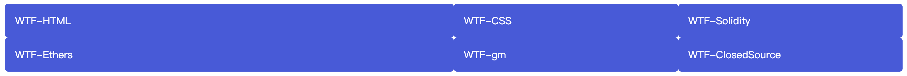
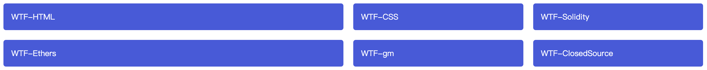
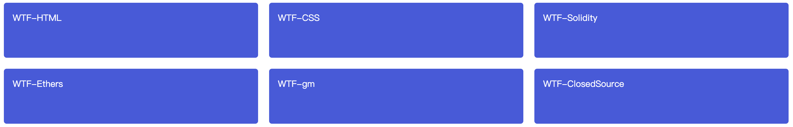
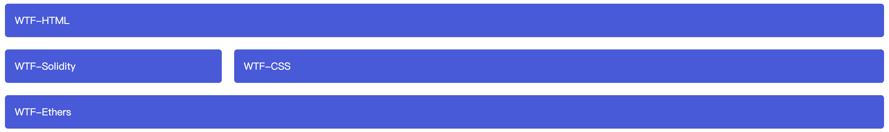

# WTF CSS极简教程: 11. Grid 布局

WTF CSS教程，帮助新人快速入门CSS。

**推特**：[@WTFAcademy_](https://twitter.com/WTFAcademy_)  ｜ [@0xAA_Science](https://twitter.com/0xAA_Science) 

**WTF Academy社群：** [官网 wtf.academy](https://wtf.academy) | [WTF Solidity教程](https://github.com/AmazingAng/WTFSolidity) | [discord](https://discord.gg/5akcruXrsk) | [微信群申请](https://docs.google.com/forms/d/e/1FAIpQLSe4KGT8Sh6sJ7hedQRuIYirOoZK_85miz3dw7vA1-YjodgJ-A/viewform?usp=sf_link)

所有代码和教程开源在github: [github.com/WTFAcademy/WTF-CSS](https://github.com/WTFAcademy/WTF-CSS)

---

这一讲，我们介绍 Grid 布局，学习如何使用网格把内容按照行与列的格式进行排版，轻松地实现一些复杂的布局。

## 什么是网格布局？

网格是由一系列水平及垂直的线构成的一种布局模式。根据网格，我们能够将设计元素进行排列，帮助我们设计一系列具有固定位置以及宽度的元素的页面，使我们的网站页面更加统一。

一个网格通常具有许多的**列（column）**与**行（row）**，以及行与行、列与列之间的间隙，这个间隙一般被称为**沟槽（gutter）**。


## 在 CSS 中创建自己的网格

决定好你的设计所需要的网格后，你可以创建一个 CSS 网格版面并放入各类元素。

### 定义一个网格

将容器的display属性设置为grid来定义一个网络。与弹性盒子一样，将父容器改为网格布局后，他的直接子项会变为网格项。

```css
.wrapper {
  display: grid;
}
```

```html
<div class="wrapper">
  <div class="box1">WTF-HTML</div>
  <div class="box2">WTF-CSS</div>
  <div class="box3">WTF-Solidity</div>
  <div class="box4">WTF-Ethers</div>
  <div class="box5">WTF-gm</div>
  <div class="box6">WTF-ClosedSource</div>
</div>
```

与弹性盒子不同的是，在定义网格后，网页并不会马上发生变化。因为 `display: grid` 的声明只创建了一个只有一列的网格，所以你的子项还是会像正常布局流那样从上而下一个接一个的排布。

为了让我们的容器看起来更像一个网格，我们要给刚定义的网格加一些列。那就让我们加三个宽度为200px的列。当然，这里可以用任何长度单位，包括百分比。

```css
.wrapper {
  display: grid;
  grid-template-columns: 200px 200px 200px;
}
```


### 使用 fr 单位的灵活网格

```css
.wrapper {
  display: grid;
  grid-template-columns: 2fr 1fr 1fr;
}
```

```html
<div class="wrapper">
  <div class="box1">WTF-HTML</div>
  <div class="box2">WTF-CSS</div>
  <div class="box3">WTF-Solidity</div>
  <div class="box4">WTF-Ethers</div>
  <div class="box5">WTF-gm</div>
  <div class="box6">WTF-ClosedSource</div>
</div>
```

这个定义里，第一列被分配了 `2fr` 可用空间，余下的两列各被分配了 `1fr` 的可用空间，这会使得第一列的宽度是第二第三列的两倍。另外，`fr` 可以与一般的长度单位混合使用，比如`grid-template-columns: 300px 2fr 1fr`，那么第一列宽度是300px，剩下的两列会根据除去300px后的可用空间按比例分配。



### 网格间隙

使用 [`column-gap`](https://developer.mozilla.org/zh-CN/docs/Web/CSS/column-gap) 属性来定义列间隙；使用 [`row-gap`](https://developer.mozilla.org/zh-CN/docs/Web/CSS/row-gap) 来定义行间隙；使用 [`gap`](https://developer.mozilla.org/zh-CN/docs/Web/CSS/gap) 可以同时设定两者。


```css
.wrapper {
  display: grid;
  grid-template-columns: 2fr 1fr 1fr;
  gap: 20px;
}
```

```html
<div class="wrapper">
  <div class="box1">WTF-HTML</div>
  <div class="box2">WTF-CSS</div>
  <div class="box3">WTF-Solidity</div>
  <div class="box4">WTF-Ethers</div>
  <div class="box5">WTF-gm</div>
  <div class="box6">WTF-ClosedSource</div>
</div>
```

间隙距离可以用任何长度单位包括百分比来表示，但不能使用`fr` 单位。



### 重复构建行/列

你可以使用repeat来重复构建具有某些宽度配置的某些列。举个例子，如果要创建多个等宽轨道，可以用下面的方法。

```css
.wrapper {
  display: grid;
  grid-template-columns: repeat(3, 1fr);
  gap: 20px;
}
```

```html
<div class="wrapper">
  <div class="box1">WTF-HTML</div>
  <div class="box2">WTF-CSS</div>
  <div class="box3">WTF-Solidity</div>
  <div class="box4">WTF-Ethers</div>
  <div class="box5">WTF-gm</div>
  <div class="box6">WTF-ClosedSource</div>
</div>
```

和之前一样，你仍然得到了 3 个 `1fr` 的列。第一个传入 repeat 函数的值（`3`）表明了后续列宽的配置要重复多少次，而第二个值（`1fr`）表示需要重复的构建配置，这个配置可以具有多个长度设定。


### 显式网格与隐式网格

到目前为止，我们定义过了列，但还没有管过行。但在这之前，我们要来理解一下显式网格和隐式网格。显式网格是我们用 `grid-template-columns` 或 `grid-template-rows` 属性创建的。而隐式网格则是当有内容被放到网格外时才会生成的。显式网格与隐式网格的关系与弹性盒子的 main 和 cross 轴的关系有些类似。

隐式网格中生成的行/列大小是参数默认是 `auto`，大小会根据放入的内容自动调整。当然，你也可以使用 [`grid-auto-rows`](https://developer.mozilla.org/zh-CN/docs/Web/CSS/grid-auto-rows) 和 [`grid-auto-columns`](https://developer.mozilla.org/zh-CN/docs/Web/CSS/grid-auto-columns) 属性手动设定隐式网格的大小。下面的例子将 `grid-auto-rows` 设为了 `100px`，然后你可以看到那些隐式网格中的行（因为这个例子里没有设定`grid-template-rows`，因此，所有行都位于隐式网格内）现在都是 100 像素高了。

```css
.wrapper {
  display: grid;
  grid-template-columns: repeat(3, 1fr);
  grid-auto-rows: 100px;
  gap: 20px;
}
```

```html
<div class="wrapper">
  <div class="box1">WTF-HTML</div>
  <div class="box2">WTF-CSS</div>
  <div class="box3">WTF-Solidity</div>
  <div class="box4">WTF-Ethers</div>
  <div class="box5">WTF-gm</div>
  <div class="box6">WTF-ClosedSource</div>
</div>
```


### 方便的 `minmax()` 函数

100 像素高的行/列有时可能会不够用，因为时常会有比 100 像素高的内容加进去。所以，我们希望可以将其设定为至少 100 像素，而且可以跟随内容来自动拓展尺寸保证能容纳所有内容。显而易见，你很难知道网页上某个元素的尺寸在不同情况下会变成多少，一些额外的内容或者更大的字号就会导致许多能做到像素级精准的设计出现问题。所以，我们有了 [`minmax`](https://developer.mozilla.org/zh-CN/docs/Web/CSS/minmax) 函数。

[`minmax`](https://developer.mozilla.org/zh-CN/docs/Web/CSS/minmax) 函数为一个行/列的尺寸设置了取值范围。比如设定为 `minmax(100px, auto)`，那么尺寸就至少为 100 像素，并且如果内容尺寸大于 100 像素则会根据内容自动调整。在这里试一下把 `grid-auto-rows` 属性设置为`minmax` 函数。

```css
.wrapper {
  display: grid;
  grid-template-columns: repeat(3, 1fr);
  grid-auto-rows: minmax(100px, auto);
  gap: 20px;
}
```

```html
<div class="wrapper">
  <div class="box1">WTF-HTML</div>
  <div class="box2">WTF-CSS</div>
  <div class="box3">WTF-Solidity</div>
  <div class="box4">WTF-Ethers</div>
  <div class="box5">WTF-gm</div>
  <div class="box6">WTF-ClosedSource</div>
</div>
```



如果所有网格内的内容均小于 100 像素，那么看起来不会有变化，但如果在某一项中放入很长的内容或者图片，你可以看到这个格子所在的哪一行的高度变成能刚好容纳内容的高度了。注意我们修改的是 `grid-auto-rows` ，因此只会作用于隐式网格。当然，这一项属性也可以应用于显式网格，更多内容可以参考 [`minmax`](https://developer.mozilla.org/zh-CN/docs/Web/CSS/minmax) 页面。

### 自动使用多列填充

现在来试试把学到的关于网格的一切，包括 `repeat` 与 `minmax` 函数，组合起来，来实现一个非常有用的功能。某些情况下，我们需要让网格自动创建很多列来填满整个容器。通过设置 `grid-template-columns` 属性，我们可以实现这个效果，不过这一次我们会用到 `repeat` 函数中的一个关键字 `auto-fill` 来替代确定的重复次数。而函数的第二个参数，我们使用 `minmax` 函数来设定一个行/列的最小值，以及最大值 `1fr`。

```css
.wrapper {
  display: grid;
  grid-template-columns: repeat(auto-fill, minmax(200px, 1fr));
  grid-auto-rows: minmax(100px, auto);
  gap: 20px;
}
```

```html
<div class="wrapper">
  <div class="box1">WTF-HTML</div>
  <div class="box2">WTF-CSS</div>
  <div class="box3">WTF-Solidity</div>
  <div class="box4">WTF-Ethers</div>
  <div class="box5">WTF-gm</div>
  <div class="box6">WTF-ClosedSource</div>
</div>
```


## 基于线的元素放置

在定义完了网格之后，我们要把元素放入网格中。我们的网格有许多分隔线，第一条线的起始点与文档书写模式相关。在英文中，第一条列分隔线（即网格边缘线）在网格的最左边而第一条行分隔线在网格的最上面。而对于阿拉伯语，第一条列分隔线在网格的最右边，因为阿拉伯文是从右往左书写的。

我们根据这些分隔线来放置元素，通过以下属性来指定从那条线开始到哪条线结束。

- [`grid-column-start`](https://developer.mozilla.org/en-US/docs/Web/CSS/grid-column-start)
- [`grid-column-end`](https://developer.mozilla.org/en-US/docs/Web/CSS/grid-column-end)
- [`grid-row-start`](https://developer.mozilla.org/en-US/docs/Web/CSS/grid-row-start)
- [`grid-row-end`](https://developer.mozilla.org/en-US/docs/Web/CSS/grid-row-end)

这些属性的值均为分隔线序号，你也可以用以下缩写形式来同时指定开始与结束的线。

- [`grid-column`](https://developer.mozilla.org/zh-CN/docs/Web/CSS/grid-column)
- [`grid-row`](https://developer.mozilla.org/zh-CN/docs/Web/CSS/grid-row)

注意开始与结束的线的序号要使用 `/` 符号分开。

```css
.wrapper {
  display: grid;
  grid-template-columns: 1fr 3fr;
  gap: 20px;
}

.wrapper .box1 {
  grid-column: 1 / 3;
  grid-row: 1;
}

.wrapper .box2 {
  grid-column: 2;
  grid-row: 2;
}

.wrapper .box3 {
  grid-column: 1;
  grid-row: 2;
}

.wrapper .box4 {
  grid-column: 1 / 3;
  grid-row: 3;
}
```

```html
<div class="wrapper">
  <div class="box1">WTF-HTML</div>
  <div class="box2">WTF-CSS</div>
  <div class="box3">WTF-Solidity</div>
  <div class="box4">WTF-Ethers</div>
</div>
```


### 使用 grid-template-areas 属性放置元素

另一种往网格放元素的方式是用 [`grid-template-areas`](https://developer.mozilla.org/zh-CN/docs/Web/CSS/grid-template-areas) 属性，并且你要命名一些元素并在属性中使用这些名字作为一个区域。

```css
.wrapper {
  display: grid;
  grid-template-areas:
    "box1 box1"
    "box3 box2"
    "box4 box4";
  grid-template-columns: 1fr 3fr;
  gap: 20px;
}

.wrapper .box1 {
  grid-area: box1;
}

.wrapper .box2 {
  grid-area: box2;
}

.wrapper .box3 {
  grid-area: box3;
}

.wrapper .box4 {
  grid-area: box4;
}
```

```html
<div class="wrapper">
  <div class="box1">WTF-HTML</div>
  <div class="box2">WTF-CSS</div>
  <div class="box3">WTF-Solidity</div>
  <div class="box4">WTF-Ethers</div>
</div>
```



## 总结

我们在这篇文章中接触了 CSS 网格版面的主要特性，你现在应该可以在你自己的设计中使用了。
