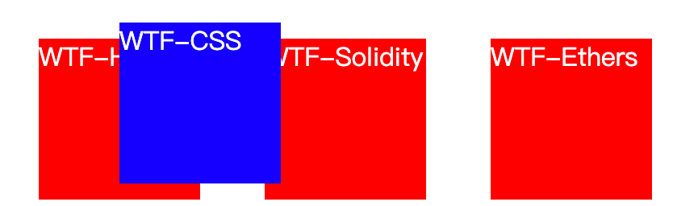
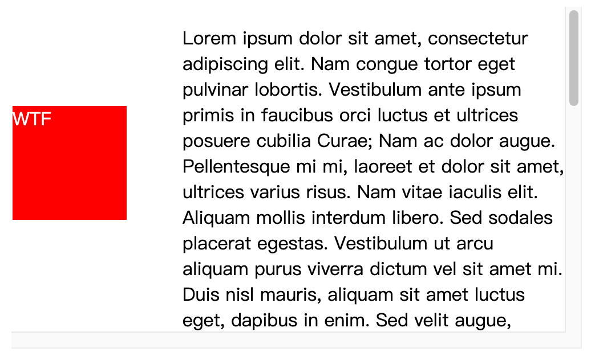
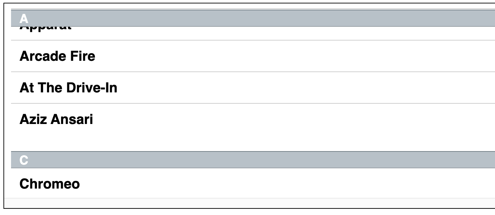

# WTF CSS 极简教程: 12. 定位定位

WTF CSS 教程，帮助新人快速入门 CSS。

**推特**：[@WTFAcademy_](https://twitter.com/WTFAcademy_) ｜ [@0xAA_Science](https://twitter.com/0xAA_Science)

**WTF Academy 社群：** [官网 wtf.academy](https://wtf.academy) | [WTF Solidity 教程](https://github.com/AmazingAng/WTFSolidity) | [discord](https://discord.gg/5akcruXrsk) | [微信群申请](https://docs.google.com/forms/d/e/1FAIpQLSe4KGT8Sh6sJ7hedQRuIYirOoZK_85miz3dw7vA1-YjodgJ-A/viewform?usp=sf_link)

所有代码和教程开源在 github: [github.com/WTFAcademy/WTF-CSS](https://github.com/WTFAcademy/WTF-CSS)

---

这一讲，我们介绍定位（Position）布局，position 属性用于指定一个元素在文档中的定位方式。top，right，bottom 和 left 属性则决定了该元素的最终位置。

## 定位类型

- 定位元素（positioned element）是其计算后位置属性为 relative, absolute, fixed 或 sticky 的一个元素（换句话说，除 static 以外的任何东西）。
- 相对定位元素（relatively positioned element）是计算后位置属性为 relative 的元素。
- 绝对定位元素（absolutely positioned element）是计算后位置属性为 absolute 或 fixed 的元素。
- 粘性定位元素（stickily positioned element）是计算后位置属性为 sticky 的元素。

大多数情况下，height 和 width 被设定为 auto 的绝对定位元素，按其内容大小调整尺寸。但是，被绝对定位的元素可以通过指定 top 和 bottom ，保留 height 未指定（即 auto），来填充可用的垂直空间。它们同样可以通过指定 left 和 right 并将 width 指定为 auto 来填充可用的水平空间。

除了刚刚描述的情况（绝对定位元素填充可用空间）：

- 如果 top 和 bottom 都被指定（严格来说，这里指定的值不能为 auto ），top 优先。
- 如果指定了 left 和 right ，当 direction 设置为 ltr（水平书写的中文、英语）时 left 优先，当 direction 设置为 rtl（阿拉伯语、希伯来语、波斯语由右向左书写）时 right 优先。

## 语法

position 属性被指定为从下面的值列表中选择的单个关键字。

### 取值

- **`static`**: 该关键字指定元素使用正常的布局行为，即元素在文档常规流中当前的布局位置。此时 top, right, bottom, left 和 z-index 属性无效。

- **`relative`**:
  该关键字下，元素先放置在未添加定位时的位置，再在不改变页面布局的前提下调整元素位置（因此会在此元素未添加定位时所在位置留下空白）。position:relative 对 table-\*-group, table-row, table-column, table-cell, table-caption 元素无效。

- **`absolute`**:
  元素会被移出正常文档流，并不为元素预留空间，通过指定元素相对于最近的非 static 定位祖先元素的偏移，来确定元素位置。绝对定位的元素可以设置外边距（margins），且不会与其他边距合并。

- **`fixed`**:
  元素会被移出正常文档流，并不为元素预留空间，而是通过指定元素相对于屏幕视口（viewport）的位置来指定元素位置。元素的位置在屏幕滚动时不会改变。打印时，元素会出现在的每页的固定位置。fixed 属性会创建新的层叠上下文。当元素祖先的 transform, perspective 或 filter 属性非 none 时，容器由视口改为该祖先。

- **`sticky`**:
  元素根据正常文档流进行定位，然后相对它的*最近滚动祖先（nearest scrolling ancestor）*和 containing block (最近块级祖先 nearest block-level ancestor)，包括 table-related 元素，基于 top, right, bottom, 和 left 的值进行偏移。偏移值不会影响任何其他元素的位置。 该值总是创建一个新的层叠上下文（stacking context）。注意，一个 sticky 元素会“固定”在离它最近的一个拥有“滚动机制”的祖先上（当该祖先的 overflow 是 hidden, scroll, auto, 或 overlay 时），即便这个祖先不是最近的真实可滚动祖先。这有效地抑制了任何“sticky”行为（详情见 Github issue on W3C CSSWG）。

## 示例

### 相对定位

相对定位的元素是在文档中的正常位置偏移给定的值，但是不影响其他元素的偏移。下面的例子中，注意未应用定位的其它元素是按照 "Two" 在正常位置的情况下进行布局的。

```html
<div class="box" id="one">WTF-HTML</div>
<div class="box" id="two">WTF-CSS</div>
<div class="box" id="three">WTF-Solidity</div>
<div class="box" id="four">WTF-Ethers</div>
```

```css
.box {
  display: inline-block;
  width: 100px;
  height: 100px;
  background: red;
  color: white;
}

#two {
  position: relative;
  top: 20px;
  left: 20px;
  background: blue;
}
```


### 绝对定位

相对定位的元素并未脱离文档流，而绝对定位的元素则脱离了文档流。在布置文档流中其它元素时，绝对定位元素不占据空间。绝对定位元素相对于最近的非 static 祖先元素定位。当这样的祖先元素不存在时，则相对于 ICB（inital container block, 初始包含块）。

```html
<div class="box" id="one">WTF-HTML</div>
<div class="box" id="two">WTF-CSS</div>
<div class="box" id="three">WTF-Solidity</div>
<div class="box" id="four">WTF-Ethers</div>
```

```css
.box {
  display: inline-block;
  background: red;
  width: 100px;
  height: 100px;
  float: left;
  margin: 20px;
  color: white;
}

#three {
  position: absolute;
  top: 20px;
  left: 20px;
}
```



### 固定定位

固定定位与绝对定位相似，但元素的包含块为 viewport 视口。该定位方式常用于创建在滚动屏幕时仍固定在相同位置的元素。在下面的示例中，"One" 元素定位在离页面顶部 80px，离页面左侧 20px 的位置。

```html
<div class="outer">
  <p>
    Lorem ipsum dolor sit amet, consectetur adipiscing elit. Nam congue tortor
    eget pulvinar lobortis. Vestibulum ante ipsum primis in faucibus orci luctus
    et ultrices posuere cubilia Curae; Nam ac dolor augue. Pellentesque mi mi,
    laoreet et dolor sit amet, ultrices varius risus. Nam vitae iaculis elit.
    Aliquam mollis interdum libero. Sed sodales placerat egestas. Vestibulum ut
    arcu aliquam purus viverra dictum vel sit amet mi. Duis nisl mauris, aliquam
    sit amet luctus eget, dapibus in enim. Sed velit augue, pretium a sem
    aliquam, congue porttitor tortor. Sed tempor nisl a lorem consequat, id
    maximus erat aliquet. Sed sagittis porta libero sed condimentum. Aliquam
    finibus lectus nec ante congue rutrum. Curabitur quam quam, accumsan id
    ultrices ultrices, tempor et tellus.
  </p>
  <p>
    Lorem ipsum dolor sit amet, consectetur adipiscing elit. Nam congue tortor
    eget pulvinar lobortis. Vestibulum ante ipsum primis in faucibus orci luctus
    et ultrices posuere cubilia Curae; Nam ac dolor augue. Pellentesque mi mi,
    laoreet et dolor sit amet, ultrices varius risus. Nam vitae iaculis elit.
    Aliquam mollis interdum libero. Sed sodales placerat egestas. Vestibulum ut
    arcu aliquam purus viverra dictum vel sit amet mi. Duis nisl mauris, aliquam
    sit amet luctus eget, dapibus in enim. Sed velit augue, pretium a sem
    aliquam, congue porttitor tortor. Sed tempor nisl a lorem consequat, id
    maximus erat aliquet. Sed sagittis porta libero sed condimentum. Aliquam
    finibus lectus nec ante congue rutrum. Curabitur quam quam, accumsan id
    ultrices ultrices, tempor et tellus.
  </p>
  <div class="box" id="one">One</div>
</div>
```

```css
.box {
  background: red;
  width: 100px;
  height: 100px;
  margin: 20px;
  color: white;
}
#one {
  position: fixed;
  top: 80px;
  left: 10px;
}
.outer {
  width: 500px;
  height: 300px;
  overflow: scroll;
  padding-left: 150px;
}
```



### 粘性定位

粘性定位可以被认为是相对定位和固定定位的混合。元素在跨越特定阈值前为相对定位，之后为固定定位。例如：

```css
#one {
  position: sticky;
  top: 10px;
}
```

在 viewport 视口滚动到元素 top 距离小于 10px 之前，元素为相对定位。之后，元素将固定在与顶部距离 10px 的位置，直到 viewport 视口回滚到阈值以下。

粘性定位常用于定位字母列表的头部元素。标示 B 部分开始的头部元素在滚动 A 部分时，始终处于 A 的下方。而在开始滚动 B 部分时，B 的头部会固定在屏幕顶部，直到所有 B 的项均完成滚动后，才被 C 的头部替代。

须指定 top, right, bottom 或 left 四个阈值其中之一，才可使粘性定位生效。否则其行为与相对定位相同。

```html
<div>
  <dl>
    <dt>A</dt>
    <dd>Andrew W.K.</dd>
    <dd>Apparat</dd>
    <dd>Arcade Fire</dd>
    <dd>At The Drive-In</dd>
    <dd>Aziz Ansari</dd>
  </dl>
  <dl>
    <dt>C</dt>
    <dd>Chromeo</dd>
    <dd>Common</dd>
    <dd>Converge</dd>
    <dd>Crystal Castles</dd>
    <dd>Cursive</dd>
  </dl>
  <dl>
    <dt>E</dt>
    <dd>Explosions In The Sky</dd>
  </dl>
  <dl>
    <dt>T</dt>
    <dd>Ted Leo & The Pharmacists</dd>
    <dd>T-Pain</dd>
    <dd>Thrice</dd>
    <dd>TV On The Radio</dd>
    <dd>Two Gallants</dd>
  </dl>
</div>
```

```css
* {
  box-sizing: border-box;
}

dl {
  margin: 0;
  padding: 24px 0 0 0;
}

dt {
  background: #b8c1c8;
  border-bottom: 1px solid #989ea4;
  border-top: 1px solid #717d85;
  color: #fff;
  font: bold 18px/21px Helvetica, Arial, sans-serif;
  margin: 0;
  padding: 2px 0 0 12px;
  position: -webkit-sticky;
  position: sticky;
  top: -1px;
}

dd {
  font: bold 20px/45px Helvetica, Arial, sans-serif;
  margin: 0;
  padding: 0 0 0 12px;
  white-space: nowrap;
}

dd + dd {
  border-top: 1px solid #ccc;
}
```



## z-index

z-index 属性设定了一个定位元素及其后代元素或 flex 项目的 z-order。当元素之间重叠的时候，z-index 较大的元素会覆盖较小的元素在上层进行显示。

对于一个已经定位的盒子（即其 position 属性值不是 static，这里要注意的是 CSS 把元素看作盒子），z-index 属性指定：

- 盒子在当前堆叠上下文中的堆叠层级。
- 盒子是否创建一个本地堆叠上下文。

### 语法

```css
/* 字符值 */
z-index: auto;

/* 整数值 */
z-index: 0;
z-index: 3;
z-index: 289;
z-index: -1; /* 使用负值降低优先级 */

/* 全局值 */
z-index: inherit;
z-index: initial;
z-index: unset;
```

- **`auto`**:
  盒子不会创建一个新的本地堆叠上下文。在当前堆叠上下文中生成的盒子的堆叠层级和父级盒子相同。
- **`<integer>`**:
  `<integer>`（整型数字）是生成的盒子在当前堆叠上下文中的堆叠层级。此盒子也会创建一个堆叠层级为 0 的本地堆叠上下文。这意味着后代（元素）的 z-indexes 不与此元素的外部元素的 z-indexes 进行对比。

### 示例

```html
<div class="wrapper">
  <div class="dashed-box">Dashed box</div>
  <div class="gold-box">Gold box</div>
  <div class="green-box">Green box</div>
</div>
```

```css
.wrapper {
  position: relative;
}

.dashed-box {
  position: relative;
  z-index: 1;
  border: dashed;
  height: 8em;
  margin-bottom: 1em;
  margin-top: 2em;
}
.gold-box {
  position: absolute;
  z-index: 3; /* put .gold-box above .green-box and .dashed-box */
  background: gold;
  width: 80%;
  left: 60px;
  top: 3em;
}
.green-box {
  position: absolute;
  z-index: 2; /* put .green-box above .dashed-box */
  background: lightgreen;
  width: 20%;
  left: 65%;
  top: -25px;
  height: 7em;
  opacity: 0.9;
}
```


## 总结

这一讲我们介绍了 position 定位的概念，如何在文档流控制元素的位置以及四种不同的定位类型。
