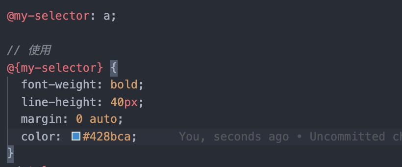
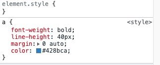
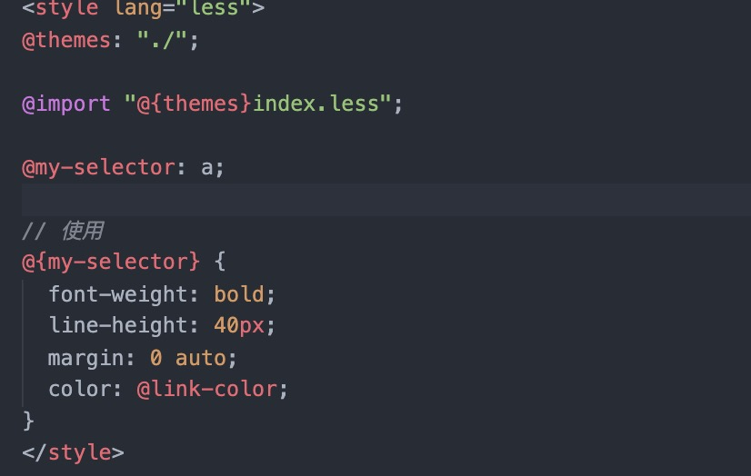
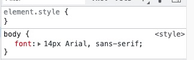
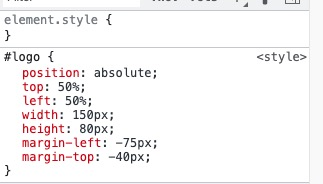
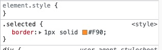

# WTF CSS 极简教程: 15. 预处理器

WTF CSS 教程，帮助新人快速入门 CSS。

**推特**：[@WTFAcademy_](https://twitter.com/WTFAcademy_) ｜ [@0xAA_Science](https://twitter.com/0xAA_Science)

**WTF Academy 社群：** [官网 wtf.academy](https://wtf.academy) | [WTF Solidity 教程](https://github.com/AmazingAng/WTFSolidity) | [discord](https://discord.gg/5akcruXrsk) | [微信群申请](https://docs.google.com/forms/d/e/1FAIpQLSe4KGT8Sh6sJ7hedQRuIYirOoZK_85miz3dw7vA1-YjodgJ-A/viewform?usp=sf_link)

所有代码和教程开源在 github: [github.com/WTFAcademy/WTF-CSS](https://github.com/WTFAcademy/WTF-CSS)

---

这一讲，我们介绍 CSS 预处理器，涉及行业常见预处理器 Less、Stylus、及Sass。本节我们只涉及预处理器变量部分。

## 预处理器简介

CSS 预处理器是一个能让你通过预处理器自己独有的语法来生成 CSS 的程序。市面上有很多 CSS 预处理器可供选择，且绝大多数 CSS 预处理器会增加一些原生 CSS 不具备的特性，例如代码混合，嵌套选择器，继承选择器等。这些特性让 CSS 的结构更加具有可读性且易于维护。

要使用 CSS 预处理器，你必须在 web 服务中服务器安装 CSS 编译工具。编译工具会将各预处理器语言编译后输出成为浏览器可识别的标准CSS语言。


## 变量简介
预处理器对变量提供了支持，你可以把反复使用的 `css` 属性值定义为变量，然后通过变量名来引用它们，无需重复书写这一属性值。或者，对于仅使用过一 次的属性值，你可以赋予其一个易懂的变量名，让人一眼就知道这个属性值的用途。
`Less` 通过 `@` 符号标识变量，`Stylus` 则通过 `font-size = 14px` 直接赋值的形式来表示一个变量，也可以使用 `$` 符号来标识一个变量， `Sass` 也是通过 `$` 来标识变量，下面我们来详细分析一下各个预处理器变量部分。

## Less

Less是一种可靠的、成熟的CSS预处理器。它支持变量、混合宏、嵌套规则、函数等特性。Less 可以运行在 Node 或浏览器端。 相关文档可前往 [Less官网](https://lesscss.org/) 进行查看。

### Less 变量 ( Variables )
`Less` 通过 `@` 符号标识一个变量
例如：
```less
// 定义
@link-color: #428bca; // sea blue

// 使用
a,
.link {
  color: @link-color;
}

// 经过编译后输出为
a,
.link {
  color: #428bca;
}
```
编译前：


编译后：


> 上述例子中展示了 `Less` 变量的简单使用，在`Less`中变量也可以当做选择器、URL 和 @import 来使用

### 选择器
```less
// 定义
@my-selector: banner;

// 使用
.@{my-selector} {
  font-weight: bold;
  line-height: 40px;
  margin: 0 auto;
}

// 编译后输出为
.banner {
  font-weight: bold;
  line-height: 40px;
  margin: 0 auto;
}
```
编译前：


编译后：


### URL
```less
// 定义
@images: "../img";

// 使用
body {
  color: #444;
  background: url("@{images}/white-sand.png");
}
```

### @import 中使用
```less
// 定义
@themes: "../../src/themes";

// 使用
@import "@{themes}/tidal-wave.less";
```


### 使用另一个变量来定义变量的名称
```less
// 定义
@primary:  green;

// 使用
.section {
  // 定义 此处 primary 为上面定义的 @primary
  @color: primary;

  // 使用 此处 @color 为一个变量
  .element {
    color: @@color;
  }
}
```

编译输出为：
```css
.section .element {
  color: green;
}
```


**注意**：此处 `@color` 定义在了 `.section {}` 内部，所以只可以在 `.section{} ` 内部使用，不可以在其外部使用，否则编译器会报错 `@color is undefined`。

## Stylus

Stylus是一种富有表现力、灵活的CSS预处理器。它的语法非常灵活，你可以选择使用缩进或者大括号、分号等。相关文档可前往 [Stylus官网](https://stylus-lang.com/) 进行查看。

### Stylus 变量 ( Variables )
我们可以将表达式赋值给变量，然后在整个样式表中使用变量，也可以使用 `$` 符号定义变量

```stylus
// 定义
font-size = 14px
// 或者
$font-size = 14px

// 使用
body
   font font-size Arial, sans-serif
```
编译输出为：
```css
body {
  font: 14px "Lucida Grande", Arial, sans-serif;
}
```


也可以不直接定义变量，而是通过向上查找来确定属性值，例如：
```stylus
#logo
   position: absolute
   top: 50%
   left: 50%
   width: w = 150px
   height: h = 80px
   margin-left: -(w / 2)
   margin-top: -(h / 2)
```
此处 `w` `h` 并没有事先单独声明，而是在使用位置的前一步 `width: w = 150px` 处进行了声明 `w = 150px`，也可以用另一种方式，如下所示：
```stylus
#logo
   position: absolute
   top: 50%
   left: 50%
   width: 150px
   height: 80px
   margin-left: -(@width / 2)
   margin-top: -(@height / 2)
```
此处的 `@width` `@height` 则是直接使用了 `width: 150px` `height: 80px` 的定义



> 上述例子中使用变量都是基于变量有定义的前提下，`Stylus` 变量也可以指定回退变量
```stylus
position()
    position: arguments
    z-index: 1 unless @z-index
```
`@z-index` 编译的时候会“向上冒泡”查找堆栈直到被发现，如果最终查找失败，则会返回 1

## Sass


Sass（Syntactically Awesome Stylesheets）是最早的CSS预处理器，也是最流行的预处理器之一。它支持两种语法：基于缩进的语法（.sass），以及类似于CSS的语法（.scss）。相关文档可前往 [Sass官网](https://sass-lang.com/) 进行查看。

### Sass 变量 ( Variables )
Sass 中使用 `$` 来定义变量

变量声明：
```scss
$nav-color: #F90;
$highlight-color: #F90;
$highlight-border: 1px solid $highlight-color;
// 使用
.nav {
  $width: 100px;
  width: $width;
  color: $nav-color;
}

.selected {
  border: $highlight-border;
}
```
编译输出为：
```css
nav {
  width: 100px;
  color: #F90;
}

.selected {
  border: 1px solid #F90;
}
```




**注意**：在此处例子中， `$nav-color` 变量声明没有父级限制，则可以全局使用，而 `$width`是定义在了 `.nav{}` 中，所以只能在 `.nav{}`中使用，在`.nav{}`外部不可使用


## 总结
这一讲我们介绍了`Less`、`Stylus`及 `Sass` 变量部分的一些简单用法，`css` 预处理器的功能非常健壮，变量只是其中的冰山一角，更多内容可前往上文中相关官网链接中进行查看并多加学习，预处理器使用恰当的话可以极大解放开发者的双手，并节省相当一部分的开发时间，也可以对项目及产品进行 `css` 相关的规范化与标准化。