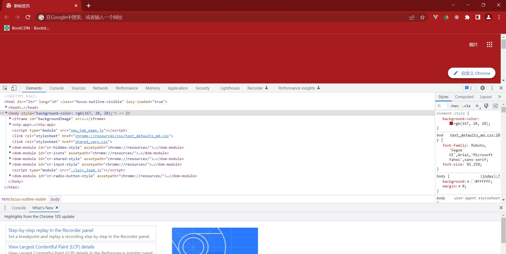
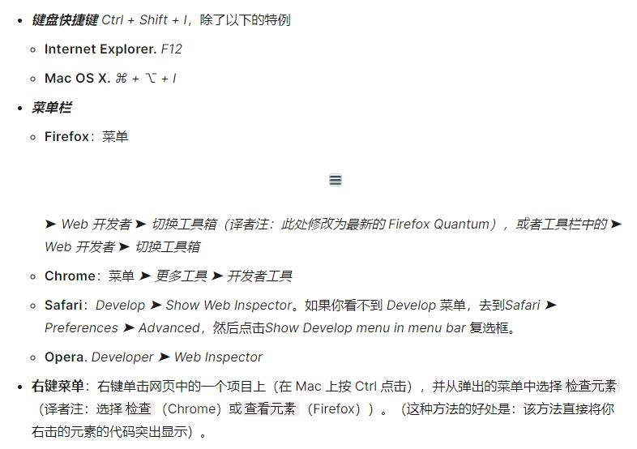
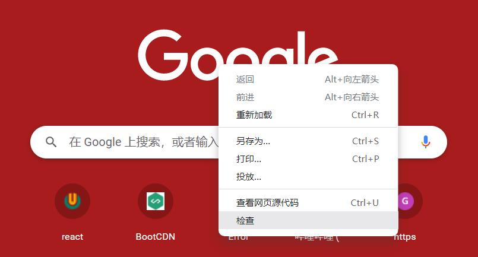
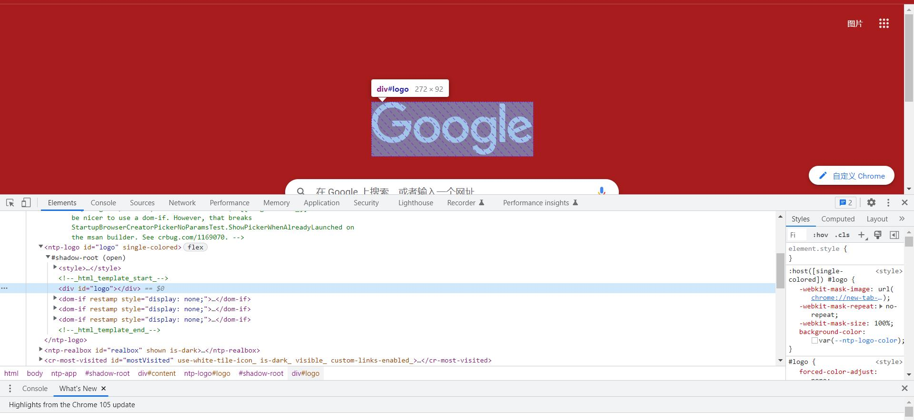
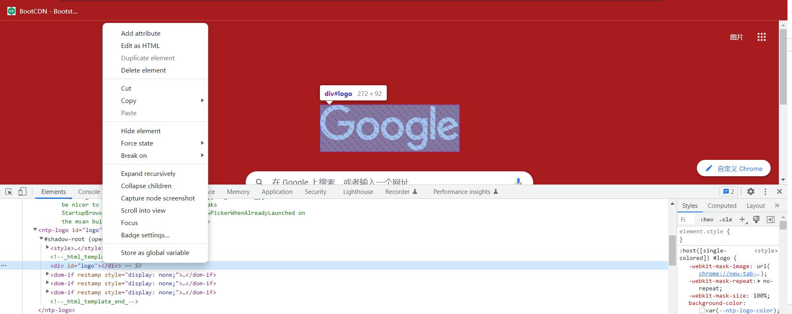
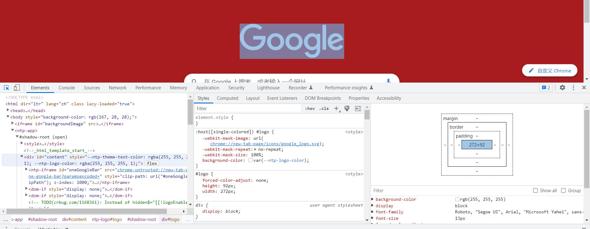
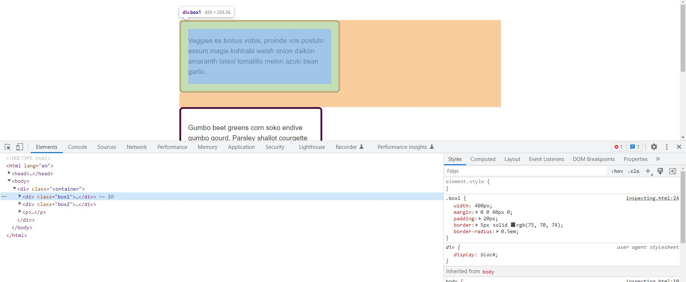
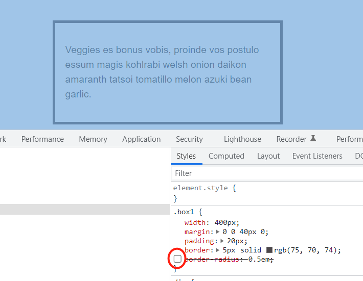
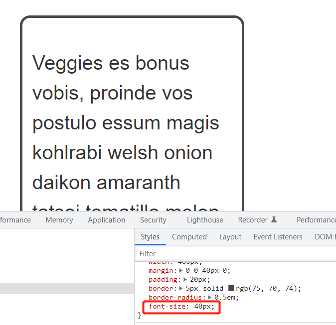
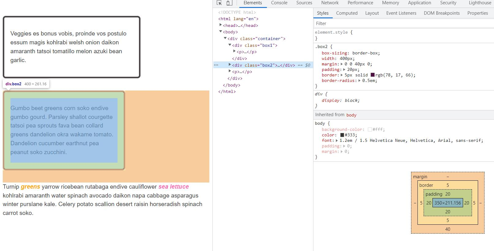

# WTF CSS极简教程: 16. 开发者工具

WTF CSS教程，总结/搬运自MDN CSS教程[开发者工具](https://developer.mozilla.org/zh-CN/docs/Learn/Common_questions/What_are_browser_developer_tools)和[调试CSS](https://developer.mozilla.org/zh-CN/docs/Learn/CSS/Building_blocks/Debugging_CSS)，帮助新人快速入门CSS。

**推特**：[@WTFAcademy_](https://twitter.com/WTFAcademy_)  ｜ [@0xAA_Science](https://twitter.com/0xAA_Science) 

**WTF Academy社群：** [官网 wtf.academy](https://wtf.academy) | [WTF Solidity教程](https://github.com/AmazingAng/WTFSolidity) | [discord](https://discord.gg/5akcruXrsk) | [微信群申请](https://docs.google.com/forms/d/e/1FAIpQLSe4KGT8Sh6sJ7hedQRuIYirOoZK_85miz3dw7vA1-YjodgJ-A/viewform?usp=sf_link)

所有代码和教程开源在github: [github.com/WTFAcademy/WTF-CSS](https://github.com/WTFAcademy/WTF-CSS)

---

这一讲，我们介绍如何使用浏览器开发者工具的基本功能，并用它来调试CSS。

## 什么是浏览器开发者工具？

每一个现代网络浏览器都包含一套强大的开发工具套件。这些工具可以检查当前加载的HTML、CSS和JavaScript，显示每个资源页面的请求以及载入所花费的时间。本文阐述了如何利用浏览器的开发工具的基本功能。

## 如何在浏览器中打开开发者工具

开发者工具内置在您的浏览器的子窗口之中，大概像这样：

如何打开它？有三种方式：

元素(Elements):DOM 浏览器和 CSS 编辑器

开发者工具在打开时默认为Elements页面，如下图所示。这个工具可以让你看到你的网页的 HTML 运行时的样子，以及哪些 CSS 规则被应用到了页面上元素。它还允许您立即修改 HTML 和 CSS 并在浏览器中实时观察修改的结果。

如果你看不到Elements,

1. 点击“检查”选项卡
2. 在 Internet Explorer 中，点击 DOM Explorer，或按 Ctrl + 1
3. 在 Safari 中，控制就不是很清楚了，但是如果你没有选择的东西出现在窗口看到 HTML。按下按钮查看 CSS 样式。

## 探索DOM检查器

首先在DOM检查器中右键单击一个HTML元素，看上下文菜单。菜单选项各不相同，但主要功能是相同的：

- 删除节点（或删除元素）：删除当前元素。
- 编辑HTML（或添加属性/编辑文本）：让您更改HTML和看到在变化的结果。对于调试和测试非常有用。
- :hover/:active/:focus（悬停/激活/聚焦）：强制切换元素状态以查看显示外观。
- 复制/复制为 HTML：复制当前选定的 HTML。
- 一些浏览器也有复制 CSS 路径和复制 XPath，允许你选择复制当前的HTML元素CSS选择器或XPath表达式。

要想编辑你的Element，你可以双击元素，或在页面内容里右键单击它并选择编辑HTML。你可以做出任何你想要的改变，但你不能保存。

## 探索CSS编辑器

默认情况下，CSS编辑器显示当前所选元素应用的CSS规则：

以下功能特别有用：

- 应用于当前元素的规则以相关度排序。越特定的规则显示的越靠前。
- 点击每个声明旁边的复选框，看看如果删除声明会发生什么。
- 点击每个简写属性旁边的小箭头显示属性的普通等效项。
- 单击属性名称或值以显示一个文本框，您可以在其中键入新值以获取样式更改的实时预览。
- 每个规则旁边是规则定义的文件名和行号。单击该规则将使开发工具跳转到自己的视图中显示，通常可以编辑和保存。
- 您还可以单击任何规则的关闭大括号，以在新行上显示一个文本框，您可以在其中为页面写入一个全新的声明。

您会注意到CSS查看器顶部的一些可点击的选项卡：

- 计算：显示当前所选元素的计算样式（浏览器应用的最终归一化值）。
- 盒子模型：这可以直观地表示当前元素的框模型，所以您可以一目了然地看到应用了什么填充，边框和边距，以及它的内容有多大。
- 字体：在 Firefox 中，“字体”选项卡显示应用于当前元素的字体。

## 检查CSS

从页面上选择一个元素，可以通过以下方法：右键该元素，选择检查；从DevTools左侧HTML tree中选择该元素。试试选择class为box1的元素吧，它是页面上的第一个元素，周围画有边框。

如果查看HTML右边的StyleS栏，你应该能看到该元素的CSS属性与值。你能看到直接应用到box1类上的规则，还有其继承了祖先的CSS（该例中指`<body>`）。这在一种情况下就很有帮助——你看到有些CSS并非在计划之内（或许它们继承自某个父元素然而你没有覆盖它们）。

另一个有用的功能是将简写属性展开的功能。在我们的示例里面使用了margin的简写。点击小箭头来展开界面，显示不同的完整属性和它们的值。

你可以在Styles面板活动的时候打开或关闭值，在你将光标悬浮在上面的时候，就会出现勾选框。取消勾选一个规则的勾选框，例如border-radius，CSS 就会停止应用。

## 编辑值

除了开关属性以外，你还能编辑它们的值。选择了box1以后，点击显示应用在边框的颜色的色块（被涂上颜色的圆），会打开一个颜色选择器，然后你就能尝试一些不同的颜色，页面上的显示会进行实时的更新。类似地，你也可以用这种方法改变宽度或者边框的样式。

## 添加一个新属性

你可以使用开发者工具添加属性。你可以点击在规则中合拢的花括号，开始向里面键入一个新的声明，此时你可以开始键入新的属性，开发者工具会展示给你一个自动填充的对应属性列表。在选择了font-size以后，键入你想要尝试的值。你也可以点击“+”按钮以添加一个对应于相同选择器的规则，将你的新规则加到那里。

## 理解盒模型

在之前的课程里我们已经讨论了盒模型，现在开发者工具可以确实帮助你理解元素尺寸的计算方式。

将这两个分别带有 box1 和 box2 类的盒子进行比较，它们可能都应用了相同的宽度（400 像素），但是 box1 显然更宽。你可以在布局面板上看到，它的box-sizing为默认的content-box，即为那种取你赋予元素的大小并在这基础上加上内边距和边框宽度的那种值。

带有 box2 类的盒子使用了 border-box，所以此时内边距和边框的值是从你赋给元素的值里面减去的，也就是说页面上被盒子占据的空间大小就是你指定的大小，此例中为 width: 400px。

## 总结

这一讲我们简单介绍了如何使用开发者工具，并用它来对CSS进行初步的调试。开发者工具的功能十分强大，同时它在不同浏览器中的细节也有所不同，这部分就留给学员们自己探索。
