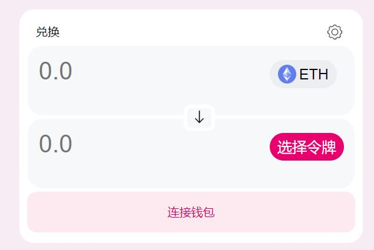

# WTF CSS极简教程: 18. Uniswap页面

WTF CSS教程，总结/搬运自[MDN CSS教程](https://developer.mozilla.org/zh-CN/docs/Learn/CSS)，帮助新人快速入门CSS。

**推特**：[@WTFAcademy_](https://twitter.com/WTFAcademy_)  ｜ [@0xAA_Science](https://twitter.com/0xAA_Science) 

**WTF Academy社群：** [官网 wtf.academy](https://wtf.academy) | [WTF Solidity教程](https://github.com/AmazingAng/WTFSolidity) | [discord](https://discord.gg/5akcruXrsk) | [微信群申请](https://docs.google.com/forms/d/e/1FAIpQLSe4KGT8Sh6sJ7hedQRuIYirOoZK_85miz3dw7vA1-YjodgJ-A/viewform?usp=sf_link)

所有代码和教程开源在github: [github.com/WTFAcademy/WTF-CSS](https://github.com/WTFAcademy/WTF-CSS)

---

这一讲，我们将在WTF HTML第九讲UniswapHTML的基础上用预处理器less给它增加CSS样式表，最终效果如下：


**注意**：本讲所用的HTML内容在之前的基础上做了略微的调整，想要练习的学员请下载本讲中最新的文件

## background

首先我们设置背景的颜色，可以用取色器取来颜色后直接给`background-color`赋值

```css
body {
    background-color: #f7ebf3;
}
```

## `class="header"`

然后我们处理头部的样式，Uniswap原生的样式是这样的：


头部的排列可以使用定位来解决。左右子元素的定位很简单，但中间元素想要让它居中，除了要让`right=50%`，还得让`margin-right: -140px`（`140px`是中间元素宽度的一半），否则会让它的右边居中。

`border-radius`不要设置成百分比，因为元素的宽高不同，设置成行高的一半即可。

`a`的`display`设置成`inline-block`，这样就可以调整他的宽度。

`line-height`设置成`40px`不仅可以改变`a`的高度，还可以让其中的内容垂直居中。

```css
.header {
    margin-top: 20px;
    &>img {
        width: 25px;
    }
    &>.switchPage {
        position: absolute;
        top: 20px;
        right: 50%;
        margin-right: -140px;
        background-color: white;
        border-radius: 20px;
        &>a {
            display: inline-block;
            width: 70px;
            line-height: 40px;
            text-align: center;
            &:first-child {
                background-color: #f7f8fa;
                border-radius: 20px;
            }
        }
    }
}
```

对于右边的一组元素，我们将包裹他们的父元素的`position`设置成`absolute`，再让`right: 0`，就可以让它们位于页面右边。再将它的`display`设置成`flex`，就可以让他的三个子元素位于同一行。

`changeNetwork`里`img`的`position`要先设置成`relative`，再调整它的`top`,使得它与右边的文字水平对齐。

同时还要调整三个子元素的`margin-right`，让它们不要挤在一起。

```css
    &>.right {
        display: flex;
        position: absolute;
        top: 20px;
        right: 0;

        &>.changeNetwork {

            background-color: white;
            margin-right: 10px;
            width: 120px;
            border-radius: 15px;
            text-align: center;

            &>img {
                position: relative;
                top: 5px;
                width: 25px;
            }

            &>.Ethereum {
                line-height: 40px;
            }
        }

        &>.connect {
            background-color: #fdeaf1;
            color: #d50066;
            border: 4px white solid;
            width: 100px;
            height: 40px;
            margin-right: 10px;
            border-radius: 20px;
            font-size: 16px;
        }

        &>.menu {
            background-color: white;
            font-size: 20px;
            border: 4px white solid;
            width: 42px;
            height: 40px;
            margin-right: 10px;
            border-radius: 15px;
        }
    }
```

到此`header`里的关键点就讲完了，效果如下：


## `class="body"`

最后我们处理中间内容的样式，这部分会比较复杂。

我们先将`class="body"`的`margin-top`调整为`80px`，将它与头部分开。

然后是`swap-page`的样式，`position`修改为`relative`后，要同时调整`left`和`margin-left`才能让它水平居中。

`padding`也需要给它赋值，让`swap-page`与它的子元素分开。

```css
&>.swap-page {
        position: relative;
        background-color: white;
        width: 446px;
        height: 298px;
        left: 50%;
        margin-left: -223px;
        border-radius: 20px;
        padding: 10px;
}
```

接着是`swap-page-header`，`margin`设置为`10px auto`可以让它水平居中。

```css
&>.swap-page-header {
            margin:10px auto;
            width: 422px;
            height: 20px;
}
```

然后是`token1`和`token2`共同的样式，调整它们的`margin`和`padding`可以将它们与父、子元素分离。调整子元素`input`的`padding`可以让输入的内容不紧挨着边框。

```css
& .token1,
        .token2 {
            background-color: #f7f8fa;
            width: 444px;
            height: 62px;
            margin: 5px auto;
            padding: 16px 0;
            border-radius: 20px;
            &>input {
                background-color: #f7f8fa;
                border: none;
                line-height: 33px;
                font-size: 33px;
                width: 294px;
                padding: 0 15px;
            }
        }
```

之后是`token1-btnto`和`token2-btn`不同样式的设计。

```css
            & .token1-btn {
                background-color: #edeef2;
                border: none;
                width: 91px;
                height: 38px;
                border-radius: 19px;
                line-height: 38px;
                & img {
                    position: relative;
                    top: 5px;
                    width: 25px;
                }
                & span {
                    font-size: 20px;
                }
            }
            & .token2-btn {
                background-color: #e8006f;
                color: white;
                border: none;
                width: 101px;
                height: 38px;
                border-radius: 19px;
                line-height: 38px;
                & span {
                    font-size: 20px;
                }
            }
```

接着是两个`input`中间的箭头`button`,将它的`position`设置为`absolute`可以让它从文档流中脱离，再调整它的`top`、`left`和`margin-left`让它位于两个`input`中间

```css
        & .arrow{
            background-color: #f7f8fa;
            border: 5px white solid;
            border-radius: 25%;
            position: absolute;
            top:130px;
            left:50%;
            margin-left:-10px;
            &>img{
                width: 20px;
            }
        }
```

然后是尾部连接钱包的`button`，这里未涉及到位置的赋值。

```css
        & .swap-page-footer-connect{
                 width: 100%;
                 height: 55px;
                 border: none;
                 border-radius: 13px;
                 background-color: #fdeaf1;
                 color: #d50066;
                 font-size: 16px;
        }
```

到此swap的样式就完成了，效果如下：



最后就剩下`chooseLanguage`和`gasPriceAndBlockNumber`的样式，这两部分比较简单。

先将`chooseLanguage`的`display`设置为`inline-block`，方便我们调整它的宽度，宽度设置好之后就可以通过`position`、`left`、`margin-left`和`top`调整它的位置。

```css
    &>.chooseLanguage{
        position: relative;
        display: inline-block;
        width: 130px;
        font-size: 12px;
        left:50%;
        margin-left: -65px;
        top:10px;
    }
```

`gasPriceAndBlockNumber`位于页面右下方，我们可以直接将它的`position`设置为`absolute`，让它脱离文档流，再通过调整`top`、`margin-top`、`margin-right`和`right`让它处于页面右下角。

```css
    &>.gasPriceAndBlockNumber{
        position: absolute;
        top:100%;
        margin-top: -36px;
        margin-right:20px;
        right:0;
        font-size: 10px;
    }
```

至此，Uniswap极简页面就完成了，效果如下：


可以看到，我们做的极简页面和官方页面是非常相似的。但目前该页面还没有任何功能，这需要我们后续继续给他加上JS。

## 总结

这一讲我们在之前UniswapHTML的基础上增加了样式表，做出的效果与官方页面十分相似。学员们自己练习时不必写的与本教程一模一样，只要能达到预期效果即可。
