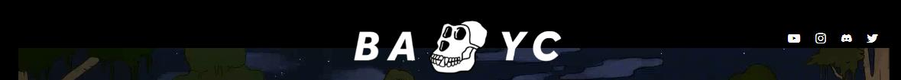
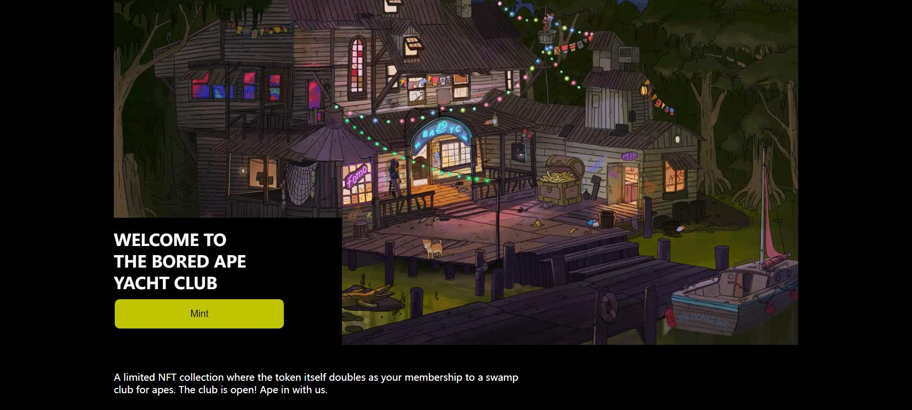

# WTF CSS极简教程: 19. BAYC页面

WTF CSS教程，总结/搬运自[MDN CSS教程](https://developer.mozilla.org/zh-CN/docs/Learn/CSS)，帮助新人快速入门CSS。

**推特**：[@WTFAcademy_](https://twitter.com/WTFAcademy_)  ｜ [@0xAA_Science](https://twitter.com/0xAA_Science) 

**WTF Academy社群：** [官网 wtf.academy](https://wtf.academy) | [WTF Solidity教程](https://github.com/AmazingAng/WTFSolidity) | [discord](https://discord.gg/5akcruXrsk) | [微信群申请](https://docs.google.com/forms/d/e/1FAIpQLSe4KGT8Sh6sJ7hedQRuIYirOoZK_85miz3dw7vA1-YjodgJ-A/viewform?usp=sf_link)

所有代码和教程开源在github: [github.com/WTFAcademy/WTF-CSS](https://github.com/WTFAcademy/WTF-CSS)

---

这一讲，我们将使用预处理器less编写一个极简BAYC mint页面样式表，制作所需要的HTML和img文件已经准备好了。最终效果如下：


## 通用样式设置

BAYC官网的背景是黑色的，所有的字体都是白色的，因此我们可以通过通用样式去调整。

```css
body {
    background-color: black;
}

* {

    color: white;
}

```

右下角这部分的内容都靠右，我们可以设置一个`right`类的通用样式，然后在需要的元素上添加即可。

```css
.right {
    display: flex;
    justify-content: flex-end;
}
```

## `class="header"`

然后我们处理头部的样式，BAYC官网头部的样式是这样的：



头部的内容比较少，我们可以用定位来解决，方法与上一讲[UniswapHTML&CSS](https://github.com/WTFAcademy/WTF-CSS/tree/main/18_UniswapHTML%26CSS)类似，这里就不再赘述。不要忘记修改`bayc-logo`的`z-index`>=1，这样才能让它处于`video`的上方。

```css
.header {
    &>img {
        position: relative;
        left: 50%;
        margin-left: -150px;
        padding-top: 24px;
        margin-bottom: -40px;
        width: 300px;
        z-index: 1;
    }

    & a {
        text-decoration: none;

        &>img {
            margin-left: 10px;
            height: 16px;
        }
    }

    &>.socialMedia {
        position: absolute;
        top: 50px;
        right: 50%;
        margin-right: -550px;
    }
}
```

## `class="body"`

然后我们处理中间内容的样式。

首先是面积最大的`welcome`部分，我们通过调整它的`width`、`position`、`left`、`margin-left`让它水平居中。

```css
.body {
    &>.welcome {
        width: 1140px;
        position: relative;
        left: 50%;
        margin-left: -570px;
    }
}
```

子元素`video`的宽度调整为`100%`使其撑满父元素。

```css
& video {
            width: 100%;
        }
```

子元素`mint`的`position`调整为`absolute`就可以让它覆盖在`video`的上方，然后再调整它的`bottom`属性使其位于`video`的左下角。

```css
&>.mint {
            background-color: black;
            position: absolute;
            bottom: 0px;
            width: 380px;
            height: 215px;
        }
```

`mint`里的欢迎词样式比较简单，它之所以排了三行是因为它的HTML里有两个`<br/>`。

```css
            &>h1 {
                width: 285px;
                height: 98px;
                font-size: 27px;
            }
```

mint按钮鼠标悬浮上去之后会有一个缓慢变色的效果，可以给它加一个`transition`。

```css
            &>button {
                width: 285px;
                height: 52px;
                font-size: 16px;
                color: black;
                background-color: #bfc500;
                border-radius: 10px;

                &:hover {
                    background-color: white;
                    transition: 0.5s;
                }
            }
```

接着`video`下面的`description`用同样的方法使它居中，再调整它的`margin-top`和`margin-bottom`让它与上下元素分离。

```css
&>.description {
        position: relative;
        left: 50%;
        margin-left: -570px;
        width: 700px;
        height: 48px;
        margin-top: 40px;
        margin-bottom: 60px;
}
```

到此`body`里的关键点就讲完了，效果如下：



## `class="footer"`

最后是尾部的样式。

首先是一个分割线，这里千万不要傻傻地在`div`中输入一大串的`———`。我们通过调整它的宽高让整个元素变成一条线，再调整`margin`为`0 auto`使其居中，最后让它的`background-color`为`white`，就画出了一条分割线。

```css
.footer {
    &>.line {
        margin: 0 auto;
        width: 93%;
        height: 2px;
        background-color: white;
    }
}
```

然后是`info`中三个子元素的排列。我们让左右元素的宽度相同，再使用`flex`布局就可以让三个子元素均匀排列在同一水平线上。

```css
&>.info {
        display: flex;
        justify-content: space-between;
        width: 90%;
        height: 240px;
        margin: 30px 96px;

        &>.email {
            width: 530px;
            height: 62px;
            margin: 69px 0;
            padding: 0 15px;
        }

        &>img {
            width: 200px;
            height: 200px;
        }

        &>.others {
            width: 560px;
            height: 184px;
            padding: 20px 0;

        }
    }
```

之后是`email`中子元素的样式，这一部分比较简单，其中我们用`position`、`top`和`left`来微调`button`的位置。

```css
            &>.get-on-the-list {
                font-size: 13px;
            }

            &>.getEmail {
                width: 530px;
                height: 28px;
                padding-top: 10px;

                &>input {
                    width: 376px;
                    height: 24px;
                    padding: 2px 2px 2px 10px;
                    box-sizing: border-box;
                    background-color: #272626;
                    color: white;
                    border: none;
                }

                &>button {
                    width: 36px;
                    height: 24px;
                    background-color: #4b4a4a;
                    position: relative;
                    top: 1px;
                    left: -5px;
                    border: none;
                }
            }
```

最后是右下角的样式，这部分也比较简单。其中`socialMedia`的样式与前面是一样的，可以直接复制粘贴过来，也可以两处都不写而是在样式表最前面单独给它写一个样式。

```css
            & .socialMedia {
                margin: 28px 0;

                &>a {
                    text-decoration: none;

                    &>img {
                        margin-left: 10px;
                        height: 16px;
                    }
                }
            }

            & .copyright {
                height: 24px;
                font-size: 12px;
            }

            &>.a-wrapper {
                height: 26px;

                &>a {
                    color: yellowgreen;
                    font-size: 12px;
                }
            }
```


同时我们给`other`的四个子元素都增加了一个提前写好的`right`类名，这样它子元素里的内容就会靠右。


至此，BAYC极简页面就完成了，效果如下：


可以看到，我们做的极简页面和官方页面是非常相似的。但目前该页面还没有任何功能，这需要我们后续继续给它加上JS。

## 总结

这一讲我们用预处理器less编写了一个BAYC极简页面样式表，做出的效果与官方页面十分相似。学员们自己练习时不必写的与本教程一模一样，只要能达到预期效果即可。
