# WTF CSS minimalist tutorial: 3. Selector

WTF CSS tutorial to help newcomers get started with CSS quickly.

**Twitter**: [@WTFAcademy_](https://twitter.com/WTFAcademy_) | [@0xAA_Science](https://twitter.com/0xAA_Science)

**WTF Academy Community:** [Official website wtf.academy](https://wtf.academy) | [WTF Solidity Tutorial](https://github.com/AmazingAng/WTFSolidity) | [discord](https: //discord.gg/5akcruXrsk) | [WeChat group application](https://docs.google.com/forms/d/e/1FAIpQLSe4KGT8Sh6sJ7hedQRuIYirOoZK_85miz3dw7vA1-YjodgJ-A/viewform?usp=sf_link)

All codes and tutorials are open source on github: [github.com/WTFAcademy/WTF-CSS](https://github.com/WTFAcademy/WTF-CSS)

---

Selectors are a key part of CSS rules and are used to specify which elements a certain CSS rule applies to.

## Type of selector

We can divide CSS selectors into the following four categories:

1. Basic selector

2. Group selector

3. Combination selector

4. Pseudo selector

## 1. Basic selector

### 1.1 Universal selector

Select all elements on the page.

Syntax: `*`

Example:

```css
* {

}
```

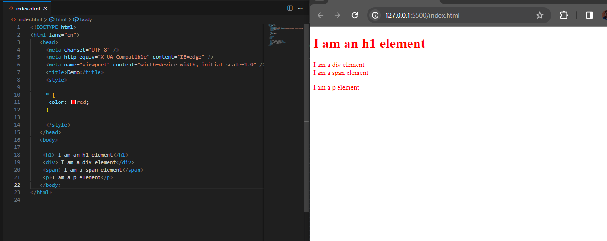

### 1.2 Element Selector

Selects all matching elements given a given element name.

Syntax: `elementname`

Example:

```css
/* Match all <h1> elements */
h1 {

}

/* Match all <input> elements */
input {

}
```

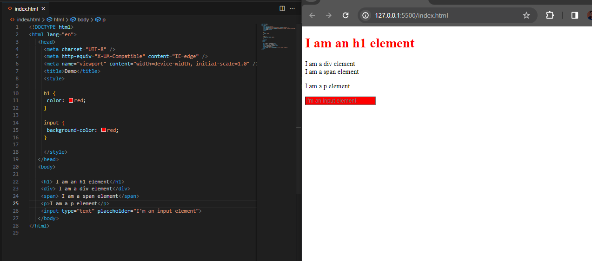

### 1.3 Class Selector

```html
// I have a class name
<h1 class="one">Hello CSS</h1>

// I have two class names: "one" and "two"
<div class="one two ">Hello CSS</div>
```

We can set the `class` attribute to an element. The value of class is a space-separated list of class names (classes) of the element. An element can have multiple class names.

The class selector selects all matching elements based on the value of the given class attribute. Class selectors start with `.` followed by the class name.

Syntax: `.classname`

Example:

```css
/* Match all elements containing the "one" class in the class attribute */
.one {
  
}
```
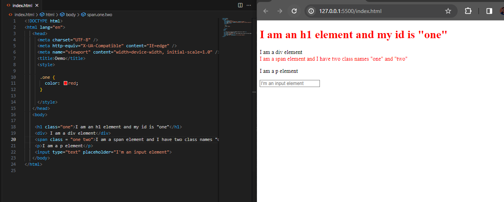

### 1.4 ID selector

```html
// My ID is "one"
<h1 id="one">Hello CSS</h1>

// My ID is "two"
<span id="two">Hello CSS</span>
```

Selects a matching element based on its id attribute. It should be noted that each ID attribute in a document should be unique. The id selector starts with `#` followed by the id value.

Syntax: `#idname`

Example:

```css
/* Match the element with id "one" */
#one {

}

/* Match the element with id "two" */
#two {
  
}
```

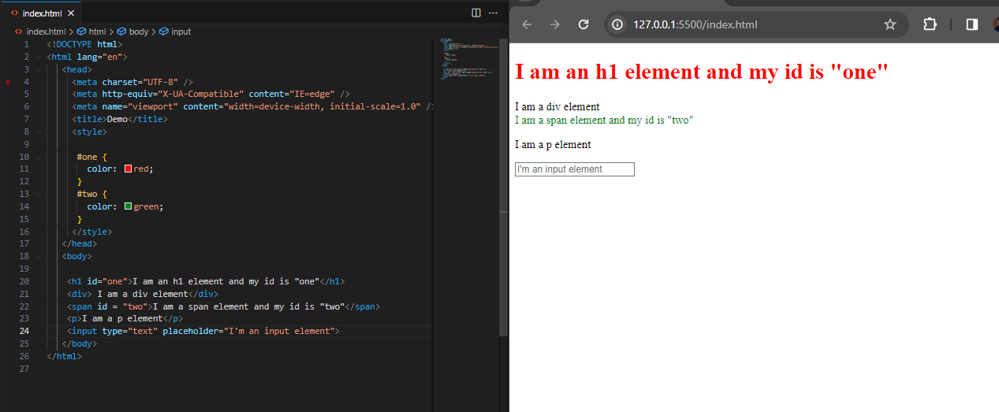

#### 1.5 Attribute Selector

Selects all matching elements according to the given attribute. Attribute selector, use `[ ]` to select elements with specified attributes.

Syntax: `[attr]`

Example:

```css
/* Match all elements with type="text" attribute */
[type="text"] {

}
```

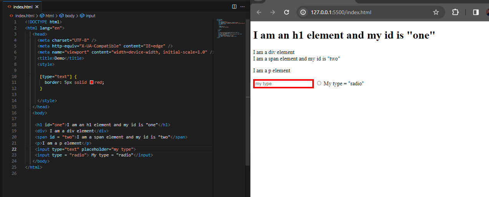

## 2. Group selector

### 2.1 Selector list

Selector lists are a way to combine different selectors together, often called union selectors or union combinators. Selector lists use a `,` separated list to group selectors.

Syntax: `A, B`

Example:

```css
/* Matches both <div> elements and <span> elements. */
div, span {

}
```

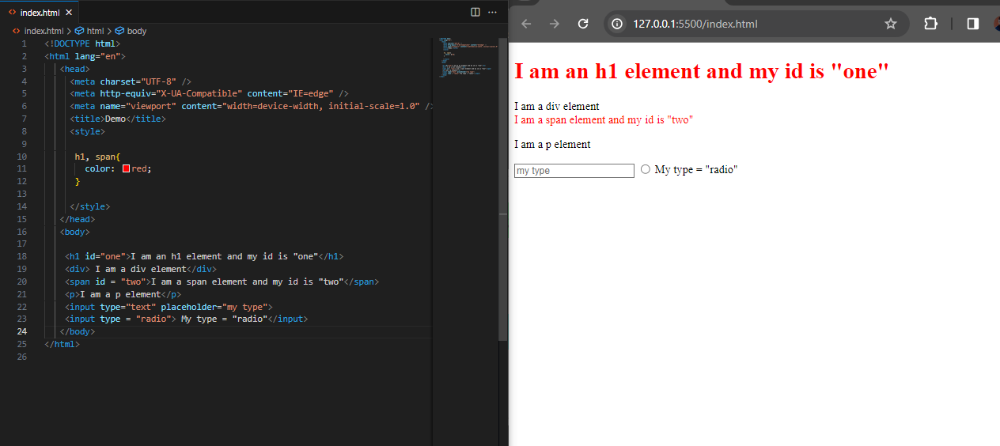

## 3. Combinator

### 3.1 Descendant combinator

Selects descendant nodes of the previous element.

Syntax: `A B`

Example:

```css
/* Matches all <span> elements within any <div> element. */
div span {

}
```

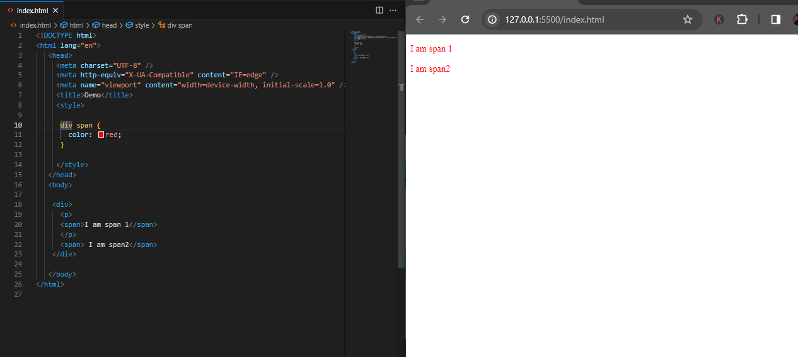

### 3.2 Direct descendant combinator

Selects nodes that are direct children of the previous element.

Syntax: `A > B`

Example:

```css
/* Matches all <li> elements nested directly within a <ul> element. */
ul > li {

}
```

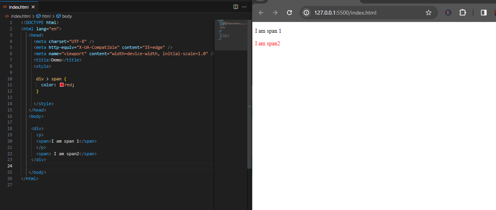

### 3.3 General sibling combiner

Selects sibling elements, that is, the subsequent node is anywhere after the previous node and shares the same parent node.

Syntax: `A ~ B`

Example:

```css
/* Matches all <span> elements after the <p> element under the same parent element. */
p ~ span {

}
```

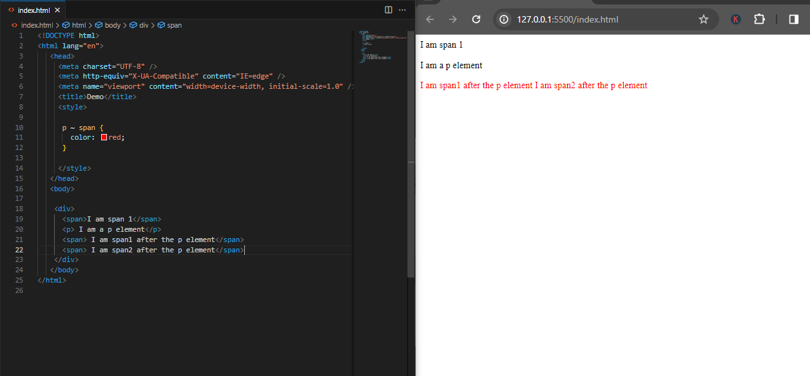

### 3.4 Next-to-sibling combinator

Select adjacent elements, that is, the next element immediately follows the previous one and shares the same parent node.

Syntax: `A + B`

Example:

```css
/* Matches all <span> elements immediately following a <p> element. */
p + span {

}
```

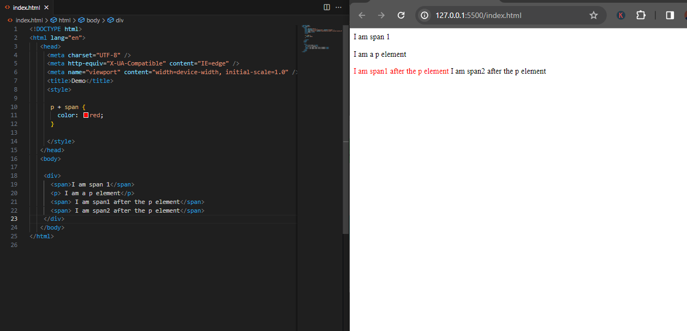

## 4. Pseudo selector

### 4.1 Pseudo classes

CSS pseudo-classes are keywords added to selectors that specify special states of the elements to be selected.

Example:

```css
/* Match selects the <input> element that has focus. */
input:focus {

}
```

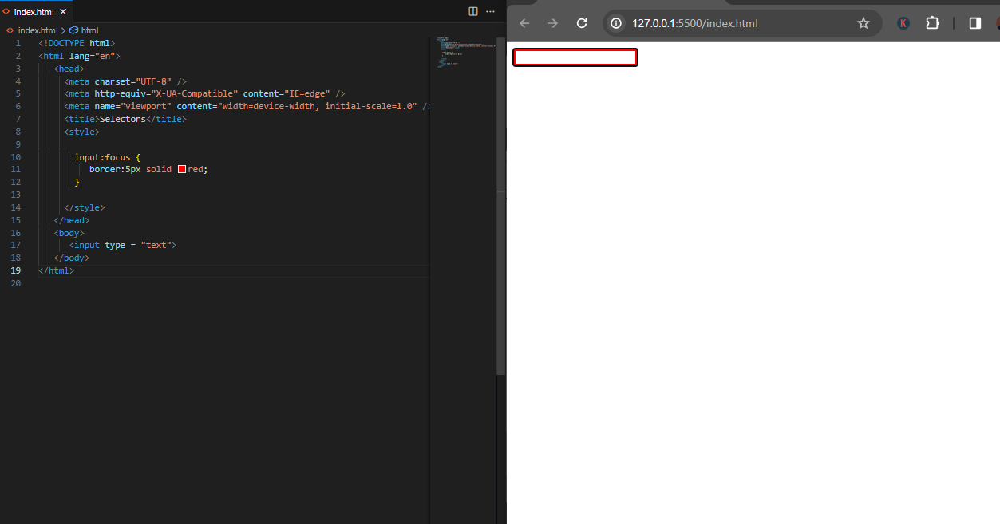

More [Detailed explanation of pseudo classes](https://developer.mozilla.org/zh-CN/docs/Web/CSS/Pseudo-classes)

### 4.2 Pseudo elements

A pseudo-element is a keyword appended to the end of a selector that allows you to modify the style of a specific part of the selected element.

Example:

```css
/* Matches the first line of all <p> elements. */
p::first-line {

}
```

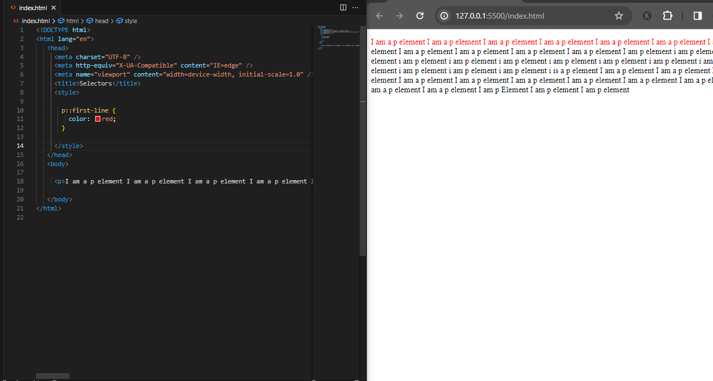

For more detailed explanation of pseudo elements, please read [MDN Tutorial](https://developer.mozilla.org/zh-CN/docs/Web/CSS/Pseudo-elements)

## Summary

In this lecture, we learned the very important CSS selectors. Mastering various selectors and being able to use them flexibly is the key to CSS programming!
