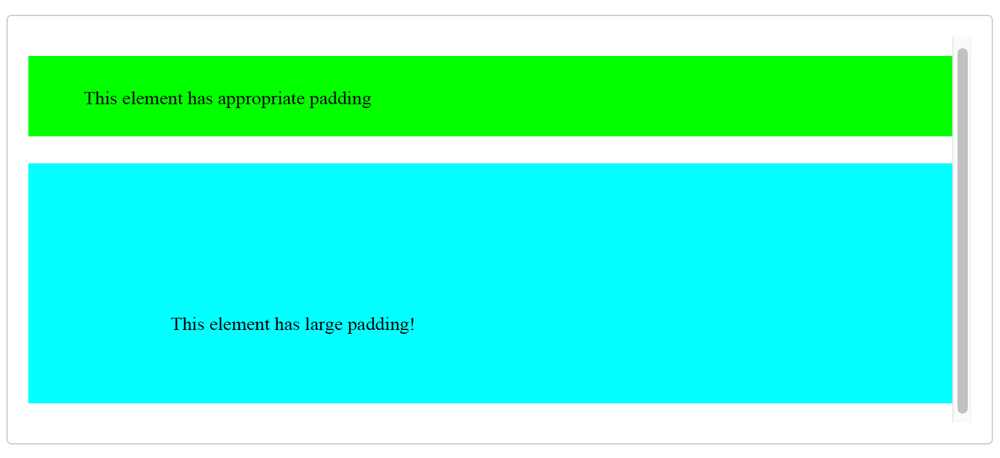
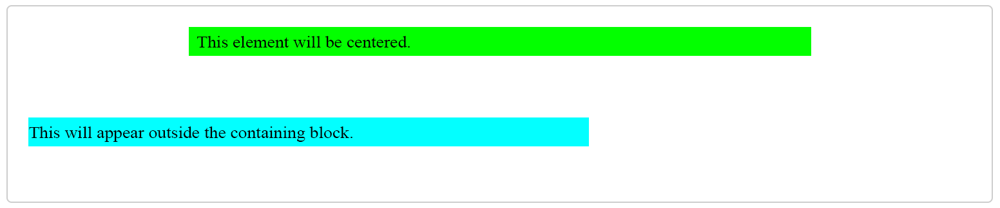
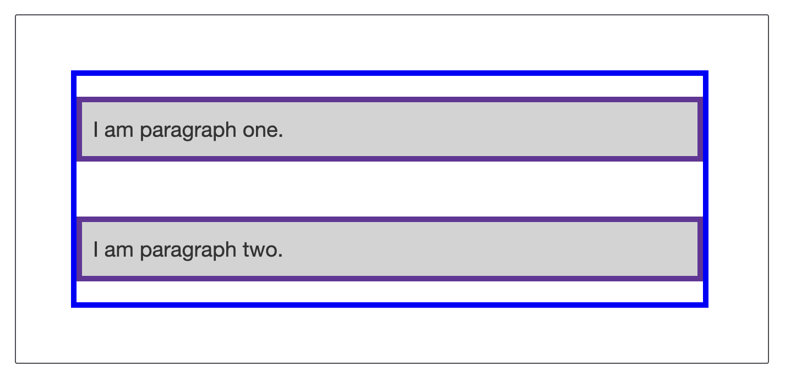
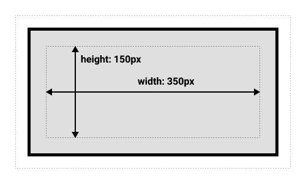
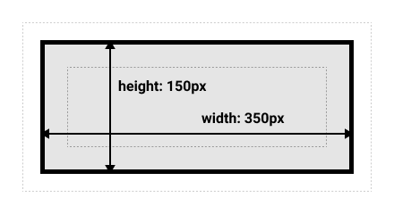

# WTF CSS Minimalist Tutorial: 4. Box Model

WTF CSS tutorial to help newcomers get started with CSS quickly.

**Twitter**: [@WTFAcademy_](https://twitter.com/WTFAcademy_) | [@0xAA_Science](https://twitter.com/0xAA_Science)

**WTF Academy Community:** [Official website wtf.academy](https://wtf.academy) | [WTF Solidity Tutorial](https://github.com/AmazingAng/WTFSolidity) | [discord](https: //discord.gg/5akcruXrsk) | [WeChat group application](https://docs.google.com/forms/d/e/1FAIpQLSe4KGT8Sh6sJ7hedQRuIYirOoZK_85miz3dw7vA1-YjodgJ-A/viewform?usp=sf_link)

All codes and tutorials are open source on github: [github.com/WTFAcademy/WTF-CSS](https://github.com/WTFAcademy/WTF-CSS)

---

In this lecture, we will introduce the CSS box model. In CSS, all elements are surrounded by "boxes". Understanding the basic principles of these "boxes" is the key to us using CSS to achieve accurate layout and handle element arrangement.

## CSS box model

The CSS box model is the foundation of CSS layout and describes the way elements take up space. A box model contains four main parts, from inside to outside: content, padding, border and margin.


### Content

The content area is the actual content seen on the page, including text, pictures, etc. We can set the width and height of the content area through the `width` and `height` properties.

```css
div {
     width: 200px;
     height: 100px;
}
```

### Padding

Padding is the space between the content area and the border. Padding is transparent, which means it is not covered by the background color or background image. We can use the `padding` attribute to set padding. Its value must be greater than or equal to 0.

```css
div {
     padding: 10px; /* The top, bottom, left and right padding are 10px */
}
```

You can also set the top, bottom, left and right padding separately:

```css
div {
     padding-top: 10px;
     padding-right: 20px;
     padding-bottom: 10px;
     padding-left: 20px;
}
```

#### grammar

```css
/*Apply to all edges */
padding: 1em;

/* Top Bottom | Left Right */
padding: 5% 10%;

/* Top | Left Right | Bottom */
padding: 1em 2em 2em;

/* Top | Right | Bottom | Left */
padding: 5px 1em 0 2em;

/* Global value */
padding: inherit;
padding: initial;
padding: unset;
```

The padding attribute accepts 1~4 values. Each value can be `<length>` or `<percentage>`. The value cannot be negative.

- When only one value is specified, that value is applied uniformly to the padding on all four sides.
- When two values ​​are specified, the first value applies to top and bottom padding, and the second value applies to left and right margins.
- When three values ​​are specified, the first value applies to the top edge, the second value applies to the right and left edges, and the third value applies to the bottom padding.
- When four values ​​are specified, they are used as top, right, bottom, and left padding in order (clockwise).

#### Possible values

- `length` uses a fixed value as padding.
- `percentage` uses a percentage value as padding relative to the width of the containing block.

#### Example

HTML

```html
<h4>This element has appropriate padding. </h4>

<h3>The padding of this element is huge! </h3>
```

CSS

```css
h4 {
   background-color: lime;
   padding: 20px 50px;
}

h3 {
   background-color: cyan;
   padding: 110px 50px 50px 110px;
}
```




### Border

The border wraps the padding and content area. The border is visible and we can set its width, style and color. Borders can be set using the `border` property.

```css
div {
     border-width: 1px; /* border width */
     border-style: solid; /* border style */
     border-color: #000; /* border color */
}
```

It is also possible to combine these three properties into a single `border` property:

```css
div {
     border: 1px solid #000;
}
```

### Margin

Margins are the distance from the border to other elements. Margins are transparent. We can use the `margin` attribute to set margins.

```css
div {
     margin: 10px; /* The top, bottom, left and right margins are 10px */
}
```

You can also set the top, bottom, left and right margins separately:

```css
div {
     margin-top: 10px;
     margin-right: 20px;
     margin-bottom: 10px;
     margin-left: 20px;
}
```

#### grammar:

```css
/*Apply to all edges */
margin: 1em;
margin: -3px;

/* Top Bottom | Left Right */
margin: 5% auto;

/* Top | Left Right | Bottom */
margin: 1em auto 2em;

/* Top | Right | Bottom | Left */
margin: 2px 1em 0 auto;

/* Global value */
margin: inherit;
margin: initial;
margin: unset;
```

The margin property accepts 1~4 values. Each value can be `<length>`, `<percentage>`, or `auto`. When the value is negative, the element will be closer to the adjacent element than it originally was.

- When only one value is specified, the value is applied uniformly to the margins on all four sides.
- When two values ​​are specified, the first value applies to the top and bottom margins, and the second value applies to the left and right margins.
- When three values ​​are specified, the first value applies to the top, the second to the right and left, and the third to the bottom margin.
- When four values ​​are specified, they are used as the top, right, bottom, and left margins in order (clockwise).

Possible values:

- `length` uses a fixed value as the margin.
- `percentage` uses a percentage value as the margin relative to the width of the containing block.
- `auto` lets the browser choose an appropriate margin. Sometimes, in some special cases, this value can center the element.

#### Example

HTML

```html
<div class="center">This element will be centered. </div>

<div class="outside">This element will appear outside the containing block. </div>
```

CSS

```css
.center {
   margin: auto;
   background: lime;
   width: 66%;
}

.outside {
   margin: 3rem 0 0 -3rem;
   background: cyan;
   width: 66%;
}
```



#### Margin folding problem

One key to understanding margins is the concept of margin collapse. If you have two elements with touching margins, those margins will be combined into a single margin, which is the size of the largest single margin.

In the example below, we have two paragraphs. The page margin-bottom of the top paragraph is 50px. The margin-top of the second paragraph is 30px. Because of the concept of margin collapse, the actual margin between boxes is 50px, not the sum of both margins. As shown below:



There are many rules that dictate when margins will and won't collapse. For more information, see Margin Overlapping. Now the first thing to remember is that margins are going to collapse this thing. If you're using margins to create space and aren't getting the effect you want, this may be the reason.

More [`margin` usage](https://developer.mozilla.org/zh-CN/docs/Web/CSS/margin).

## Standard box model and alternative box model

The CSS box model is a fundamental concept in web design that is used to define and control the size and space of elements. However, the early Internet Explorer browser and modern standard browsers had different understandings of the box model, which led to the emergence of the standard box model and the IE box model.

### Standard box model
In the standard CSS box model, the `width` and `height` properties of an element only include the width and height of the content (content), not the border (border) and padding (padding).

For example, if you set the `width` of an element to 350px, the `padding` to 25px, and the `border` to 5px, then the actual width of the space occupied by this element on the page is 410px (350px content width + 2 * 25px left and right padding + left and right borders of 2 * 5px).

```css
div {
   width: 350px;
   height: 150px;
   margin: 25px;
   padding: 25px;
   border: 5px solid black;
}
```




### Alternative (IE) box model

In the alternative box model (also known as the IE box model or the weird box model), the `width` and `height` properties of the element include content, border and padding.

Continuing the above example, if you set the `width` of an element in the IE box model to 350px, the `padding` to 25px, and the `border` to 5px, then the actual width of the space occupied by this element on the page is still 350px. This width includes content, borders, and padding.



### Change box model

To resolve this difference and allow developers to freely choose which box model to use, CSS introduced the `box-sizing` property (browsers will use the standard model by default).

```css
/* Use standard box model */
box-sizing: content-box;

/* Use IE box model */
box-sizing: border-box;
```

## Summary

That's most of what you need to know about the box model. You will come back to this section if you later find yourself still confused about the layout of the box model.
