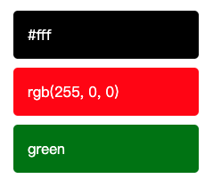
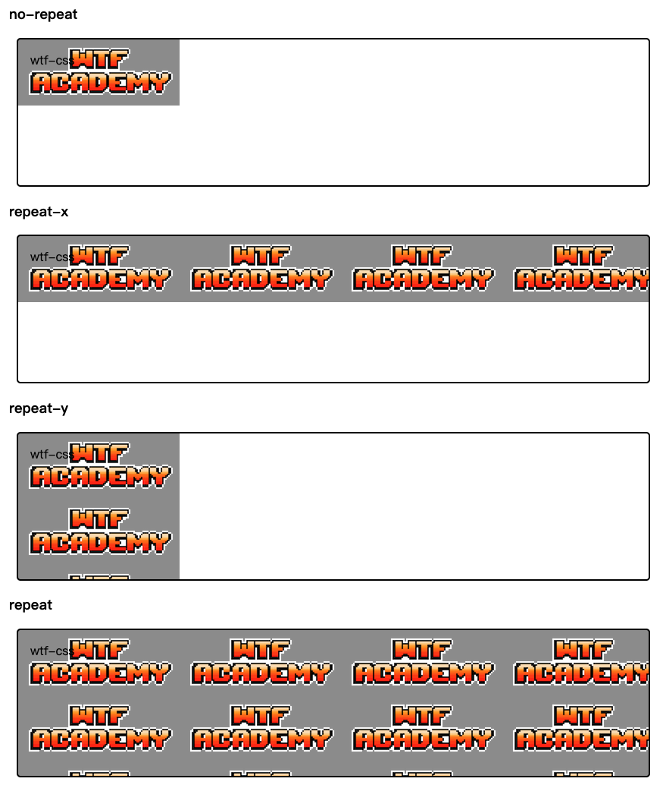
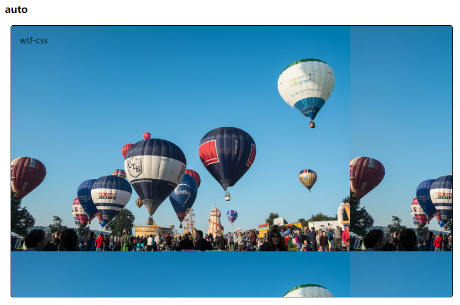
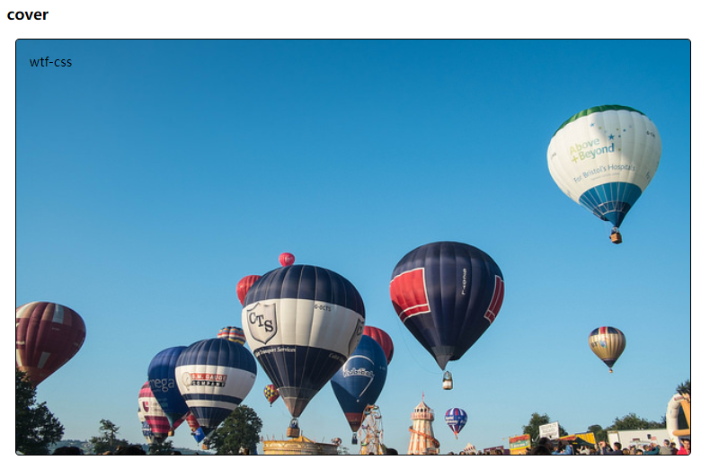
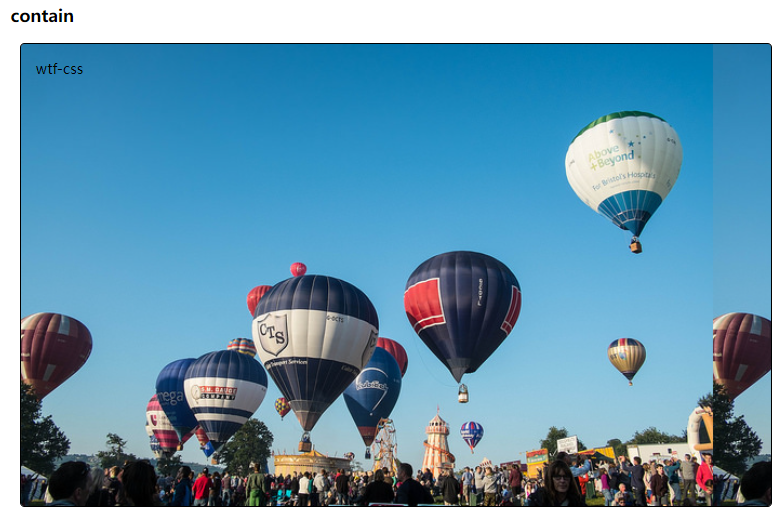
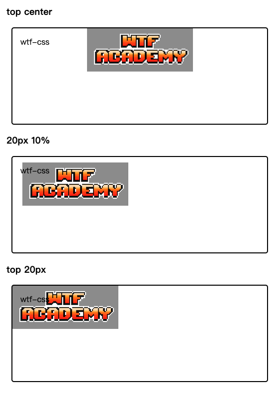
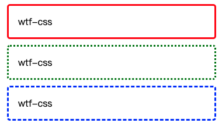
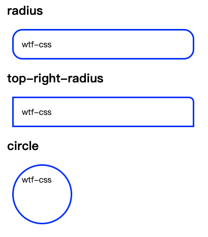

# WTF CSS Minimalist Tutorial: 5. Background and Border

WTF CSS tutorial helps newcomers get started with CSS quickly.

**Twitter**: [@WTFAcademy_](https://twitter.com/WTFAcademy_) | [@0xAA_Science](https://twitter.com/0xAA_Science)

**WTF Academy Community:** [Official website wtf.academy](https://wtf.academy) | [WTF Solidity Tutorial](https://github.com/AmazingAng/WTFSolidity) | [discord](https: //discord.gg/5akcruXrsk) | [WeChat group application](https://docs.google.com/forms/d/e/1FAIpQLSe4KGT8Sh6sJ7hedQRuIYirOoZK_85miz3dw7vA1-YjodgJ-A/viewform?usp=sf_link)

All codes and tutorials are open source on github: [github.com/WTFAcademy/WTF-CSS](https://github.com/WTFAcademy/WTF-CSS)

---

In this lecture, we introduce two common properties of CSS: background ([background](https://developer.mozilla.org/zh-CN/docs/Web/CSS/background)) and border ([border](https ://developer.mozilla.org/zh-CN/docs/Web/CSS/border)), by mastering these two properties, you can build vivid and rich interface effects.

## background

### background color

The [background-color](https://developer.mozilla.org/zh-CN/docs/Web/CSS/background-color) attribute is used to define the background color of the element and accepts valid color values.
The background color extends to the element's content and padding.
Color values ​​are usually defined as follows:

1. Hexadecimal, for example: "#fff"
2. RGB, such as "rgb(255, 0, 0)"
3. Color name, such as "black"

Code example:

```css
div {
   background-color: #fff;
   background-color: rgb(255, 0, 0);
   background-color: green;
}
```



### Background image

The [background-image](https://developer.mozilla.org/zh-CN/docs/Web/CSS/background-color) attribute is used to define the background image of the element. By default, the image is displayed tiled and repeated, covering elements background.

Code example: (Please view the html file for the complete code)

```css
.bgi {
   background-image: url(./img/wtflogo.png);
}
```

### Background tiling

The [background-repeat](https://developer.mozilla.org/zh-CN/docs/Web/CSS/background-repeat) attribute is used to control the tiling behavior of images. Commonly used attribute values ​​include the following:

+ repeat: The image repeats horizontally and vertically (default)
+ repeat-x: image repeats horizontally
+ repeat-y: image repeats vertically
+ no-repeat: image is tiled only once

Code example: (Please view the html file for the complete code)

```css
.bgr1 {
   background-repeat: no-repeat;
}

.bgr2 {
   background-repeat: repeat-x;
}

.bgr3 {
   background-repeat: repeat-y;
}

.bgr4 {
   background-repeat: repeat;
}
```


### Background size

[background-size](https://developer.mozilla.org/zh-CN/docs/Web/CSS/background-size) , which can set the length or percentage value to make the background size fit the element being filled with the background Size, commonly used attribute values ​​include the following:

+ Specify length or percentage value: render according to specified size
+ auto: scale the image as the background, the image may be displayed repeatedly
+ cover: The image expands large enough so that it completely covers the entire area while maintaining its aspect ratio, the image may be cropped
+ contain: The image is scaled as much as possible and maintains the aspect ratio to fit the entire background area. Zooming will cause the background to appear partially blank, and the blank areas will display the background color set by background-color.

Code example: (Please view the html file for the complete code)

```html
<head>
   <style>
     .bgs > div {
       width: 50em;
       height: 30em;
       border: 2px solid #000;
       background-image: url(./img/balloons.jpeg);
     }

     .bgs1 {
       background-size: auto;
     }

     .bgs2 {
       background-size: cover;
     }

     .bgs3 {
       background-size: contain;
     }
   </style>
</head>
<body>
   <div class="wrapper">
     <div class="bgs">
       <div class="bgs1">wtf-css</div>
       <div class="bgs2">wtf-css</div>
       <div class="bgs3">wtf-css</div>
     </div>
   </div>
</body>
```
0. Full display of original background image

    
1. auto: Use the proportion of the image as the background, and the image will be displayed in tiles repeatedly.

    
2. cover: The image is expanded to cover the entire area, maintaining proportions. The image may not be fully displayed and may partially overflow.

    
3. contain: The image is scaled as much as possible and maintains the aspect ratio, so that the height or width completely fits the entire background area. Scaling will cause some blank areas in the background to appear. At this time, the blank areas of the container will display the background color set by background-color.
    

### Background positioning

[background-position](https://developer.mozilla.org/zh-CN/docs/Web/CSS/background-position) is used to set the starting position of the background image. The top left corner of the box is (0,0) and the box is positioned along the horizontal (x) and vertical (y) axes. Common setting methods are as follows:

1. Any length unit can be used. If the second position (i.e. Y-axis direction) is not declared, the default is 50% (if neither position is set, the default is 0% 0%)
2. Position keywords (left/right/top/bottom/center), which can be used singly or in pairs (the second keyword defaults to center if not declared)
3. Mix it up

Code example: (Please view the html file for the complete code)

```css
   background-position: top center;
   background-position: 20px 10%;
   background-position: top 20px;
```



### Background attachment

The [background-attachment](https://developer.mozilla.org/zh-CN/docs/Web/CSS/background-attachment) attribute is used to set whether the background image is fixed or scrolls with the rest of the page.
Common attribute values ​​are as follows:

+ scroll: The background image moves as the web page scrolls (default)
+ fixed: background image will not move as the web page scrolls
+ local: The background image will scroll as the element content scrolls.

Code example: (Please view the html file for the complete code)

```css
.bga1 {
   background-attachment: scroll;
}

.bga2 {
   background-attachment: fixed;
}

.bga3 {
   background-attachment: local;
}
```

For specific effects, it is recommended to run the html file to visually compare the differences.

### Background abbreviation

The background attribute can implement abbreviation, which is much more concise than the declaration of a single sub-property, and can save a lot of code. There are many background sub-attributes, so how to arrange the order in which the sub-attributes are written is also a problem. CSS2 recommends a sub-attribute concatenation order rule:

```css
background: color image repeat attachment position/size
```

## border

[border](https://developer.mozilla.org/zh-CN/docs/Web/CSS/border) Borders can be set on all four sides of an element. You can also split the border into border-top, border-bottom, border-left, and border-right, and set a separate side.

Border consists of three attributes: width, style, and color. Width represents the border width, style represents the border style (can be solid line, dot, dotted line, etc.), and color represents the border color.

The specific syntax is as follows:

```css
.solid {
   border: 3px solid red;
   // Equivalent to
   border-width: 3px;
   border-style: solid;
   border-color: red;
}

.dotted {
   border: 3px dotted green;
}

.dashed {
   border: 3px dashed blue;
}
```



### Rounded corners

The [border-radius](https://developer.mozilla.org/zh-CN/docs/Web/CSS/border-radius) property is used to set the rounded corners of the box. You can use two lengths or percentages as values, the first value defines the horizontal radius and the second value defines the vertical radius. usually

```css
.radius {
   border: 3px solid blue;
   border-radius: 20px;
}

.top-right-radius {
   border: 3px solid blue;
   border-top-right-radius: 10px;
}

.circle {
   border: 3px solid blue;
   border-radius: 50%;
}
```



## Summary

In this lecture, we introduced the common properties and usage of backgrounds and borders. Understanding and skillfully using these properties can help you create richer and more interesting web designs.
