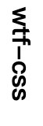
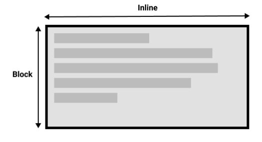
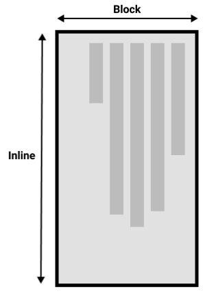
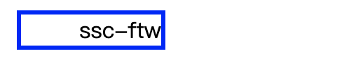
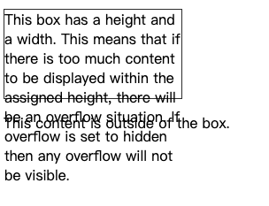
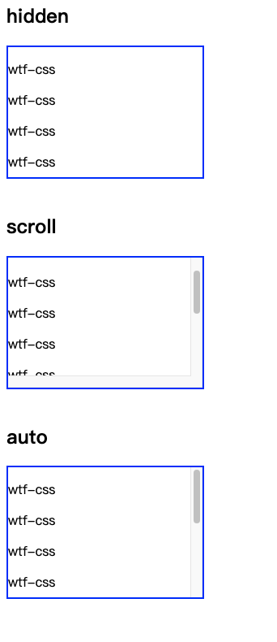

# WTF CSS minimalist tutorial: 6. Text direction and content overflow

WTF CSS tutorial helps newcomers get started with CSS quickly.

**Twitter**: [@WTFAcademy_](https://twitter.com/WTFAcademy_) | [@0xAA_Science](https://twitter.com/0xAA_Science)

**WTF Academy Community:** [Official website wtf.academy](https://wtf.academy) | [WTF Solidity Tutorial](https://github.com/AmazingAng/WTFSolidity) | [discord](https: //discord.gg/5akcruXrsk) | [WeChat group application](https://docs.google.com/forms/d/e/1FAIpQLSe4KGT8Sh6sJ7hedQRuIYirOoZK_85miz3dw7vA1-YjodgJ-A/viewform?usp=sf_link)

All codes and tutorials are open source on github: [github.com/WTFAcademy/WTF-CSS](https://github.com/WTFAcademy/WTF-CSS)

---

In this lecture, we introduce CSS [text direction](https://developer.mozilla.org/zh-CN/docs/Learn/CSS/Building_blocks/Handling_different_text_directions) and [content overflow](https://developer.mozilla .org/zh-CN/docs/Learn/CSS/Building_blocks/Overflowing_content) two modules. By studying these two modules, you can deepen your understanding of page layout.

## Handle text in different directions
### Writing mode
The writing mode in CSS refers to whether the text is arranged horizontally or vertically. Use [writing-mode](https://developer.mozilla.org/zh-CN/docs/Web/CSS/writing-mode) to set it

The three values ​​of writing-mode are:
+ horizontal-tb: Blocks flow from top to bottom. The corresponding text orientation is landscape.
+ vertical-rl: Blocks flow from right to left. The corresponding text orientation is portrait.
+ vertical-lr: Blocks flow from left to right. The corresponding text orientation is portrait.

Code example:
``` html
<style>
.writing-mode {
   writing-mode: vertical-rl;
}
</style>

<h1 class="writing-mode">wtf-css</h1>
```

Show results:



Block-level display and inline display are closely related to the writing mode of text. When switching writing modes, we are also changing the direction of block and inline text.

For example, the direction of blocks in horizontal-tb writing mode is horizontal from top to bottom. The direction of the block in vertical-rl writing mode is vertical from right to left.

Two dimensions in horizontal writing mode



Two dimensions in portrait writing mode



### Text direction
In addition to writing mode, we can also set text direction. Some languages ​​(such as Arabic) are written horizontally, but from right to left. Text direction can be set using the [direction](https://developer.mozilla.org/zh-CN/docs/Web/CSS/direction) property.

Common attribute values ​​​​of direction are as follows:
+ ltr: default, left to right, from left to right
+ rtl: right to left, from right to left

``` html
<head>
   <title>Layout</title>
   <style>
     .direction {
       margin: 10px;
       width: 100px;
       border: 3px solid blue;
       direction:rtl;
       unicode-bidi: bidi-override;
     }
   </style>
</head>
<body>
   <div class="direction">
     wtf-css
   </div>
</body>
```
The unicode-bidi attribute is used to set or return whether the text has been rewritten in order to support multiple languages ​​​​in the same document. It is generally used together with the direction attribute to determine the text direction. The bidi-override attribute value indicates the creation of an additional embedding layer, reordering strictly according to the value of the direction attribute.

The effect is as follows:



## Overflow content
We constrain the size of the box by setting the width and height. However, during development, we often encounter the phenomenon that the box cannot accommodate the content due to too much content, causing the content to overflow. In this case, the display effect can be specified by setting the overflow attribute.

Common examples of content overflow:

``` html
<div class="box">This box has a height and a width. This means that if there is too much content to be displayed within the assigned height, there will be an overflow situation. If overflow is set to hidden then any overflow will not be visible.</div>

<p>This content is outside of the box.</p>
```

``` css
.box {
   border: 1px solid #333333;
   width: 200px;
   height: 100px;
   overflow: hidden;
}
```
The effect is as follows:




### overflow
The [overflow](https://developer.mozilla.org/zh-CN/docs/Web/CSS/overflow) attribute is a way to control the overflow of elements. The default value of overflow is visible, so when the content overflows, we default case you can see them.
+ visible: default value. Content will not be trimmed and will be rendered outside the element box
+ hidden: content is trimmed, the rest of the content is invisible
+ scroll: content is trimmed, the browser will display scroll bars
+ auto: If the content is trimmed, the browser will show scroll bars

Note: the overflow attribute only works on block elements with a specified height

Examples are as follows:
``` css
.overflow > div {
   height: 10em;
   width: 15em;
   border: 2px solid blue;
}

.hidden {
   overflow: hidden;
}

.scroll {
   overflow: scroll;
}

.auto {
   overflow: auto;
}
```

``` html
<h2>hidden</h2>
<div class="hidden">
   <p>wtf-css</p>
   ...
</div>
<br>

<h2>scroll</h2>
<div class="scroll">
   <p>wtf-css</p>
   ...
</div>
<br>

<h2>auto</h2>
<div class="auto">
   <p>wtf-css</p>
   ...
</div>
```



### Overflow creates block-level context
There is a concept in CSS called Block Formatting Context (BFC). When using scroll or auto, you establish a block-level layout context. At this time, things outside the container cannot be mixed into the container, and nothing can protrude from the box and enter the surrounding layout. With the scrolling action activated, all the content in your box will be included and will not cover other objects on the page.


## Summary
In this lecture, we introduced the common properties and usage of handling text direction and content overflow. For in-depth understanding, you can read the relevant linked documents in the article.

