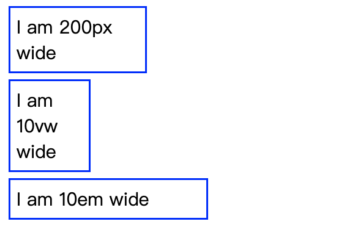
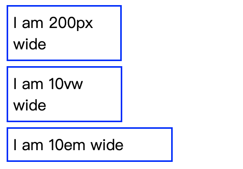
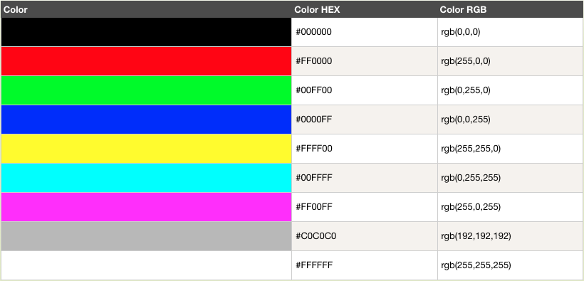
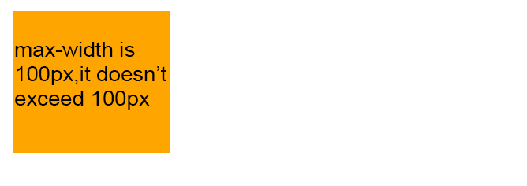
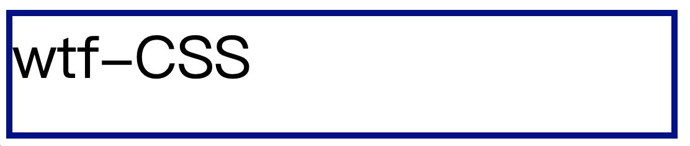

# WTF CSS Minimalist Tutorial: 7. Values, Units and Sizes

WTF CSS tutorial helps newcomers get started with CSS quickly.

**Twitter**: [@WTFAcademy_](https://twitter.com/WTFAcademy_) | [@0xAA_Science](https://twitter.com/0xAA_Science)

**WTF Academy Community:** [Official website wtf.academy](https://wtf.academy) | [WTF Solidity Tutorial](https://github.com/AmazingAng/WTFSolidity) | [discord](https: //discord.gg/5akcruXrsk) | [WeChat group application](https://docs.google.com/forms/d/e/1FAIpQLSe4KGT8Sh6sJ7hedQRuIYirOoZK_85miz3dw7vA1-YjodgJ-A/viewform?usp=sf_link)

All codes and tutorials are open source on github: [github.com/WTFAcademy/WTF-CSS](https://github.com/WTFAcademy/WTF-CSS)

---

In this lecture, we introduce the commonly used CSS [Values ​​and Units] (https://developer.mozilla.org/zh-CN/docs/Learn/CSS/Building_blocks/Values_and_units), and master [Resize] (https:/ /developer.mozilla.org/zh-CN/docs/Learn/CSS/Building_blocks/Sizing_items_in_CSS) related knowledge content to help us master more practical experience and skills in style development.

## Numbers, lengths and percentages
### Numeric type
There are multiple numeric types in CSS
+ integer：integer
+ number: decimal
+ dimension: consists of number and an additional unit, such as 10px, 5em, 4s
+ percentage: represents a portion of some other value, such as 50%; a percentage value is relative to another quantity, such as the length of an element relative to the length of its parent element

### Length unit
The two most commonly used length units in style development are px and %. However, as the diversity of terminal device resolutions increases, CSS has derived more and more length units. Flexible combination of these length units can provide layout solutions for web pages. More possibilities.

Among them, absolute units include:
1. px: pixel
2. pt: point, 1 pt = 1 / 72 in
3. pc: pie, 1 pc = 12 pt
4. mm: millimeter
5. cm: centimeter
6. in: inch, 1 in = 96px = 2.54cm

Relative units include
1. %: Percentage, relative to parent node size
2. em: width of M, relative to the current node font
3. rem: width of M, relative to root node font
4. ch: width of 0, relative to the current node font
5. ex: width of x, relative to the current node font
6. vw: 1% window width, relative to the window
7. vh: 1% window height, relative to the window
8. vmin: the smallest of vw/vh, relative window
9. vmax: the largest vw/vh, relative to the window

### Screen Resolution
Screen resolution refers to the number of pixels in the horizontal and vertical directions, and the unit is px.

When the screen size is the same, the lower the screen resolution, the fewer pixels, and the size of a single pixel is larger. The higher the screen resolution, the more pixels, and the size of a single pixel is smaller.

Screen resolution is the number of pixels displayed on the screen. A resolution of 1920×1080 means that the horizontal direction contains 1920 pixels and the vertical direction contains 1080 pixels. When the screen size is the same, the higher the screen resolution, the more delicate the display effect.

Whether it is an absolute unit or a relative unit, it will eventually be converted into px and displayed on the screen, so px shall prevail during design and development.

### The difference between em and rem
em and rem are unique length units in mobile layout. The full name of rem is root em, which refers to the length unit relative to the root node as a reference.
+ em: Current node font width, to be precise, it is the width of an M
+ rem: Default font width, to be precise, it is the width of an M

### Window scale unit
Four viewport-related length units have been added to CSS3. Currently, browsers have good compatibility with these length units, and this is also the most recommended length unit to be used in scaling solutions in the future.
+ 1vw: 1% window width
+ 1vh: 1% window height
+ 1vmin: The smallest of 1% window width and 1% window height
+ 1vmax: The largest of 1% window width and 1% window height

The window width and height correspond to window.innerWdith and window.innerHeight respectively in JS. Using the window scale unit, the mobile scaling solution can be solved with one line of code.

The code example is as follows:
``` html
<head>
   <style>
     .wrapper {
       font-size: 1em;
     }
     .px {
       width: 200px;
     }
     .vw {
       width: 10vw;
     }
     .em {
       width: 10em;
     }
   </style>
</head>

<body>
   <div class="wrapper">
     <div class="box px">I am 200px wide</div>
     <div class="box vw">I am 10vw wide</div>
     <div class="box em">I am 10em wide</div>
   </div>
</body>
```

The display effect is as follows:


If you resize the viewport, the size of the vw units will also change


Similarly, changing the font size of the node will also change the size of the em unit. You can try it yourself.

### color
Color is defined in CSS [color](https://developer.mozilla.org/zh-CN/docs/Web/CSS/color_value), using hexadecimal (hex) notation as the color values ​​of red, green, and blue combine. Can be a minimum value of 0 (hex 00) to a maximum value of 255 (hex FF)

3 double-digit hexadecimal values, starting with the # symbol.




### picture
The [image](https://developer.mozilla.org/zh-CN/docs/Web/CSS/image) data type is used wherever an image is a valid value. It can be an actual image file pointed to via the url() function, or it can be a gradient.

``` html
<head>
   <style>
     .image {
       background-image: url(./img/wtflogo.png);
     }

     .gradient {
       background-image: linear-gradient(90deg, rgba(119,0,255,1) 39%, rgba(0,212,255,1) 100%);
     }
</head>

<body>
   <div class="box image"></div>
   <div class="box gradient"></div>
</body>
```
The display effect is as follows:


## Location
[position](https://developer.mozilla.org/zh-CN/docs/Web/CSS/position_value) represents a set of 2D coordinates used to position an element. You can use keywords (such as top, left, bottom, right, and center ) align the element to a specific bounds of the 2D box, and the length representing the offset from the top and left edges of the box.

A typical position value consists of two values ​​- the first value sets the position horizontally, and the second value sets the position vertically. If you specify a value for only one axis, the other axis will default to center.

``` html
<head>
   <style>
     .position {
       height: 300px;
       width: 400px;
       border: 3px solid blue;
       background-image: url(./img/wtflogo.png);
       background-repeat: no-repeat;
       background-position: 40px right;
     }
   </style>
</head>

<body>
   <div class="position"></div>
</body>
```

The display effect is as follows:


## Function
In programming, a function is a reusable piece of code that can be run multiple times to complete repetitive tasks.

CSS functions refer to complex types or component value types that call special processing. Adds a more powerful embellishment to monotonous property declarations. Its syntax is also very simple, in the form of function (params), which is the same as JS function call.

Commonly used functions in development include rgb() used in the color part, and url() used to return the value of the image from a file.

Here is a commonly used calculation function calc(). When the value cannot be defined when writing CSS in the project, and the browser needs to calculate it at runtime, you can use calc() to dynamically calculate the unit, value, length, angle, time and percentage. can be used as parameters.

In single-page applications, the appearance and hiding of scroll bars may cause left and right jitters when the web page jumps to the route. In this case, clac() can be used to solve the problem.
```css
.elem {
padding-right: calc(100vw - 100%);
}
```

100vw is the window width, 100% is the content width, then 100vw - 100% is the scroll bar width. Declaring padding-right is used to retain the position where the scroll bar appears, so that the web page will not shake whether the scroll bar appears or not.


## adjust size
### min- and max-size
In CSS, you can use max-width, max-height, min-width, and min-height to set the maximum or minimum size for an element.
During development, if you want a box to have at least a certain height or width, you can set the min-height attribute. The box will always remain greater than the minimum height, but if there is more content than the box can accommodate in the minimum height state, The more content there is, the bigger the box will be.

Code example: For example, set the max-width attribute, which is used to set the maximum width of an element.
``` html
<head>
   <title>Layout</title>
   <style>
     .max-width {
       max-width:100px;
     background-color: orange;
     }
   </style>
</head>

<body>
   <p class="max-width">
     max-width is 100px, the maximum width does not exceed 100px
   </p>
</body>
```



### Viewport unit
Viewport refers to the part of the page seen in the browser. There are measurement units related to viewport size in CSS, namely the vw unit, which means the width of the viewport, and the vh unit, which means the height of the viewport. Using these units allows you to have something that changes size depending on the user's viewport.

1vh is equal to 1% of the viewport height, and 1vw is 1% of the viewport width. You can use these units to constrain the size of the box, as well as the size of the text.


``` html
<head>
   <style>
     .viewport {
       border: 5px solid darkblue;
       width: 50vw;
       height: 20vh;
       font-size: 10vh;
     }
   </style>
</head>

<body>
   <div class="viewport">
     wtf-CSS
   </div>
</body>
```

The effect is shown as follows: Drag the window size by yourself, and you can find that the box width, height and font size will change accordingly.



## Summary
In this lecture, we introduced the values, units and resizing methods commonly used in style development. For more specific study and research, you can read the linked document for in-depth understanding.
