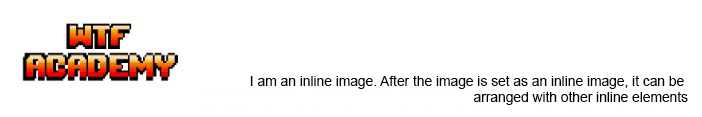

# WTF CSS minimalist tutorial: 8. Special elements

WTF CSS tutorial helps newcomers get started with CSS quickly.

**Twitter**: [@WTFAcademy_](https://twitter.com/WTFAcademy_) | [@0xAA_Science](https://twitter.com/0xAA_Science)

**WTF Academy Community:** [Official website wtf.academy](https://wtf.academy) | [WTF Solidity Tutorial](https://github.com/AmazingAng/WTFSolidity) | [discord](https: //discord.gg/5akcruXrsk) | [WeChat group application](https://docs.google.com/forms/d/e/1FAIpQLSe4KGT8Sh6sJ7hedQRuIYirOoZK_85miz3dw7vA1-YjodgJ-A/viewform?usp=sf_link)

All codes and tutorials are open source on github: [github.com/WTFAcademy/WTF-CSS](https://github.com/WTFAcademy/WTF-CSS)

---

In this lecture, we introduce some special elements in CSS, including images, media, forms, and tables.

## picture
Pictures are a very important media type in web pages. Proper use of pictures can make web pages colorful and vivid, and are no longer limited to cold text.

### Insert picture

```html

```

```css
img {
   display: block; //Set the current image as a block-level element
   width: 100%; //Set the width attribute of the current image to 100% (relative to the parent whose positioning is not fixed recently, you can move to WTF CSS 12 for viewing related positioning)
   height: 1016px; //Set the current image height to 1016 pixels (px)
}
```


### Set the image as an inline element


```css
img {
   width: 200px;
   height: 100px;
}
```


The img element is an inline element by default, and has a `5px` margin by default. If necessary, you can specify the img as a block-level element, an inline element, or others through the `display` attribute.

### Picture translucent/transparent
```css
img {
   width: 200px;
   height: 100px;
   Opacity: 0.5; // Set the transparency of the image through the opacity attribute
}
```

```css
img {
   width: 200px;
   height: 100px;
   Opacity: 0; // Use opacity: 0; to set the image to be fully transparent
}
```


### Picture location
#### Pictures are block-level elements:
```css
img {
   margin: 0 auto;
   display: block;
   width: 200px;
   height: 100px;
}
```


#### The picture is an inline element:
```css
div {
   text-align: center;
}
img {
   width: 200px;
   height: 100px;
}
```


### Rounded corner pictures
Create a circular image using the `border-radius` property:

#### Rounded corner pictures
```css
img {
   border-radius: 8px;
}
```

#### Circle picture
```css
img {
   border-radius: 50%;
}
```


### Pictures with shadow
Use the `box-shadow` property to create a shadowed image:
```css
img {
   box-shadow: 0 4px 8px 0 rgba(0, 0, 0, 0.2), 0 6px 20px 0 rgba(0, 0, 0, 0.19);
}
```


## Media
Common media on websites can include `video` (video) and `audio` (audio).

### video
```html
<video src="xxx" controls></video>
```

```css
video {
   display: block;
   width: 100%;
}
```
Common css writing methods for videos are similar to pictures. The different parts are in the video control bar, as shown below:
```css
//Remove progress bar
video:-webkit-media-controls-timeline {
   display: none;
}

//Remove the current time of viewing
video:-webkit-media-controls-current-time-display {
   display: none;
}

//Remove remaining time
video:-webkit-media-controls-time-remaining-display {
   display: none;
}

//Remove all controls
video:-webkit-media-controls {
   display: none !important;
}
```
Compare the effect and pay attention to the control part:


### Audio
```html
<audio src="xxx" controls></audio>
```

```css
audio {
   display: block;
   width: 100%;
}
```
Audio tags are more controlled through the tag's own attributes, so here is a brief introduction.
**Note**: The `autoplay` autoplay attribute of the `audio` tag is disabled in Google Chrome and requires manual user action to trigger audio playback.


## Form
Common login, registration and user information modification or mint information submission in the website will use the form part. The form can be beautified through css and generate the form style we want.
```css
input[type=text], select, textarea {
   width: 100%;
   padding: 12px 20px;
   margin: 8px 0;
   display: inline-block;
   border: 1px solid #ccc;
   border-radius: 4px;
   box-sizing: border-box;
}

input[type=submit] {
   width: 100%;
   background-color: #4CAF50;
   color: white;
   padding: 14px 20px;
   margin: 8px 0;
   border: none;
   border-radius: 4px;
   cursor: pointer;
}

input[type=submit]:hover {
   background-color: #45a049;
}

textarea {
   overflow: auto;
}
```

```html
<form action="">
   <label for="fname">nickname</label>
   <input type="text" />

   <label for="lname">Introduce yourself in one sentence</label>
   <textarea placeholder="Introduce yourself in one sentence (I am textarea)"></textarea>

   <label for="country">Technology stack</label>
   <select>
     <option value="1">Front end</option>
     <option value="2">Contract</option>
     <option value="3">Backend</option>
     <option value="4">Product</option>
     <option value="5">Design</option>
   </select>

   <input type="submit" value="Submit" />
</form>
```


### Set the style of the input box
Use the `width` attribute to determine the width of the input box:
```css
input {
   width: 100%;
}
```

```css
input {
   width: 200px;
}
```


Use the `border` attribute to modify the input box border:
```css
input {
   border: 2px solid red;
   border-radius: 4px;
}
```


If you only need the bottom border, use the `border-bottom` attribute to modify the input box border:
```css
input {
   border-bottom: 2px solid red;
   border-radius: 4px;
}
```


#### Colored input box
```css
input {
   background-color: #3CBC8D;
   color: white;
}
```


#### Set the style of the selection menu
```css
select {
   padding: 16px 20px;
   border: none;
   border-radius: 4px;
   background-color: #f1f1f1;
}
```


## sheet
Tables are also a special element that we often use in the web. Although many third-party UI libraries now provide a variety of feature-rich and colorful table components, we still need to master the basic table elements so that we can understand the UI. Take a closer look at the table components provided by the library.

### Set table border

```css
table, th, td {
   border: 1px solid black;
}
```


### Set table width

```css
table {
   width: 100%; // After setting, the table width will follow the width of the nearest parent
}
```


### Merge table borders
Please note that the table above has double borders. This is because the table and `th` `td` elements have separate borders. To remove double borders, see the example below.

```css
table {
   border-collapse: collapse;
}

table, th, td {
   border: 1px solid black;
}
```


If you only want a border around the table, you only need to set the `border` attribute to the table:
```css
table {
   border: 1px solid black;
}
```


### Table width, height

The width and height of the table are defined by the `width` and `height` properties.

The following example sets the width of the table to 100% and the height of the `th` `td` element to 50px:
```css
table {
   width: 100%; // The width of the table relative to the parent can be modified according to personal needs
}

th, td {
   height: 50px;
}
```


### Table text alignment
Use the `text-align` `vertical-align` attribute to modify the horizontal and vertical alignment directions of the table
```css
table {
   width: 100%;
}

th, td {
   text-align: left; // Optional left, center, right alignment
   vertical-align: bottom; // Optional top(top), center(middle), bottom(bottom) alignment
}
```


### Horizontal divider, mouseover highlight effect

```css
//Specify the border direction
th, td {
   border-bottom: 1px solid #ddd; // You can also set border-top/left/right to specify the top, left, and right borders to be displayed.
}
//Mouse highlight
tr:hover {
   background-color: #f5f5f5;
}
```


## Summary
In this lecture, we introduced some simple usages of images, media, forms, and tables. Practice more and explore more in your daily life to unlock more usages to enrich your web site.
