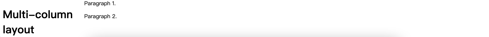

# WTF CSS Minimalist Tutorial: 9. Layout

WTF CSS tutorial helps newcomers get started with CSS quickly.

**Twitter**: [@WTFAcademy_](https://twitter.com/WTFAcademy_) | [@0xAA_Science](https://twitter.com/0xAA_Science)

**WTF Academy Community:** [Official website wtf.academy](https://wtf.academy) | [WTF Solidity Tutorial](https://github.com/AmazingAng/WTFSolidity) | [discord](https: //discord.gg/5akcruXrsk) | [WeChat group application](https://docs.google.com/forms/d/e/1FAIpQLSe4KGT8Sh6sJ7hedQRuIYirOoZK_85miz3dw7vA1-YjodgJ-A/viewform?usp=sf_link)

All codes and tutorials are open source on github: [github.com/WTFAcademy/WTF-CSS](https://github.com/WTFAcademy/WTF-CSS)

---

In this lecture, we introduce CSS layout, traditional layout methods involving floats and positioning, as well as modern layout tools like flexbox. Each technology has its uses, has its own pros and cons, and complements each other. By understanding the design philosophy of each layout method, you can find the layout solution you need to build the web page you want.

## Normal layout

Normal flow refers to the browser's default HTML layout when no layout control is performed on the page. Let's look at a quick HTML example:

```html
<p>I love my cat.</p>

<ul>
   <li>Buy cat food</li>
   <li>Exercise</li>
   <li>Cheer up friend</li>
</ul>

<p>The end!</p>
```

By default, the browser displays this:

<p>I love my cat.</p>

<ul>
   <li>Buy cat food</li>
   <li>Exercise</li>
   <li>Cheer up friend</li>
</ul>

<p>The end!</p>

Note that HTML elements are displayed exactly in the order they appear in the source code - first paragraph, then unordered list, second paragraph.

An element that appears below another element is described as a block element, unlike an inline element that appears next to another element, which acts like a single word within a paragraph.

## Floating layout

"Floating" an element changes the behavior of both the element itself and other elements that follow it in normal flow. This element will float to the left or right and be removed from the normal flow (normal flow), and other surrounding content will be set to float ([float](https://developer.mozilla .org/zh-CN/docs/Web/CSS/float)).

The [float](https://developer.mozilla.org/zh-CN/docs/Web/CSS/float) attribute has four possible values:

- `left` — Float the element to the left.
- `right` — Float the element to the right.
- `none` — Default value, no float.
- `inherit` — Inherit the float property of the parent element.

In the following example, we float a `<div>` element to the left and give it a margin on the right to push the text away. This gives us the effect of text wrapping around the `<div>` element, which is the only thing you need to learn in modern web design.

```html
<h1>Simple float example</h1>

<div class="box">Float</div>

<p> Lorem ipsum dolor sit amet, consectetur adipiscing elit. Nulla luctus aliquam dolor, eu lacinia lorem placerat vulputate. Auctor cursus massa at porta. Integer ligula ipsum, tristique sit amet orci vel, viverra egestas ligula. Curabitur vehicula tellus neque, ac ornare ex malesuada et. congue. Duis ornare egestas augue ut luctus. Proin blandit quam nec lacus varius commodo et a urna.
```

```css
.box {
   float: left;
   width: 150px;
   height: 150px;
   margin-right: 30px;
}
```


## Positioning layout

Positioning is another important CSS layout tool that controls the precise location of elements on the page. The `position` attribute has five values: `static` (default), `relative`, `absolute`, `fixed` and `sticky`.

- `static`: The element is positioned according to the normal document flow (that is, no special positioning is performed).

- `relative`: The element is positioned relative to its normal position.

```css
div {
     position: relative;
     top: 20px; /* Move down 20px */
     left: 20px; /* Move 20px to the right */
}
```

- `absolute`: The element is positioned relative to its nearest non-statically positioned ancestor element (rather than its parent element in HTML). If there is no such element, then it will be positioned relative to the `<html>` element.

```css
div {
     position: absolute;
     top: 20px;
     left: 20px;
}
```

- `fixed`: The element is positioned relative to the browser window so that it stays in the same position even if the page is scrolled.

```css
div {
     position: fixed;
     top: 20px;
     left: 20px;
}
```

- `sticky`: The element is positioned based on the user's scroll position. It behaves like a mix of `position:relative` and `position:fixed`.

```css
div {
     position: sticky;
     top: 0;
}
```

## Flexible box

Flexbox is the abbreviation of CSS Flexible Box Layout Module ([Flexible Box Layout](https://developer.mozilla.org/zh-CN/docs/Web/CSS/CSS_Flexible_Box_Layout) Module), which is specially designed to create horizontal Or a vertical one-dimensional page layout. To use flexbox, you only need to apply `display: flex` on the parent element you want to be laid out in flex, and all direct child elements will be laid out in flex. Let's look at an example.

### Set `display: flex`

```css
.wrapper {
   display: flex;
}
```

```html
<div class="wrapper">
   <div class="box1">WTF-HTML</div>
   <div class="box2">WTF-CSS</div>
   <div class="box3">WTF-Solidity</div>
</div>
```


### Set flex property

In addition to the above properties that can be applied to flex containers, there are many properties that can be applied to flex items. These properties change the way flex items occupy the width/height in a flex layout, allowing them to scale to fit the available space.

```css
.wrapper {
   display: flex;
}

.wrapper > div {
   flex: 1;
}
```

```html
<div class="wrapper">
   <div class="box1">WTF-HTML</div>
   <div class="box2">WTF-CSS</div>
   <div class="box3">WTF-Solidity</div>
</div>
```


For an in-depth understanding of Flex layout, please see the [Flex Layout](https://github.com/WTFAcademy/WTF-CSS/blob/main/10_Flex/readme.md) chapter.


## Grid Layout

Flexbox is used to design horizontal or vertical layouts, while Grid layout is designed to arrange elements neatly in rows and columns in both dimensions.

### Set `display: grid`

Like flex, you can switch to grid layout by specifying the value of display: `display: grid`. The following example uses HTML markup similar to the flex example, describing a container and several child elements. In addition to using `display: grid`, we also use [`grid-template-rows`](https://developer.mozilla.org/zh-CN/docs/Web/CSS/grid-template-rows) and [ `grid-template-columns`](https://developer.mozilla.org/zh-CN/docs/Web/CSS/grid-template-columns) Two properties define some row and column tracks. After defining three `1fr` columns and two `100px` rows, there is no need to specify any rules on the child elements, they are automatically arranged into the grid we created.

```css
.wrapper {
   display: grid;
   grid-template-columns: 1fr 1fr 1fr;
   grid-template-rows: 100px 100px;
   grid-gap: 10px;
}
```

```html
<div class="wrapper">
   <div class="box1">WTF-HTML</div>
   <div class="box2">WTF-CSS</div>
   <div class="box3">WTF-Solidity</div>
   <div class="box4">WTF-Ethers</div>
   <div class="box5">WTF-gm</div>
   <div class="box6">WTF-ClosedSource</div>
</div>
```


### Place elements within the grid

Once you have a grid, you can also place elements within it explicitly rather than relying on the browser to automatically arrange it. In the second example below, we define the same grid as above, but this time we only have three child elements. We use [`grid-column`](https://developer.mozilla.org/zh-CN/docs/Web/CSS/grid-column) and [`grid-row`](https://developer.mozilla .org/zh-CN/docs/Web/CSS/grid-row) two attributes to specify which row/column each child element should start and end at. This allows child elements to be expanded across multiple rows/columns.

```css
.wrapper {
   display: grid;
   grid-template-columns: 1fr 1fr 1fr;
   grid-template-rows: 100px 100px;
   grid-gap: 10px;
}

.box1 {
   grid-column: 2 / 4;
   grid-row: 1;
}

.box2 {
   grid-column: 1;
   grid-row: 1 / 3;
}

.box3 {
   grid-row: 2;
   grid-column: 3;
}
```

```html
<div class="wrapper">
   <div class="box1">WTF-HTML</div>
   <div class="box2">WTF-CSS</div>
   <div class="box3">WTF-Solidity</div>
</div>
```


To find out more about Flexbox, see the [Flex Layout](https://github.com/WTFAcademy/WTF-CSS/blob/main/10_Flex/readme.md) chapter.

For an in-depth understanding of Grid layout, please see the [Grid Layout](https://github.com/WTFAcademy/WTF-CSS/blob/main/11_Grid/readme.md) chapter.


##Multiple column layout

The multi-column layout module gives us a way to sort content into columns, much like text is arranged in a newspaper. Since having your users scroll up and down in one column to read two related pieces of text in web content is a very inefficient way, arranging content into multiple columns can be a useful technique.

To convert a block into a multicol container, we can use the [`column-count`](https://developer.mozilla.org/zh-CN/docs/Web/CSS/column-count) attribute To tell the browser how many columns we need, you can also use [`column-width`](https://developer.mozilla.org/en-US/docs/Web/CSS/column-width) to tell the browser to use at least As many columns of a certain width as possible to fill the container.

In the following example, we start with a block of HTML inside a `<div>` container element of class `container`.

```html
<div class="container">
   <h1>Multi-column layout</h1>

   <p>Paragraph 1.</p>
   <p>Paragraph 2.</p>
</div>
```

We specified the `column-width` of the container to be 200 pixels, which tells the browser to create as many 200 pixel columns as possible to fill the container. Then they jointly use the remaining space to stretch themselves.

```css
.container {
   column-width: 200px;
}
```



## Summary

In this lecture we have given you a brief overview of all layout techniques, to learn more read more about each technique!
