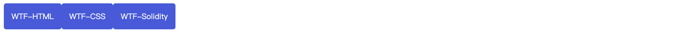
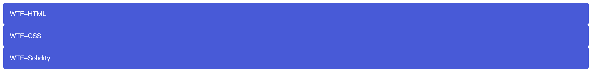
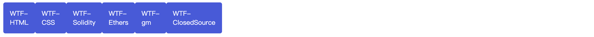
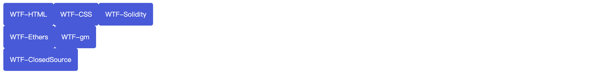
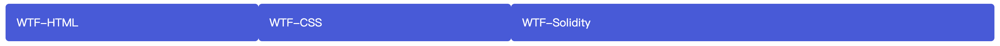
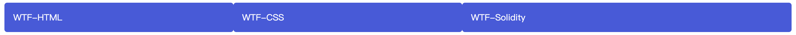

# WTF CSS minimalist tutorial: 10. Flex layout

WTF CSS tutorial helps newcomers get started with CSS quickly.

**Twitter**: [@WTFAcademy_](https://twitter.com/WTFAcademy_) | [@0xAA_Science](https://twitter.com/0xAA_Science)

**WTF Academy Community:** [Official website wtf.academy](https://wtf.academy) | [WTF Solidity Tutorial](https://github.com/AmazingAng/WTFSolidity) | [discord](https: //discord.gg/5akcruXrsk) | [WeChat group application](https://docs.google.com/forms/d/e/1FAIpQLSe4KGT8Sh6sJ7hedQRuIYirOoZK_85miz3dw7vA1-YjodgJ-A/viewform?usp=sf_link)

All codes and tutorials are open source on github: [github.com/WTFAcademy/WTF-CSS](https://github.com/WTFAcademy/WTF-CSS)

---

In this lecture, we introduce Flex layout. Flexbox is a one-dimensional layout method for laying out elements in rows or columns. Elements can expand to fill additional space and shrink to fit smaller spaces. This article will explain all the basic principles.

## Why is it a flexible box?
For a long time, the only reliable and cross-browser compatible creation tools for CSS layouts were [`floats`](https://developer.mozilla.org/zh-CN/docs/Learn/CSS/CSS_layout/Floats) and [` positioning`](https://developer.mozilla.org/zh-CN/docs/Learn/CSS/CSS_layout/Positioning). Both of these tools work well for the most part, but they have certain limitations in some areas that make it difficult to complete the task.

The following simple layout requirements are difficult or impossible to implement conveniently and flexibly using such tools (floats and positioning):

- Center a block of content vertically inside the parent content.
- Makes all children of the container take up an equal amount of the available width/height, regardless of how much width/height is available.
- Make all columns in a multi-column layout the same height, even if they contain different amounts of content.

## flex model description

When elements appear as flex boxes, they are laid out along two axes:


- The main axis is the axis that extends along the direction in which the flex element is placed (such as horizontal rows and vertical columns on the page). The start and end of this axis are called **main start** and **main end**.
- The cross axis is the axis perpendicular to the direction in which the flex element is placed. The start and end of this axis are called **cross start** and **cross end**.
- The parent element with display: flex set is called a flex container.
- Elements that behave as flexible boxes in a flex container are called flex items.

## Columns or rows?

Flexible box provides [`flex-direction`](https://developer.mozilla.org/zh-CN/docs/Web/CSS/flex-direction) such a property, which can specify the direction of the main axis (flexible box where the class is placed) - its default value is `row`, which makes them line up in your browser's default language direction (left to right in English/Chinese browsers).

```css
.wrapper {
   display: flex;
   flex-direction: row;
}
```

```html
<div class="wrapper">
   <div class="box1">WTF-HTML</div>
   <div class="box2">WTF-CSS</div>
   <div class="box3">WTF-Solidity</div>
</div>
```



```css
.wrapper {
   display: flex;
   flex-direction: column;
}
```

```html
<div class="wrapper">
   <div class="box1">WTF-HTML</div>
   <div class="box2">WTF-CSS</div>
   <div class="box3">WTF-Solidity</div>
</div>
```




## Line break

When you use fixed width or fixed height in layout, a problem may occur, that is, the flexible box child elements in the container will overflow, destroying the layout. As follows:

```css
.wrapper {
   display: flex;
   width: 200px;
}
```

```html
<div class="wrapper">
   <div class="box1">WTF-HTML</div>
   <div class="box2">WTF-CSS</div>
   <div class="box3">WTF-Solidity</div>
   <div class="box4">WTF-Ethers</div>
   <div class="box5">WTF-gm</div>
   <div class="box6">WTF-ClosedSource</div>
</div>
```




We can set `flex-wrap: wrap` so that overflowing elements will be moved to the next line.

```css
.wrapper {
   display: flex;
   width: 200px;
   flex-wrap: wrap;
}
```

```html
<div class="wrapper">
   <div class="box1">WTF-HTML</div>
   <div class="box2">WTF-CSS</div>
   <div class="box3">WTF-Solidity</div>
   <div class="box4">WTF-Ethers</div>
   <div class="box5">WTF-gm</div>
   <div class="box6">WTF-ClosedSource</div>
</div>
```



## flex-flow abbreviation

At this point, you should note that there are abbreviations for `flex-direction`, `flex-wrap` and `flex-flow`. For example, you can

```css
flex-direction: row;
flex-wrap: wrap;
```

Replace with

```css
flex-flow: row wrap;
```

## Dynamic size of flex items

Now look at the example below to see how to control the proportion of space occupied by flex items.

```css
.wrapper {
   display: flex;
}

.wrapper .box1 {
   flex: 1;
}

.wrapper .box2 {
   flex: 1;
}

.wrapper .box3 {
   flex: 2;
}
```

```html
<div class="wrapper">
   <div class="box1">WTF-HTML</div>
   <div class="box2">WTF-CSS</div>
   <div class="box3">WTF-Solidity</div>
</div>
```

This is a unitless scale value that represents the amount of space available along the main axis for each flex item.



You can see that the first two flex items have one unit each, so they take up 1/4 of each available space. The third one has two units, so it takes up 2/4 or that's 1/2 of the available space.

You can also specify a minimum value for flex.

```css
.wrapper {
   display: flex;
}

.wrapper .box1 {
   flex: 1 200px;
}

.wrapper .box2 {
   flex: 1 200px;
}

.wrapper .box3 {
   flex: 2 200px;
}
```

```html
<div class="wrapper">
   <div class="box1">WTF-HTML</div>
   <div class="box2">WTF-CSS</div>
   <div class="box3">WTF-Solidity</div>
</div>
```



This means "each flex item will first be given 200px of free space, then the remaining free space will be shared in proportion to the allocation".

## flex: abbreviation and full form

[`flex`](https://developer.mozilla.org/zh-CN/docs/Web/CSS/flex) is an abbreviated property that can specify up to three different values:

- The first is the unitless scale discussed above. The value of the fully-written [`flex-grow`](https://developer.mozilla.org/zh-CN/docs/Web/CSS/flex-grow) attribute can be specified individually.
- The second unitless scale — [`flex-shrink`](https://developer.mozilla.org/zh-CN/docs/Web/CSS/flex-shrink) — is generally used for flex items that overflow the container. This specifies how much overflow is taken from each flex item to stop them from overflowing their container. This is a fairly advanced flexbox feature and we won't explain it further in this article.
- The third is the minimum discussed above. The value of the fully-written [`flex-basis`](https://developer.mozilla.org/zh-CN/docs/Web/CSS/flex-basis) attribute can be specified individually.

We recommend not using the write-all attribute unless you really need it (for example, to overwrite something previously written). Using write-all will require a lot more code, and they can also be a bit confusing.

## Horizontal and vertical alignment

You can use the flexbox functionality to align flex items along the main or cross axis.

### `align-items`

Controls the position of flex items on the cross axis.

- The default value is stretch, which causes all flex items to stretch along the cross axis to fill the parent container. If the parent container does not have a fixed width (i.e. height) in the cross-axis direction, all flex items will become as long as the longest flex item (i.e. remain the same height). Our first example gets columns of equal height by default.
- The center value we used in the above rule will keep the items at their original height, but center them on the cross axis. That's why those buttons are vertically centered.
- You can also set things like flex-start or flex-end so that the flex items align all values ​​at the start or end of the cross axis. See [`align-items`](https://developer.mozilla.org/zh-CN/docs/Web/CSS/align-items) to learn more.

```css
.wrapper {
   display: flex;
   align-items: center;
}

.wrapper .box1 {
   height: 40px;
}

.wrapper .box2 {
   height: 80px;
}

.wrapper .box3 {
   height: 60px;
}
```

```html
<div class="wrapper">
   <div class="box1">WTF-HTML</div>
   <div class="box2">WTF-CSS</div>
   <div class="box3">WTF-Solidity</div>
</div>
```


### `justify-content`

Controls the position of flex items on the main axis.

- The default is `flex-start`, which places all flex items at the start of the main axis.
- You can also use `flex-end` to bring flex items to the end.
- `center` is also available in `justify-content`, which can center flex items on the main axis.
- And the value `space-around` we used above is useful - it will spread all flex items evenly along the main axis, leaving a little space at either end.
- Another value is `space-between`, which is very similar to `space-around` except that it does not leave any space at either end.

```css
.wrapper {
   display: flex;
   justify-content: center;
}
```

```html
<div class="wrapper">
   <div class="box1">WTF-HTML</div>
   <div class="box2">WTF-CSS</div>
   <div class="box3">WTF-Solidity</div>
</div>
```


## Sort flex items

Flexbox also has the function of changing the layout position of flex items without affecting the source order (that is, the order of elements in the DOM tree). This is also difficult to achieve with traditional layout methods. We can set `order` to sort.

- The default `order` value for all flex items is 0.
- Flex items with a larger `order` value are later in the display order than flex items with a smaller `order` value.
- flex items with the same `order` value are displayed in source order. So if you have four elements with `order` values ​​of 2, 1, 1 and 0, their display order will be fourth, second, third and first respectively.
-You can give `order` a negative value to order them ahead of elements with a value of 0.

```css
.wrapper {
   display: flex;
}

.wrapper .box1 {
   order: 1;
}

.wrapper .box2 {
   order: 0;
}

.wrapper .box3 {
   order: -1;
}
```

```html
<div class="wrapper">
   <div class="box1">WTF-HTML</div>
   <div class="box2">WTF-CSS</div>
   <div class="box3">WTF-Solidity</div>
</div>
```


## flex nesting

Flexboxes can also create some quite complex layouts. If an element is set as a flex item, it will also become a flex container, and its children (direct child nodes) will also appear as flexible boxes.


```css
.wrapper {
   display: flex;
   align-items: center;
}
.wrapper .inner {
   display: flex;
   flex-direction: column;
}
```

```html
<div class="wrapper">
   <div class="box1">WTF-HTML</div>
   <div class="inner">
     <div class="box2">WTF-CSS</div>
     <div class="box3">WTF-Solidity</div>
   </div>
</div>
```


## Summary

In this lecture, we introduced the concept of Flex layout, specifying the main axis direction, line wrapping, dynamic size of flex items, horizontal and vertical alignment, sorting of flex items, and flex nesting.
