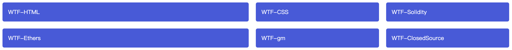
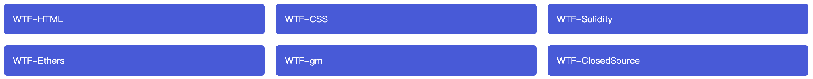
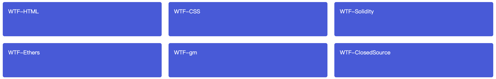
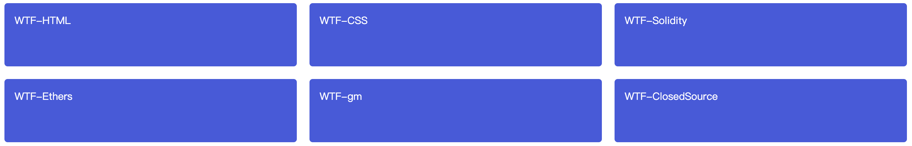
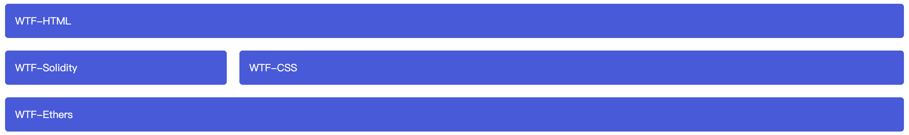

# WTF CSS minimalist tutorial: 11. Grid layout

WTF CSS tutorial helps newcomers get started with CSS quickly.

**Twitter**: [@WTFAcademy_](https://twitter.com/WTFAcademy_) | [@0xAA_Science](https://twitter.com/0xAA_Science)

**WTF Academy Community:** [Official website wtf.academy](https://wtf.academy) | [WTF Solidity Tutorial](https://github.com/AmazingAng/WTFSolidity) | [discord](https: //discord.gg/5akcruXrsk) | [WeChat group application](https://docs.google.com/forms/d/e/1FAIpQLSe4KGT8Sh6sJ7hedQRuIYirOoZK_85miz3dw7vA1-YjodgJ-A/viewform?usp=sf_link)

All codes and tutorials are open source on github: [github.com/WTFAcademy/WTF-CSS](https://github.com/WTFAcademy/WTF-CSS)

---

In this lecture, we introduce Grid layout, learn how to use grids to layout content in rows and columns, and easily implement some complex layouts.

## What is grid layout?

A grid is a layout pattern consisting of a series of horizontal and vertical lines. According to the grid, we can arrange the design elements, helping us design a series of pages with fixed position and width elements, making our website pages more unified.

A grid usually has many columns and rows, as well as gaps between rows and rows and columns. This gap is generally called a gutter. )**.


## Create your own grid in CSS

Once you've decided on the grid you need for your design, you can create a CSS grid layout and place the various elements in it.

### Define a grid

Set the container's display attribute to grid to define a network. Like flexbox, after changing the parent container to grid layout, its direct children will become grid items.

```css
.wrapper {
   display: grid;
}
```

```html
<div class="wrapper">
   <div class="box1">WTF-HTML</div>
   <div class="box2">WTF-CSS</div>
   <div class="box3">WTF-Solidity</div>
   <div class="box4">WTF-Ethers</div>
   <div class="box5">WTF-gm</div>
   <div class="box6">WTF-ClosedSource</div>
</div>
```

Unlike the flexible box, the web page will not change immediately after defining the grid. Because the `display: grid` declaration only creates a grid with only one column, your items will still be arranged one after another from top to bottom as in the normal layout flow.

To make our container look more like a grid, we're going to add some columns to the grid we just defined. So let's add three columns with a width of 200px. Of course, any unit of length can be used here, including percentages.

```css
.wrapper {
   display: grid;
   grid-template-columns: 200px 200px 200px;
}
```


### Flexible grid using fr units

```css
.wrapper {
   display: grid;
   grid-template-columns: 2fr 1fr 1fr;
}
```

```html
<div class="wrapper">
   <div class="box1">WTF-HTML</div>
   <div class="box2">WTF-CSS</div>
   <div class="box3">WTF-Solidity</div>
   <div class="box4">WTF-Ethers</div>
   <div class="box5">WTF-gm</div>
   <div class="box6">WTF-ClosedSource</div>
</div>
```

In this definition, the first column is allocated `2fr` of free space, and the remaining two columns are each allocated `1fr` of free space, which makes the first column twice as wide as the second and third columns. In addition, `fr` can be mixed with general length units, such as `grid-template-columns: 300px 2fr 1fr`, then the width of the first column is 300px, and the remaining two columns will be proportional to the available space after removing 300px distribute.


### Grid gap

Use the [`column-gap`](https://developer.mozilla.org/zh-CN/docs/Web/CSS/column-gap) attribute to define column gaps; use [`row-gap`](https: //developer.mozilla.org/zh-CN/docs/Web/CSS/row-gap) to define row gaps; use [`gap`](https://developer.mozilla.org/zh-CN/docs/ Web/CSS/gap) You can set both at the same time.


```css
.wrapper {
   display: grid;
   grid-template-columns: 2fr 1fr 1fr;
   gap: 20px;
}
```

```html
<div class="wrapper">
   <div class="box1">WTF-HTML</div>
   <div class="box2">WTF-CSS</div>
   <div class="box3">WTF-Solidity</div>
   <div class="box4">WTF-Ethers</div>
   <div class="box5">WTF-gm</div>
   <div class="box6">WTF-ClosedSource</div>
</div>
```

Gap distance can be expressed in any length unit including percentage, but not in `fr` units.



### Repeat to build rows/columns

You can use repeat to repeatedly build certain columns with certain width configurations. For example, if you want to create multiple equal-width tracks, you can use the following method.

```css
.wrapper {
   display: grid;
   grid-template-columns: repeat(3, 1fr);
   gap: 20px;
}
```

```html
<div class="wrapper">
   <div class="box1">WTF-HTML</div>
   <div class="box2">WTF-CSS</div>
   <div class="box3">WTF-Solidity</div>
   <div class="box4">WTF-Ethers</div>
   <div class="box5">WTF-gm</div>
   <div class="box6">WTF-ClosedSource</div>
</div>
```

As before, you still get 3 `1fr` columns. The first value (`3`) passed into the repeat function indicates how many times the subsequent column width configuration should be repeated, while the second value (`1fr`) indicates the need to repeat the build configuration, which can have multiple lengths. set up.



### Explicit grid and implicit grid

So far, we have defined columns, but not rows. But before that, we need to understand explicit grid and implicit grid. Explicit grids are created by us using the `grid-template-columns` or `grid-template-rows` properties. The implicit grid is generated when content is placed outside the grid. The relationship between the explicit grid and the implicit grid is somewhat similar to the relationship between the main and cross axes of the flexbox.

The row/column size generated in the implicit grid is the parameter default is `auto`, and the size will be automatically adjusted according to the content put in. Of course, you can also use [`grid-auto-rows`](https://developer.mozilla.org/zh-CN/docs/Web/CSS/grid-auto-rows) and [`grid-auto-columns `](https://developer.mozilla.org/zh-CN/docs/Web/CSS/grid-auto-columns) property to manually set the size of the implicit grid. The following example sets `grid-auto-rows` to `100px`, then you can see the rows in the implicit grid (since `grid-template-rows` is not set in this example, all rows both within the implicit grid) are now 100 pixels high.

```css
.wrapper {
   display: grid;
   grid-template-columns: repeat(3, 1fr);
   grid-auto-rows: 100px;
   gap: 20px;
}
```
```html
<div class="wrapper">
   <div class="box1">WTF-HTML</div>
   <div class="box2">WTF-CSS</div>
   <div class="box3">WTF-Solidity</div>
   <div class="box4">WTF-Ethers</div>
   <div class="box5">WTF-gm</div>
   <div class="box6">WTF-ClosedSource</div>
</div>
```



### Convenient `minmax()` function

Rows/columns that are 100 pixels high may sometimes be insufficient because content that is taller than 100 pixels is often added. So, we want to be able to set it to at least 100 pixels, and automatically expand the size according to the content to ensure that it can accommodate all the content. Obviously, it is difficult to know what the size of an element on a web page will become under different circumstances. Some additional content or larger font sizes will cause problems in many designs that can achieve pixel-level accuracy. So, we have the [`minmax`](https://developer.mozilla.org/zh-CN/docs/Web/CSS/minmax) function.

The [`minmax`](https://developer.mozilla.org/zh-CN/docs/Web/CSS/minmax) function sets the value range for a row/column size. For example, if set to `minmax(100px, auto)`, the size will be at least 100 pixels, and if the content size is greater than 100 pixels, it will be automatically adjusted according to the content. Try setting the `grid-auto-rows` property to the `minmax` function here.

```css
.wrapper {
   display: grid;
   grid-template-columns: repeat(3, 1fr);
   grid-auto-rows: minmax(100px, auto);
   gap: 20px;
}
```

```html
<div class="wrapper">
   <div class="box1">WTF-HTML</div>
   <div class="box2">WTF-CSS</div>
   <div class="box3">WTF-Solidity</div>
   <div class="box4">WTF-Ethers</div>
   <div class="box5">WTF-gm</div>
   <div class="box6">WTF-ClosedSource</div>
</div>
```



If all the content in the grid is less than 100 pixels, there will be no change, but if you put a long content or image in a certain item, you can see the height of the row where the grid is located. It can just accommodate the height of the content. Note that we are modifying `grid-auto-rows`, so it will only affect the implicit grid. Of course, this property can also be applied to explicit grids. For more information, please refer to the [`minmax`](https://developer.mozilla.org/zh-CN/docs/Web/CSS/minmax) page.

### Automatically fill with multiple columns

Now try to combine everything you learned about grids, including the `repeat` and `minmax` functions, to implement a very useful function. In some cases, we need to have the grid automatically create many columns to fill the entire container. By setting the `grid-template-columns` property, we can achieve this effect, but this time we will use a keyword `auto-fill` in the `repeat` function to replace the determined number of repetitions. As for the second parameter of the function, we use the `minmax` function to set the minimum value of a row/column, and the maximum value `1fr`.

```css
.wrapper {
   display: grid;
   grid-template-columns: repeat(auto-fill, minmax(200px, 1fr));
   grid-auto-rows: minmax(100px, auto);
   gap: 20px;
}
```

```html
<div class="wrapper">
   <div class="box1">WTF-HTML</div>
   <div class="box2">WTF-CSS</div>
   <div class="box3">WTF-Solidity</div>
   <div class="box4">WTF-Ethers</div>
   <div class="box5">WTF-gm</div>
   <div class="box6">WTF-ClosedSource</div>
</div>
```


## Line-based element placement

After defining the grid, we need to place elements into the grid. Our grid has many dividing lines, the starting point of the first line is related to the document writing mode. In English, the first column separator (i.e. the grid edge line) is at the far left of the grid and the first row separator is at the top of the grid. For Arabic, the first column separator is at the far right of the grid because Arabic is written from right to left.

We place elements according to these dividing lines, specifying which line to start from and which line to end through the following properties.

- [`grid-column-start`](https://developer.mozilla.org/en-US/docs/Web/CSS/grid-column-start)
- [`grid-column-end`](https://developer.mozilla.org/en-US/docs/Web/CSS/grid-column-end)
- [`grid-row-start`](https://developer.mozilla.org/en-US/docs/Web/CSS/grid-row-start)
- [`grid-row-end`](https://developer.mozilla.org/en-US/docs/Web/CSS/grid-row-end)

The values ​​of these properties are separator line numbers. You can also use the following abbreviations to specify the starting and ending lines at the same time.

- [`grid-column`](https://developer.mozilla.org/zh-CN/docs/Web/CSS/grid-column)
- [`grid-row`](https://developer.mozilla.org/zh-CN/docs/Web/CSS/grid-row)

Note that the starting and ending line numbers must be separated by the `/` symbol.

```css
.wrapper {
   display: grid;
   grid-template-columns: 1fr 3fr;
   gap: 20px;
}

.wrapper .box1 {
   grid-column: 1 / 3;
   grid-row: 1;
}

.wrapper .box2 {
   grid-column: 2;
   grid-row: 2;
}

.wrapper .box3 {
   grid-column: 1;
   grid-row: 2;
}

.wrapper .box4 {
   grid-column: 1 / 3;
   grid-row: 3;
}
```

```html
<div class="wrapper">
   <div class="box1">WTF-HTML</div>
   <div class="box2">WTF-CSS</div>
   <div class="box3">WTF-Solidity</div>
   <div class="box4">WTF-Ethers</div>
</div>
```


### Use the grid-template-areas attribute to place elements

Another way to place elements into the grid is to use the [`grid-template-areas`](https://developer.mozilla.org/zh-CN/docs/Web/CSS/grid-template-areas) attribute, And you have to name some elements and use those names in attributes as a region.

```css
.wrapper {
   display: grid;
   grid-template-areas:
     "box1 box1"
     "box3 box2"
     "box4 box4";
   grid-template-columns: 1fr 3fr;
   gap: 20px;
}

.wrapper .box1 {
   grid-area: box1;
}

.wrapper .box2 {
   grid-area: box2;
}

.wrapper .box3 {
   grid-area: box3;
}

.wrapper .box4 {
   grid-area: box4;
}
```

```html
<div class="wrapper">
   <div class="box1">WTF-HTML</div>
   <div class="box2">WTF-CSS</div>
   <div class="box3">WTF-Solidity</div>
   <div class="box4">WTF-Ethers</div>
</div>
```



## Summary

We touched upon the main features of CSS Grid Layout in this article, which you should now be able to use in your own designs.
