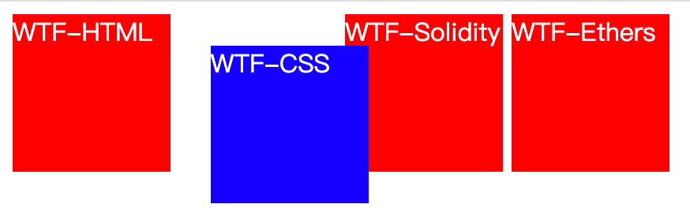
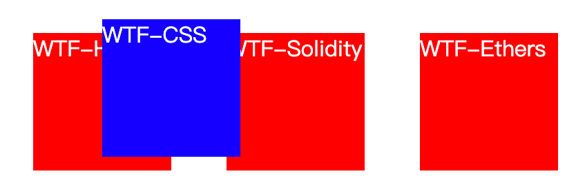
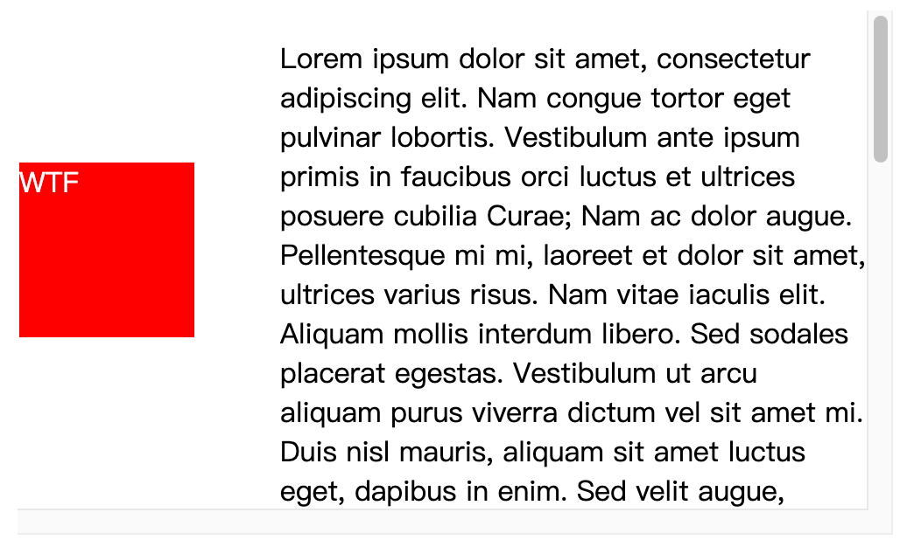
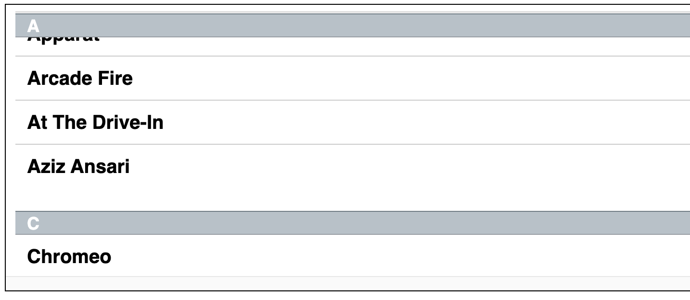
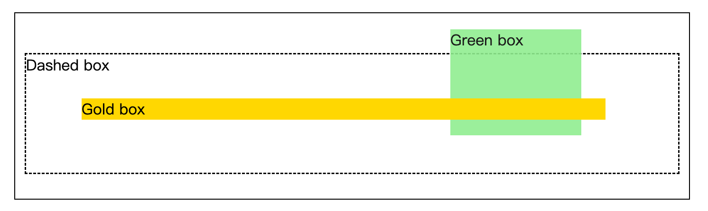

# WTF CSS Minimalist Tutorial: 12. Positioning

WTF CSS tutorial to help newcomers get started with CSS quickly.

**Twitter**: [@WTFAcademy_](https://twitter.com/WTFAcademy_) | [@0xAA_Science](https://twitter.com/0xAA_Science)

**WTF Academy Community:** [Official website wtf.academy](https://wtf.academy) | [WTF Solidity Tutorial](https://github.com/AmazingAng/WTFSolidity) | [discord](https: //discord.gg/5akcruXrsk) | [WeChat group application](https://docs.google.com/forms/d/e/1FAIpQLSe4KGT8Sh6sJ7hedQRuIYirOoZK_85miz3dw7vA1-YjodgJ-A/viewform?usp=sf_link)

All codes and tutorials are open source on github: [github.com/WTFAcademy/WTF-CSS](https://github.com/WTFAcademy/WTF-CSS)

---

In this lecture, we introduce positioning (Position) layout. The position attribute is used to specify how an element is positioned in the document. The top, right, bottom and left attributes determine the final position of the element.

## Positioning type

- A positioned element is an element whose calculated position property is relative, absolute, fixed, or sticky (in other words, anything other than static).
- A relatively positioned element is an element whose calculated position attribute is relative.
- An absolutely positioned element is an element whose calculated position attribute is absolute or fixed.
- A sticky positioned element is an element whose calculated position attribute is sticky.

In most cases, absolutely positioned elements with height and width set to auto are resized to the size of their content. However, an absolutely positioned element can fill the available vertical space by specifying top and bottom and leaving height unspecified (i.e. auto). They can also fill the available horizontal space by specifying left and right and width as auto.

Except for the case just described (absolutely positioned elements fill available space):

- If both top and bottom are specified (strictly speaking, the value specified here cannot be auto), top takes precedence.
- If left and right are specified, when the direction is set to ltr (Chinese and English written horizontally), left takes precedence, and when the direction is set to rtl (Arabic, Hebrew, and Persian written from right to left), right takes precedence. .

## grammar

The position attribute is specified as a single keyword selected from the list of values ​​below.

### Value

- **`static`**: This keyword specifies that the element uses normal layout behavior, that is, the element's current layout position in the normal flow of the document. At this time the top, right, bottom, left and z-index properties have no effect.

- **`relative`**:
   Under this keyword, the element is first placed at the position when no positioning is added, and then the position of the element is adjusted without changing the page layout (therefore, a blank will be left at the position where the element was without positioning). position:relative is not valid for table-\*-group, table-row, table-column, table-cell, table-caption elements.

- **`absolute`**:
   The element is moved out of the normal document flow, and no space is reserved for the element. The position of the element is determined by specifying its offset relative to the nearest non-statically positioned ancestor element. Absolutely positioned elements can have margins set and will not be merged with other margins.

- **`fixed`**:
   The element is moved out of the normal document flow, and space is not reserved for the element. Instead, the element's position is specified by specifying its position relative to the screen's viewport. The element's position does not change when the screen scrolls. When printing, the element appears at a fixed location on each page. The fixed attribute creates a new stacking context. When the transform, perspective or filter property of an element's ancestor is non-none, the container is changed from the viewport to that ancestor.

- **`sticky`**:
   The element is positioned according to normal document flow, and then relative to its nearest scrolling ancestor and containing block (nearest block-level ancestor), including table-related elements, based on top, right, bottom, Offset with the value of left. The offset value does not affect the position of any other elements. This value always creates a new stacking context. Note that a sticky element will be "fixed" to its nearest ancestor with a "scrolling mechanism" (when the ancestor's overflow is hidden, scroll, auto, or overlay), even if this ancestor is not the nearest truly scrollable ancestor. ancestor. This effectively suppresses any "sticky" behavior (see Github issue on W3C CSSWG for details).

## Example

### Relative positioning

A relatively positioned element is offset from its normal position in the document by a given value, but does not affect the offset of other elements. In the example below, note that other elements without positioning are laid out according to "Two" in their normal position.

```html
<div class="box" id="one">WTF-HTML</div>
<div class="box" id="two">WTF-CSS</div>
<div class="box" id="three">WTF-Solidity</div>
<div class="box" id="four">WTF-Ethers</div>
```

```css
.box {
   display: inline-block;
   width: 100px;
   height: 100px;
   background: red;
   color: white;
}

#two {
   position: relative;
   top: 20px;
   left: 20px;
   background: blue;
}
```



### Absolute positioning

Relatively positioned elements do not break away from the document flow, while absolutely positioned elements do. Absolutely positioned elements do not occupy space when laying out other elements in the document flow. Absolutely positioned elements are positioned relative to their nearest non-static ancestor. When such an ancestor element does not exist, it is relative to the ICB (initial container block, initial containing block).

```html
<div class="box" id="one">WTF-HTML</div>
<div class="box" id="two">WTF-CSS</div>
<div class="box" id="three">WTF-Solidity</div>
<div class="box" id="four">WTF-Ethers</div>
```

```css
.box {
   display: inline-block;
   background: red;
   width: 100px;
   height: 100px;
   float: left;
   margin: 20px;
   color: white;
}

#three {
   position: absolute;
   top: 20px;
   left: 20px;
}
```



### Fixed positioning

Fixed positioning is similar to absolute positioning, but the element's containing block is the viewport. This positioning method is often used to create elements that remain fixed in the same position as the screen is scrolled. In the example below, the "One" element is positioned 80px from the top of the page and 20px from the left side of the page.

```html
<div class="outer">
   <p>
     Lorem ipsum dolor sit amet, consectetur adipiscing elit. Nam congue tortor
     Eget pulvinar lobortis. Vestibulum ante ipsum primis in faucibus orci luctus
     and ultrices posuere cubilia Curae; Nam ac dolor augue. Pellentesque mi mi,
     laoreet et dolor sit amet, ultrices varius risus. Nam vitae iaculis elit.
     Aliquam mollis interdum libero. Sed sodales placerat egestas. Vestibulum ut
     arcu aliquam purus viverra dictum vel sit amet mi. Duis nisl mauris, aliquam
     sit amet luctus eget, dapibus in enim. Sed velit augue, pretium a sem
     aliquam, congue porttitor tortor. Sed tempor nisl a lorem consequat, id
     Maximus erat aliquet. Sed sagittis porta libero sed condimentum. Aliquam
     finibus lectus nec ante congue rutrum. Curabitur quam quam, accumsan id
     ultrices ultrices, tempor and tellus.
   </p>
   <p>
     Lorem ipsum dolor sit amet, consectetur adipiscing elit. Nam congue tortor
     Eget pulvinar lobortis. Vestibulum ante ipsum primis in faucibus orci luctus
     and ultrices posuere cubilia Curae; Nam ac dolor augue. Pellentesque mi mi,
     laoreet et dolor sit amet, ultrices varius risus. Nam vitae iaculis elit.
     Aliquam mollis interdum libero. Sed sodales placerat egestas. Vestibulum ut
     arcu aliquam purus viverra dictum vel sit amet mi. Duis nisl mauris, aliquam
     sit amet luctus eget, dapibus in enim. Sed velit augue, pretium a sem
     aliquam, congue porttitor tortor. Sed tempor nisl a lorem consequat, id
     Maximus erat aliquet. Sed sagittis porta libero sed condimentum. Aliquam
     finibus lectus nec ante congue rutrum. Curabitur quam quam, accumsan id
     ultrices ultrices, tempor and tellus.
   </p>
   <div class="box" id="one">One</div>
</div>
```

```css
.box {
   background: red;
   width: 100px;
   height: 100px;
   margin: 20px;
   color: white;
}
#one {
   position: fixed;
   top: 80px;
   left: 10px;
}
.outer {
   width: 500px;
   height: 300px;
   overflow: scroll;
   padding-left: 150px;
}
```



### Sticky positioning

Sticky positioning can be thought of as a hybrid of relative positioning and fixed positioning. Elements are relatively positioned until they cross a certain threshold, and then fixedly positioned. For example:

```css
#one {
   position: sticky;
   top: 10px;
}
```

The element is positioned relatively until the viewport is scrolled to a distance less than 10px from the top of the element. The element will then be fixed at a distance of 10px from the top until the viewport scrolls back below the threshold.

Sticky positioning is often used to position the head element of an alphabetic list. The header element that marks the start of section B will always be below section A when scrolling. When starting to scroll part B, B's head will be fixed at the top of the screen until all B's items have finished scrolling, and then they will be replaced by C's head.

One of the four thresholds, top, right, bottom or left, must be specified for sticky positioning to take effect. Otherwise the behavior is the same as relative positioning.

```html
<div>
   <dl>
     <dt>A</dt>
     <dd>Andrew W.K.</dd>
     <dd>Apparat</dd>
     <dd>Arcade Fire</dd>
     <dd>At The Drive-In</dd>
     <dd>Aziz Ansari</dd>
   </dl>
   <dl>
     <dt>C</dt>
     <dd>Chromeo</dd>
     <dd>Common</dd>
     <dd>Converge</dd>
     <dd>Crystal Castles</dd>
     <dd>Cursive</dd>
   </dl>
   <dl>
     <dt>E</dt>
     <dd>Explosions In The Sky</dd>
   </dl>
   <dl>
     <dt>T</dt>
     <dd>Ted Leo & The Pharmacists</dd>
     <dd>T-Pain</dd>
     <dd>Thrice</dd>
     <dd>TV On The Radio</dd>
     <dd>Two Gallants</dd>
   </dl>
</div>
```
```css
* {
   box-sizing: border-box;
}

dl {
   margin: 0;
   padding: 24px 0 0 0;
}

dt {
   background: #b8c1c8;
   border-bottom: 1px solid #989ea4;
   border-top: 1px solid #717d85;
   color: #fff;
   font: bold 18px/21px Helvetica, Arial, sans-serif;
   margin: 0;
   padding: 2px 0 0 12px;
   position: -webkit-sticky;
   position: sticky;
   top: -1px;
}

dd {
   font: bold 20px/45px Helvetica, Arial, sans-serif;
   margin: 0;
   padding: 0 0 0 12px;
   white-space: nowrap;
}

dd + dd {
   border-top: 1px solid #ccc;
}
```



## z-index

The z-index property sets the z-order of a positioned element and its descendants or flex items. When elements overlap, the element with a larger z-index will cover the smaller element and be displayed on top.

For a positioned box (that is, its position attribute value is not static, note here that CSS treats the element as a box), the z-index attribute specifies:

- The stacking level of the box in the current stacking context.
- Whether the box creates a local stacking context.

### grammar

```css
/* character value */
z-index: auto;

/* Integer value */
z-index: 0;
z-index: 3;
z-index: 289;
z-index: -1; /* Use negative values ​​to reduce priority */

/* Global value */
z-index: inherit;
z-index: initial;
z-index: unset;
```

- **`auto`**:
   The box does not create a new local stacking context. The stacking level of the box generated in the current stacking context is the same as the parent box.
- **`<integer>`**:
   `<integer>` (integer number) is the stacking level of the generated box in the current stacking context. This box also creates a local stacking context with a stacking level of 0. This means that the z-indexes of descendants (elements) are not compared to the z-indexes of this element's outer elements.

### Example

```html
<div class="wrapper">
   <div class="dashed-box">Dashed box</div>
   <div class="gold-box">Gold box</div>
   <div class="green-box">Green box</div>
</div>
```

```css
.wrapper {
   position: relative;
}

.dashed-box {
   position: relative;
   z-index: 1;
   border: dashed;
   height: 8em;
   margin-bottom: 1em;
   margin-top: 2em;
}
.gold-box {
   position: absolute;
   z-index: 3; /* put .gold-box above .green-box and .dashed-box */
   background: gold;
   width: 80%;
   left: 60px;
   top: 3em;
}
.green-box {
   position: absolute;
   z-index: 2; /* put .green-box above .dashed-box */
   background: lightgreen;
   width: 20%;
   left: 65%;
   top: -25px;
   height: 7em;
   opacity: 0.9;
}
```



## Summary

In this lecture, we introduced the concept of position positioning, how to control the position of elements in document flow, and four different positioning types.


