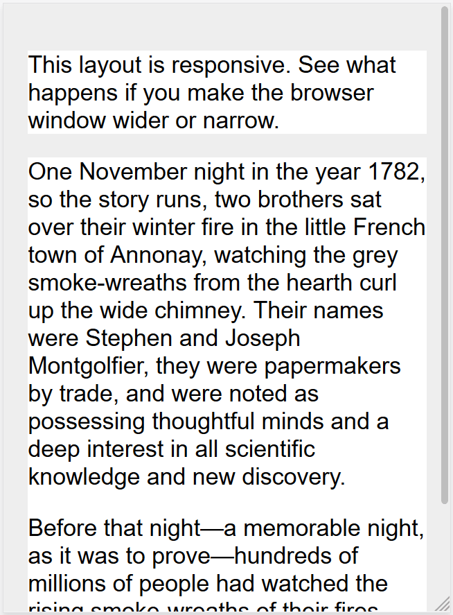
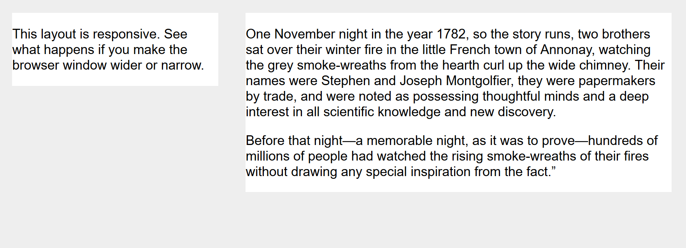
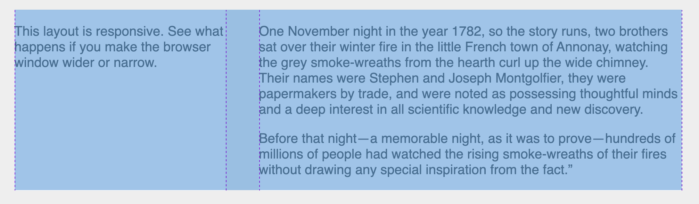
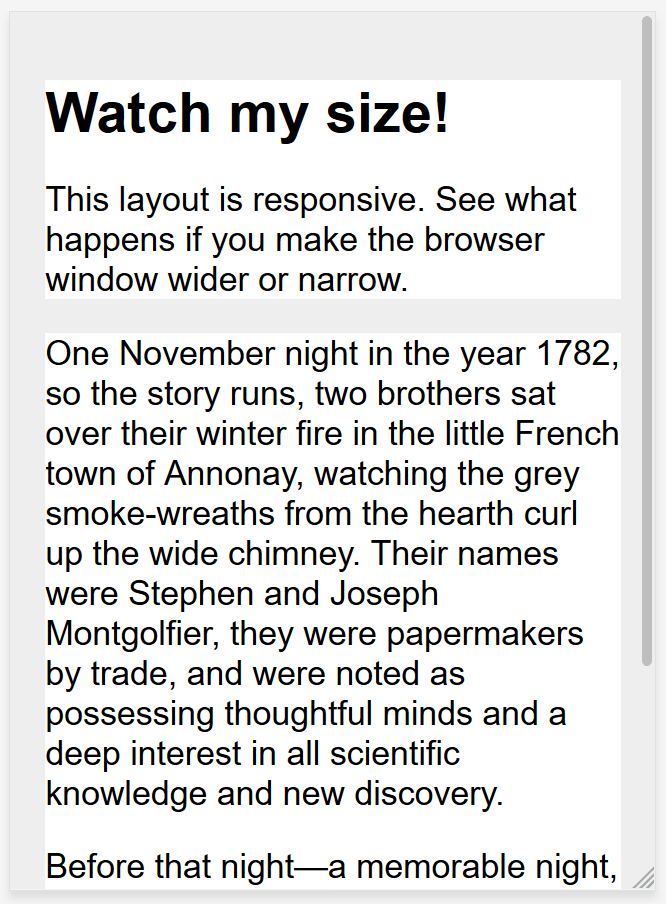

# WTF CSS Minimalist Tutorial: 13. Responsive Design

WTF CSS tutorial to help newcomers get started with CSS quickly.

**Twitter**: [@WTFAcademy_](https://twitter.com/WTFAcademy_) | [@0xAA_Science](https://twitter.com/0xAA_Science)

**WTF Academy Community:** [Official website wtf.academy](https://wtf.academy) | [WTF Solidity Tutorial](https://github.com/AmazingAng/WTFSolidity) | [discord](https: //discord.gg/5akcruXrsk) | [WeChat group application](https://docs.google.com/forms/d/e/1FAIpQLSe4KGT8Sh6sJ7hedQRuIYirOoZK_85miz3dw7vA1-YjodgJ-A/viewform?usp=sf_link)

All codes and tutorials are open source on github: [github.com/WTFAcademy/WTF-CSS](https://github.com/WTFAcademy/WTF-CSS)

---

In this lecture, we introduce how to use browser responsive design to make the page display well even in different sizes.

In the early days of designing the Web, pages were created with specific screen sizes in mind. If the user is working with a smaller or larger screen than the designer had in mind, the results can range from redundant scroll bars to overly long rows and space that is not used wisely. As people use more and more screen sizes, the concept of responsive web design (RWD) has emerged.

## Responsive design

The term “responsive design” was first coined by Ethan Marcotte in 2010, who described it as a mix of three techniques.

1. The first is liquid grids, which have been discussed earlier by Gillenwater and can be found in Marcotte's article "[Fluid Grids](https://alistapart.com/article/fluidgrids/)" (published in 2009 Read in "A List Apart" (Part 1).
2. The second one is the concept of [Liquid Images](https://unstoppablerobotninja.com/entry/fluid-images). By using the fairly simple technique of setting the max-width property to 100%, images can scale smaller when the column containing them becomes narrower than the original size of the image, but never grow larger. This allows the image to be scaled to fit into a flexible-sized column without overflowing and becoming too large and grainy when the column is wider than the image.
3. The third key component is [Media Queries](https://developer.mozilla.org/zh-CN/docs/Web/CSS/Media_Queries). Media queries enable the layout type switching implemented by JavaScript that Cameron Adams discussed in the past, and can be implemented using only CSS. Instead of using one layout for all screen sizes, the layout can be changed: the sidebar can be rearranged on small screens, and an alternative navigation bar can be displayed.

## Media query

Media queries allow us to run a series of tests, such as whether the user's screen is larger than a certain width or a certain resolution, and apply CSS to style the page selectively to suit the user's needs.

For example, the following media query tests to know whether the current web page is being displayed as screen media (that is, not a printed document) and the viewport is at least `800` pixels wide. CSS used with the `.container` selector will only be applied if these two prerequisites exist.

```css
@media screen and (min-width: 800px) {
   .container {
     margin: 1em 2em;
   }
}
```
You can add multiple media queries to a style sheet to adjust the entire page or part of the page to achieve the best results for various screen sizes. Media queries, and the points at which styles change, are called breakpoints.

A common way to use media queries is to create a simple single column layout for narrow screen devices (such as mobile devices) and then check for larger screens. When you know you have enough screen width to accommodate, Start with a multi-column layout. This is often described as mobile-first design.

## Flexible Grid

Responsive sites don’t just change their layout between breakpoints, they are built on a flexible grid. A flexible grid means you don’t need to adapt to every possible device size and then build a pixel-accurate layout for it.

With Flexible Grid, you just add a breakpoint and change the design when content looks untidy.

For example, if our expected column size is 60 pixels, and the context (or container) it's in is 960 pixels, after moving 0.2 space to the right, and dividing 60 by 960, we get what we can use in our CSS value on.

```css
.col {
   width: 6.25%; /* 60 / 960 = 0.0625 */
}
```

The example below illustrates a simple responsive design using media queries and a flexible grid. On narrow screens, the layout stacks boxes on top of one another:



On wider screens, they become two columns:



> Note: You can find a live example of this [example](https://mdn.github.io/css-examples/learn/rwd/float-based-rwd.html) and [source code](https ://github.com/mdn/css-examples/blob/main/learn/rwd/float-based-rwd.html).

## Modern layout techniques

Modern layout methods, such as [Multiple-column layout](https://developer.mozilla.org/zh-CN/docs/Learn/CSS/CSS_layout/Multiple-column_Layout), [Telescopic box](https://developer.mozilla .org/zh-CN/docs/Learn/CSS/CSS_layout/Flexbox) and [Grids](https://developer.mozilla.org/zh-CN/docs/Learn/CSS/CSS_layout/Grids) are responsive by default style. They both assume you're trying to create a scalable grid, and give you ways to do so more easily.

### Multiple columns

The oldest of these layout methods is multiple columns, which is when you specify a `column-count`, which means how many columns you want your content to be divided into. The browser then figures out the size of these columns, which is a size that changes with the screen size.

```css
.container {
   column-count: 3;
}
```

If you specify `column-width` instead, you are specifying a minimum width. The browser will create as many columns of this width as they can fit within the container, and then share the remaining space between all columns. Therefore the number of columns will change with the amount of space.

```css
.container {
   column-width: 10em;
}
```

### Telescopic box

In a flex box, the initial behavior is that the flex objects will shrink and distribute the space between the objects according to the size of the space inside the container. By changing the values ​​of `flex-grow` and `flex-shrink`, you can indicate how you want the widget to behave when it encounters more or less space around it.

In the following example, the same as described in the layout topic [Flexbox: Flexible sizing of flex items](https://developer.mozilla.org/zh-CN/docs/Learn/CSS/CSS_layout/Flexbox#flexible_sizing_of_flex_items) That way, using the abbreviation `flex: 1`, the flexable objects will each occupy an equal amount of space in the flex container.

```css
.container {
   display: flex;
}

.item {
   flex: 1;
}
```

> Note: As an example, we have refactored the simple responsive layout above, this time using flex boxes. You can see how we no longer need to use weird percentage values ​​to calculate column sizes: [Example](https://mdn.github.io/css-examples/learn/rwd/flex-based- rwd.html), [source code](https://github.com/mdn/css-examples/blob/main/learn/rwd/flex-based-rwd.html).

### CSSGrid

In CSS grid layout, the `fr` unit allows distribution across the available space of the grid tracks. The following example creates a grid container with 3 tracks of size 1fr. This creates three column tracks, each taking up a portion of the available space in the container. You can learn more and this in the Learning Layout Grids topic under [Flexible grids with the fr unit](https://developer.mozilla.org/zh-CN/docs/Learn/CSS/CSS_layout/Grids#flexible_grids_with_the_fr_unit) information related to one method.

```css
.container {
   display: grid;
   grid-template-columns: 1fr 1fr 1fr;
}
```

> Note: The code for the grid layout version is simpler because we can define the columns on the .wrapper: [Example](https://mdn.github.io/css-examples/learn/rwd/grid-based-rwd .html), [source code](https://github.com/mdn/css-examples/blob/main/learn/rwd/grid-based-rwd.html).



## Responsive images

The simplest way to work with responsive images is as described in Marcotte's early article on responsive design. Basically, you use an image of the largest size required. Then scale it. This is still a method used today, and in most style sheets you can find the following CSS somewhere:

```css
img {
   max-width: 100%;
}
```

This approach has obvious drawbacks. It's possible for an image to be displayed much smaller than its original size, thus wasting bandwidth - a mobile user will download an image several times the size they actually see in their browser window. Additionally, you probably don’t want to have the same image aspect ratio on mobile and desktop.

Responsive images, using the `<picture>` element and the `srcset` and `sizes` attributes of ``, solve these two problems. You can provide multiple sizes accompanied by "hints" (metadata describing the screen size and resolution at which the image is best suited), and the browser will choose the image that is most suitable for the device, ensuring that users download the size appropriate for the device they are using. Image.

## Responsive typography

One element of responsive design that was not considered in earlier work was the idea of ​​responsive typography. Essentially, this describes changing the font size alongside a media query based on how much of the screen is actually used.

In this example, we want to set our first-level heading to 4rem, which means it will be four times the size of our base font. This is a really big title! We only want to have such a large title on a larger screen, so let's make a smaller title first, then use media queries, and overwrite it with a larger size when we know that the user uses a screen of at least 1200px. it.

```css
html {
   font-size: 1em;
}

h1 {
   font-size: 2rem;
}

@media (min-width: 1200px) {
   h1 {
     font-size: 4rem;
   }
}
```

We've edited our responsive grid example above to also include responsive types using circles. You can also see how the headers change size as the layout changes to two columns.

On mobile, the title becomes smaller:



But on the desktop, we see a larger title:


> Note: Check out this compiled example: [Example](https://mdn.github.io/css-examples/learn/rwd/type-rwd.html), [Source Code](https://github. com/mdn/css-examples/blob/main/learn/rwd/type-rwd.html).

As this type of layout demonstrates, you don't need to let media queries just change the layout of the page. They can also be used to adjust each element to make it more usable or attractive on other screen sizes.

### Use viewport units to implement responsive typography

An interesting way is to use the viewport unit vw to implement responsive typography. 1vw is equivalent to one percent of the viewport width, that is, if you use vw to set the font size, the font size will always change with the size of the viewport.

```css
h1 {
   font-size: 6vw;
}
```

The problem is that when doing the above, because the text always changes size with the size of the viewport, the user loses the ability to scale any text using vw units. So you should never set text only in viewport units.

There is a workaround, which uses [calc()](https://developer.mozilla.org/zh-CN/docs/Web/CSS/calc), if you add vw units to use a fixed size (e.g. em or rem), the text is still scalable. Basically, vw is added to the scaled value.

```css
h1 {
   font-size: calc(1.5rem + 3vw);
}
```

This means that we only need to specify the font size of the title once, rather than setting it for mobile and then redefining it in the media query. The font size will gradually increase as you increase the viewport size.

> Note: See a compiled example of this situation: [Examples](https://mdn.github.io/css-examples/learn/rwd/type-vw.html), [Source Code](https: //github.com/mdn/css-examples/blob/main/learn/rwd/type-vw.html).

## Viewport meta tag

If you look at the HTML source code of a responsive page, you will usually see the following `<meta>` tag in the `<head>` of the document.

```html
<meta name="viewport" content="width=device-width,initial-scale=1" />
```

This meta tag tells mobile browsers that they should set the viewport width to the width of the device, enlarge the document to 100% of its intended size, and display the document at the mobile-optimized size you want.

Along with the viewport meta tag, there are a few other settings you can use, but generally speaking, the line above is what you want to use.

- `initial-scale`: Sets the initial scaling of the page, we set it to 1.
- `height`: Set a height specifically for the viewport.
- `minimum-scale`: Set the minimum zoom level.
- `maximum-scale`: Set the maximum zoom level.
- `user-scalable`: Prevents scaling if set to no.

You should avoid using `minimum-scale`, `maximum-scale`, especially if `user-scalable` is set to `no`. Users should have the power to zoom as large or small as possible, and preventing this would cause accessibility issues.

> Note: The CSS`@` rule is designed to replace the viewport meta tag - [`@viewport`](https://developer.mozilla.org/zh-CN/docs/Web/CSS/@viewport ) - but browser support for it is poor. It was introduced in IE and Edge, but since the release of Chromium-based Edge, it is no longer supported by the Edge browser.

## Summary

In this section we have learned many ways to implement responsive design of website pages, which covers many CSS and HTML functions and technologies. Now it is basically the default way we build websites.
