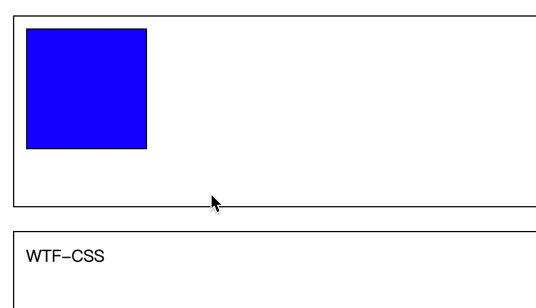
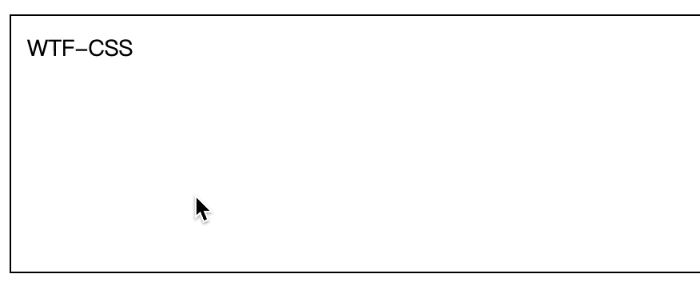
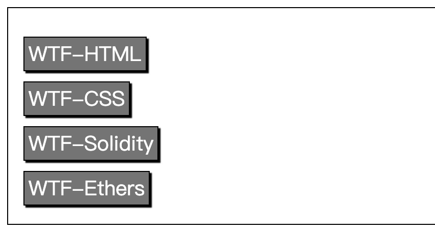
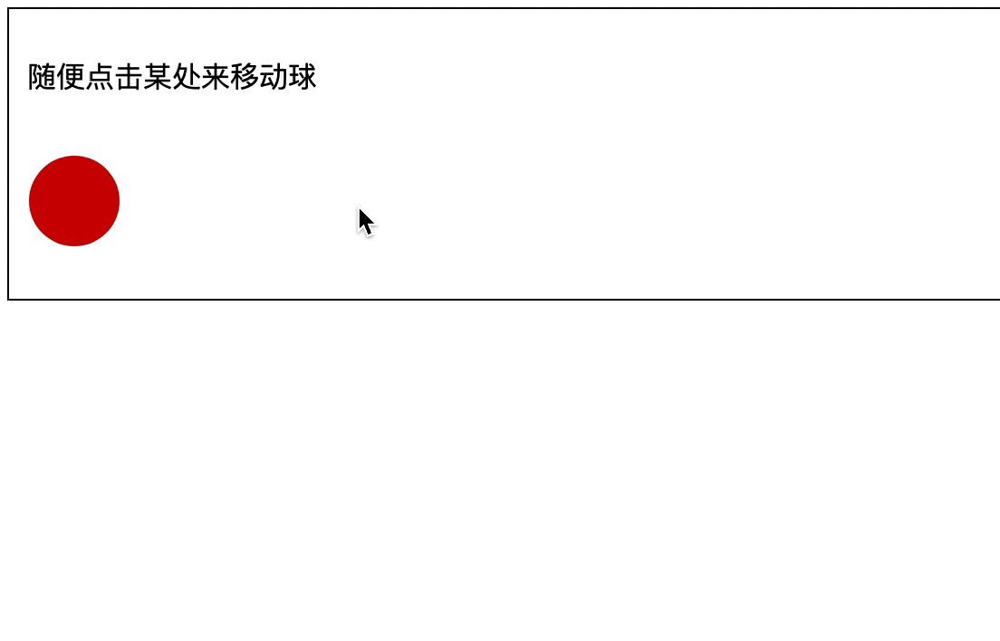

# WTF CSS Minimalist Tutorial: 14. Animation and Transition

WTF CSS tutorial to help newcomers get started with CSS quickly.

**Twitter**: [@WTFAcademy_](https://twitter.com/WTFAcademy_) | [@0xAA_Science](https://twitter.com/0xAA_Science)

**WTF Academy Community:** [Official website wtf.academy](https://wtf.academy) | [WTF Solidity Tutorial](https://github.com/AmazingAng/WTFSolidity) | [discord](https: //discord.gg/5akcruXrsk) | [WeChat group application](https://docs.google.com/forms/d/e/1FAIpQLSe4KGT8Sh6sJ7hedQRuIYirOoZK_85miz3dw7vA1-YjodgJ-A/viewform?usp=sf_link)

All codes and tutorials are open source on github: [github.com/WTFAcademy/WTF-CSS](https://github.com/WTFAcademy/WTF-CSS)

---

In this lecture, we introduce how to use transitions to implement animation in web pages.

CSS transitions provide a way to control the speed of animations when changing CSS properties. It can make attribute changes a process that lasts for a period of time instead of taking effect immediately. For example, if you change the color of an element from white to black, this change usually takes effect immediately. After using CSS transitions, the color of the element will gradually change from white to black, changing at a certain curve rate. This process can be customized.

Transitions between two states are often called implicit transitions because the state between the start and end is determined by the browser.

CSS transitions can determine which properties animate (list them explicitly), when to start (setting delay), for how long (setting duration), and how to animate (defining a timing function, such as evenly or first quickly and then slowly).

> Note: transition does not require a vendor prefix, but since the standard has just been stabilized, browsers based on Webkit still require a vendor prefix. If you want to be compatible with older versions of browsers, you also need a vendor prefix (such as Firefox 15 and earlier versions, Opera 12 and earlier versions). See the compatibility table at the bottom of this page for details.

## Which CSS properties can be animated?

Web page authors can define which properties animate in which way, allowing them to create complex transitions. Because some properties are meaningless to animate, the list of animatable properties is a limited set.

> Note: Note: The set of animatable properties will be subject to change, developers should pay attention.

Auto values ​​are often complex, and the spec says not to animate on them. Some user agents, such as those based on Gecko, follow this; some, such as those based on WebKit, are not so strict. Animation results on auto may be unpredictable depending on the browser and its version, and should be avoided.

At the same time, you should pay attention to this situation. If you use transition immediately after inserting an element (such as .appendChild()) or changing the attribute display: none, the element will be regarded as having no starting state and will always be in the ending state. Simple solution, use window.setTimeout() to delay a few milliseconds before changing properties.

## Example of animated multiple properties together

### HTML content

```html
<body>
   <div class="box"></div>
</body>
```

```css
.box {
   border-style: solid;
   border-width: 1px;
   display: block;
   width: 100px;
   height: 100px;
   background-color: #0000ff;
   -webkit-transition: width 2s, height 2s, background-color 2s, -webkit-transform
       2s;
   transition: width 2s, height 2s, background-color 2s, transform 2s;
}
.box:hover {
   background-color: #ffcccc;
   width: 200px;
   height: 200px;
   -webkit-transform: rotate(180deg);
   transform: rotate(180deg);
}
```



## Define transition

CSS transitions are defined by the abbreviated attribute [transition](https://developer.mozilla.org/zh-CN/docs/Web/CSS/transition). This is the best way to avoid attribute value lists with different lengths and save debugging time. .

You can also control various parts of the transition using the following subproperties:

**(Note that the transition infinite loop in the example below is for illustrative purposes. The transition only changes from start to end. If you need to loop, see [animation (en-US)](https://developer.mozilla.org/en-US /docs/Web/CSS/animation) .)**

- [transition-property](https://developer.mozilla.org/zh-CN/docs/Web/CSS/transition-property)
   Specify which CSS property or properties to use for the transition. Only the specified properties will animate during the transition; other properties will still change instantaneously as usual.

- [transition-duration](https://developer.mozilla.org/zh-CN/docs/Web/CSS/transition-duration)
   Specify the duration of the transition. Either specify a single value for all properties, or specify multiple values ​​with different durations for each property.

- [transition-timing-function](https://developer.mozilla.org/zh-CN/docs/Web/CSS/transition-timing-function)
   Specify a function to define how the attribute value changes. Easing functions Timing functions define how properties are evaluated. Most timing functions (en-US) define a bezier curve from four points. You can also select an easing effect from the Easing Functions Cheat Sheet.

- [transition-delay](https://developer.mozilla.org/zh-CN/docs/Web/CSS/transition-delay)
   Specifies the delay, which is the amount of time between when the property begins to change and when the transition begins to occur.

Shorthand syntax:

```css
div {
   transition: <property> <duration> <timing-function> <delay>;
}
```

## Check whether the transition is complete

An event is fired when the transition is complete. In standards-compliant browsers, this event is transitionend, and in WebKit it is webkitTransitionEnd. See the compatibility table at the bottom of the page for details. The transitionend event provides two properties:

- propertyName
   A string indicating the attribute that has completed the transition.

-elapsedTime
   Float indicating how long in seconds the transition has been running when this event is fired. This value is not affected by [transition-delay](https://developer.mozilla.org/zh-CN/docs/Web/CSS/transition-delay).

As usual, you can use the [element.addEventListener()](https://developer.mozilla.org/zh-CN/docs/Web/API/EventTarget/addEventListener) method to listen to this event:

```js
el.addEventListener("transitionend", updateTransition, true);
```

> Note: If the transition is canceled, the transitionend event will not be triggered because the animation's property value has changed before the transition is completed.

## When the length of the attribute value list is inconsistent

Taking the value list length of [transition-property](https://developer.mozilla.org/zh-CN/docs/Web/CSS/transition-property) as the standard, if the length of a property value list is shorter than it, Then repeat its value to have the same length, for example:

```css
div {
   transition-property: opacity, left, top, height;
   transition-duration: 3s, 5s;
}
```

It will be handled as follows:

```css
div {
   transition-property: opacity, left, top, height;
   transition-duration: 3s, 5s, 3s, 5s;
}
```

Similarly, if a property's value list is longer than [transition-property](https://developer.mozilla.org/zh-CN/docs/Web/CSS/transition-property), it will be truncated. For example:

```css
div {
   transition-property: opacity, left;
   transition-duration: 3s, 5s, 2s, 1s;
}
```

It will be handled as follows:

```css
div {
   transition-property: opacity, left;
   transition-duration: 3s, 5s;
}
```

## Simple example

This example achieves the following effect: 4s transition to change the font size, and 2s delay between when the mouse is hovering over the element and when the animation effect starts:

```css
#delay1 {
   position: relative;
   transition-property: font-size;
   transition-duration: 4s;
   transition-delay: 2s;
   font-size: 14px;
}

#delay1:hover {
   transition-property: font-size;
   transition-duration: 4s;
   transition-delay: 2s;
   font-size: 36px;
}
```



## Highlight menu transition effect

A common use of CSS is to highlight menus when the mouse is hovering over them. This is better achieved using transitions.

### HTML content

```html
<div class="sidebar">
   <p><a class="menuButton" href="home">WTF-HTML</a></p>
   <p><a class="menuButton" href="about">WTF-CSS</a></p>
   <p><a class="menuButton" href="contact">WTF-Solidity</a></p>
   <p><a class="menuButton" href="links">WTF-Ethers</a></p>
</div>
```

```css
.menuButton {
   position: relative;
   transition-property: background-color, color;
   transition-duration: 1s;
   transition-timing-function: ease-out;
   text-align: left;
   background-color: gray;
   left: 5px;
   top: 5px;
   height: 26px;
   color: white;
   border-color: black;
   font-family: sans-serif;
   font-size: 20px;
   text-decoration: none;
   box-shadow: 2px 2px 1px black;
   padding: 2px 4px;
   border: solid 1px black;
}

.menuButton:hover {
   position: relative;
   transition-property: background-color, color;
   transition-duration: 1s;
   transition-timing-function: ease-out;
   background-color: white;
   color: black;
   box-shadow: 2px 2px 1px black;
}
```



This CSS sets the appearance of the menu. When :hover is performed, the text, color, and background color of the elements in the menu change.

## Transition makes JavaScript effects smoother

Transition is a great tool for smoothing JavaScript effects without modifying JavaScript. See the example below.

```html
<p>Click anywhere to move the ball</p>
<div id="foo"></div>
```

Move the ball to a position using JavaScript:

```js
var f = document.getElementById("foo");
document.addEventListener(
   "click",
   function (ev) {
     f.style.left = ev.clientX - 25 + "px";
     f.style.top = ev.clientY - 25 + "px";
   },
   false
);
```

Use CSS to smooth movement by simply adding a transition:

```css
p {
   padding-left: 60px;
}

#foo {
   border-radius: 50px;
   width: 50px;
   height: 50px;
   background: #c00;
   position: absolute;
   top: 0;
   left: 0;
   transition: all 1s;
}
```



## Summary

In this lecture we introduced the concept of transitions and how to use them to generate animations in web pages.
