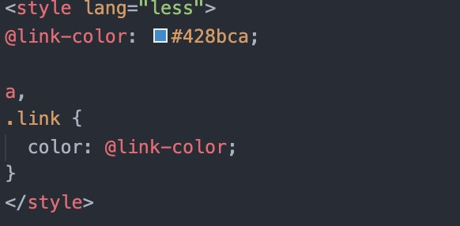
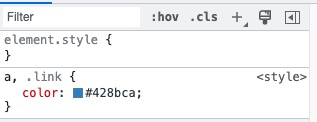
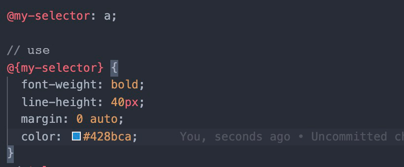
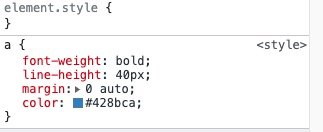
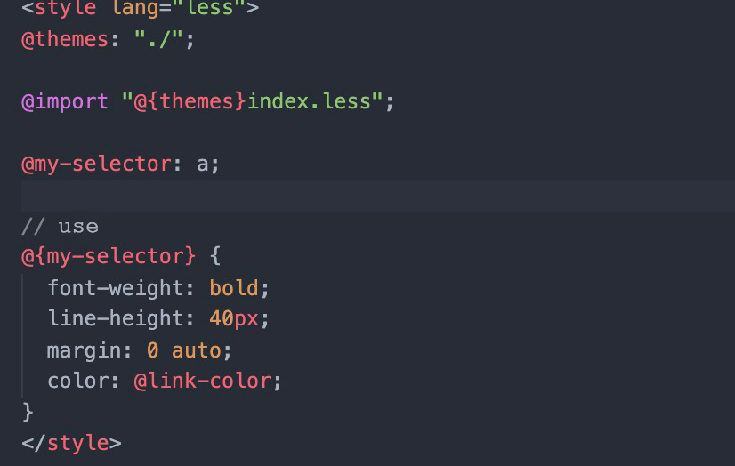
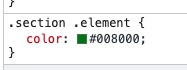
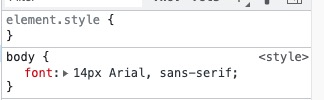
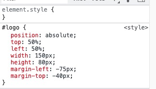
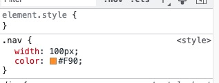
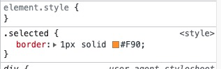

# WTF CSS Minimalist Tutorial: 15. Preprocessor

WTF CSS tutorial to help newcomers get started with CSS quickly.

**Twitter**: [@WTFAcademy_](https://twitter.com/WTFAcademy_) | [@0xAA_Science](https://twitter.com/0xAA_Science)

**WTF Academy Community:** [Official website wtf.academy](https://wtf.academy) | [WTF Solidity Tutorial](https://github.com/AmazingAng/WTFSolidity) | [discord](https: //discord.gg/5akcruXrsk) | [WeChat group application](https://docs.google.com/forms/d/e/1FAIpQLSe4KGT8Sh6sJ7hedQRuIYirOoZK_85miz3dw7vA1-YjodgJ-A/viewform?usp=sf_link)

All codes and tutorials are open source on github: [github.com/WTFAcademy/WTF-CSS](https://github.com/WTFAcademy/WTF-CSS)

---

In this lecture, we introduce CSS preprocessors, including Less, Stylus, and Sass, common preprocessors in the industry. In this section we only cover the preprocessor variable part.

## Introduction to preprocessor

A CSS preprocessor is a program that allows you to generate CSS using the preprocessor's own unique syntax. There are many CSS preprocessors on the market to choose from, and most CSS preprocessors will add some features that native CSS does not have, such as code mixing, nested selectors, inherited selectors, etc. These features make the structure of CSS more readable and easier to maintain.

To use the CSS preprocessor, you must have the CSS compilation tool installed on your web server. The compilation tool will compile each preprocessor language and output it into a standard CSS language recognized by the browser.

## Introduction to variables
The preprocessor provides support for variables. You can define repeatedly used `css` attribute values ​​​​as variables and then reference them through variable names without having to write this attribute value repeatedly. Or, for an attribute value that is only used once, you can give it an easy-to-understand variable name so that people can know the purpose of the attribute value at a glance.
`Less` uses the `@` symbol to identify a variable, `Stylus` uses `font-size = 14px` to directly assign a value to represent a variable, you can also use the `$` symbol to identify a variable, `Sass` also uses ` $` to identify variables. Let’s analyze each preprocessor variable part in detail.

## Less

Less is a reliable and mature CSS preprocessor. It supports variables, mixin macros, nested rules, functions and other features. Less can run on Node or the browser. Relevant documents can be viewed at [Less official website](https://lesscss.org/).

### Less Variables
`Less` identifies a variable with the `@` symbol
For example:
```less
//define
@link-color: #428bca; // sea blue

// use
a,
.link {
   color: @link-color;
}

//After compilation, the output is
a,
.link {
   color: #428bca;
}
```
Before compiling:


After compilation:


> The above example shows the simple use of `Less` variables. Variables in `Less` can also be used as selectors, URLs and @imports.

### Selector
```less
//define
@my-selector: banner;

// use
.@{my-selector} {
   font-weight: bold;
   line-height: 40px;
   margin: 0 auto;
}

//The output after compilation is
.banner {
   font-weight: bold;
   line-height: 40px;
   margin: 0 auto;
}
```
Before compiling:


After compilation:


### URL
```less
//define
@images: "../img";

// use
body {
   color: #444;
   background: url("@{images}/white-sand.png");
}
```

### Used in @import
```less
//define
@themes: "../../src/themes";

// use
@import "@{themes}/tidal-wave.less";
```


### Use another variable to define the name of the variable
```less
//define
@primary: green;

// use
.section {
   // Definition here primary is the @primary defined above
   @color: primary;

   // Use here @color as a variable
   .element {
     color: @@color;
   }
}
```

The compilation output is:
```css
.section .element {
   color: green;
}
```


**Note**: Here `@color` is defined inside `.section {}`, so it can only be used inside `.section{}` and cannot be used outside it, otherwise the compiler will report an error `@ color is undefined`.

## Stylus

Stylus is an expressive and flexible CSS preprocessor. Its syntax is very flexible, you can choose to use indentation or braces, semicolons, etc. Relevant documents can be viewed at [Stylus official website](https://stylus-lang.com/).

### Stylus variables (Variables)
We can assign expressions to variables and then use the variables throughout the stylesheet, or we can use the `$` symbol to define variables

```stylus
//define
font-size = 14px
// or
$font-size = 14px

// use
body
    font font-size Arial, sans-serif
```
The compilation output is:
```css
body {
   font: 14px "Lucida Grande", Arial, sans-serif;
}
```


You can also not define the variable directly, but determine the attribute value by looking up, for example:
```stylus
#logo
    position: absolute
    top: 50%
    left: 50%
    width: w = 150px
    height: h = 80px
    margin-left: -(w / 2)
    margin-top: -(h / 2)
```
Here `w` `h` is not declared separately in advance, but `w = 150px` is declared at the previous step of `width: w = 150px`. It can also be used in another way, as shown below :
```stylus
#logo
    position: absolute
    top: 50%
    left: 50%
    width: 150px
    height: 80px
    margin-left: -(@width / 2)
    margin-top: -(@height / 2)
```
`@width` `@height` here directly uses the definitions of `width: 150px` `height: 80px`



> The use of variables in the above examples is based on the premise that the variables are defined. `Stylus` variables can also specify fallback variables.
```stylus
position()
     position: arguments
     z-index: 1 unless @z-index
```
When `@z-index` is compiled, it will "bubble up" the search stack until it is found. If the final search fails, 1 will be returned.

## Sass


Sass (Syntactically Awesome Stylesheets) is the earliest CSS preprocessor and one of the most popular preprocessors. It supports two syntaxes: indentation-based syntax (.sass), and CSS-like syntax (.scss). Related documents can be viewed at [Sass official website](https://sass-lang.com/).

### Sass variables (Variables)
Use `$` to define variables in Sass

Variable declaration:
```scss
$nav-color: #F90;
$highlight-color: #F90;
$highlight-border: 1px solid $highlight-color;
// use
.nav {
   $width: 100px;
   width: $width;
   color: $nav-color;
}

.selected {
   border: $highlight-border;
}
```
The compilation output is:
```css
nav {
   width: 100px;
   color: #F90;
}

.selected {
   border: 1px solid #F90;
}
```




**Note**: In the example here, the `$nav-color` variable declaration has no parent restrictions and can be used globally, while `$width` is defined in `.nav{}`, so it can only Used in `.nav{}`, not available outside `.nav{}`


## Summary
In this lecture, we introduced some simple uses of the variable part of `Less`, `Stylus` and `Sass`. The function of the `css` preprocessor is very robust, and variables are just the tip of the iceberg. For more information, please go to the related article above. Check out the official website link and learn more. Proper use of the preprocessor can greatly free up developers' hands and save a considerable amount of development time. It can also normalize and standardize css-related projects and products.
