# WTF CSS Minimalist Tutorial: 16. Developer Tools

WTF CSS tutorial, summarized/transported from MDN CSS tutorial [Developer Tools](https://developer.mozilla.org/zh-CN/docs/Learn/Common_questions/What_are_browser_developer_tools) and [Debugging CSS](https://developer .mozilla.org/zh-CN/docs/Learn/CSS/Building_blocks/Debugging_CSS) to help newcomers get started with CSS quickly.

**Twitter**: [@WTFAcademy_](https://twitter.com/WTFAcademy_) | [@0xAA_Science](https://twitter.com/0xAA_Science)

**WTF Academy Community:** [Official website wtf.academy](https://wtf.academy) | [WTF Solidity Tutorial](https://github.com/AmazingAng/WTFSolidity) | [discord](https: //discord.gg/5akcruXrsk) | [WeChat group application](https://docs.google.com/forms/d/e/1FAIpQLSe4KGT8Sh6sJ7hedQRuIYirOoZK_85miz3dw7vA1-YjodgJ-A/viewform?usp=sf_link)

All codes and tutorials are open source on github: [github.com/WTFAcademy/WTF-CSS](https://github.com/WTFAcademy/WTF-CSS)

---

In this lecture, we introduce how to use the basic functions of browser developer tools and use them to debug CSS.

## What are browser developer tools?

Every modern web browser includes a powerful suite of development tools. These tools can examine the currently loaded HTML, CSS, and JavaScript, displaying requests for each resource page and how long it took to load. This article explains how to take advantage of the basic capabilities of the browser's development tools.

## How to open developer tools in the browser

Developer tools are built into a sub-window of your browser, something like this:

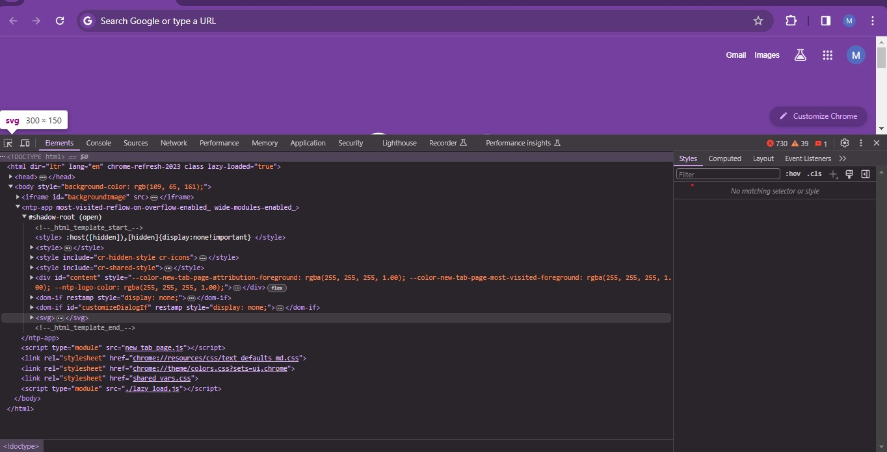

How to open it? There are three ways:

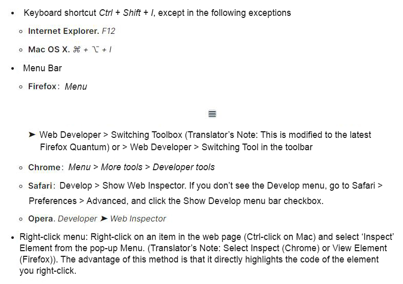

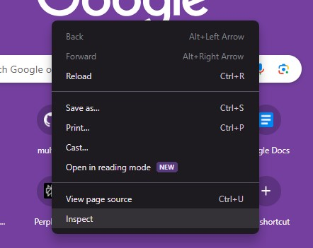

Elements: DOM browser and CSS editor

The developer tools default to the Elements page when opened, as shown in the figure below. This tool lets you see what your web page's HTML looks like when it's running, and what CSS rules are applied to elements on the page. It also allows you to instantly modify HTML and CSS and observe the results of your modifications in real-time in the browser.

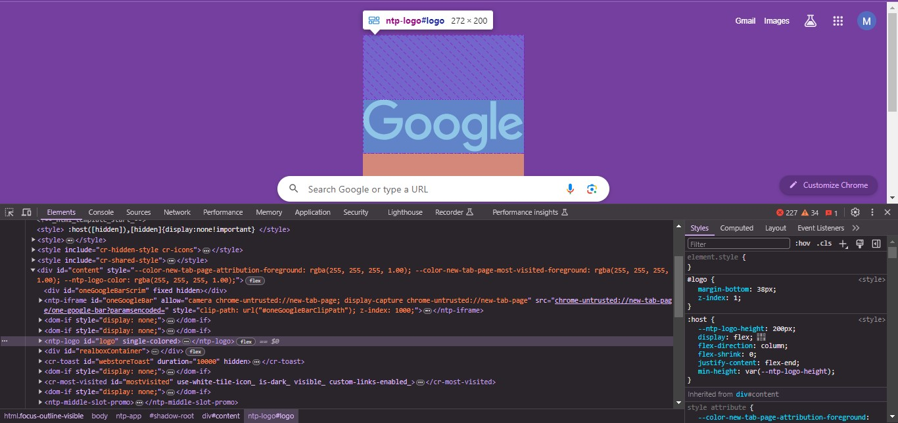

If you can't see Elements,

1. Click the "Inspection" tab
2. In Internet Explorer, click DOM Explorer, or press Ctrl + 1
3. In Safari, the controls are not very clear, but if you don't select something it appears in the window and you see the HTML. Press the button to view CSS styles.

## Explore the DOM Inspector

First, right-click an HTML element in the DOM inspector to see the context menu. The menu options vary, but the main functionality is the same:

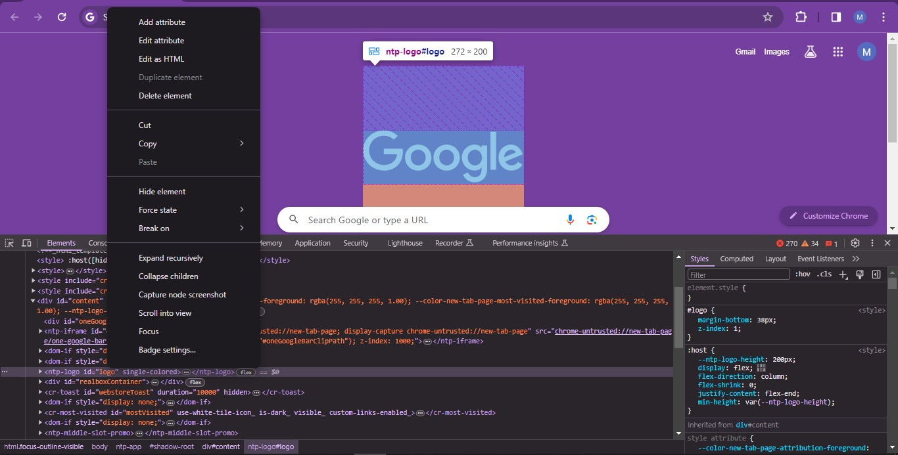

- Delete node (or delete element): delete the current element.
- Edit HTML (or add attributes/edit text): Lets you change HTML and see the results of the changes. Very useful for debugging and testing.
- :hover/:active/:focus (hover/activate/focus): force switching element state to see the display appearance.
- Copy/Copy as HTML: Copies the currently selected HTML.
- Some browsers also have Copy CSS Path and Copy XPath, allowing you to choose to copy the current HTML element using a CSS selector or XPath expression.

To edit your Element, you can double-click the element, or right-click it in the page content and select Edit HTML. You can make any changes you want, but you can't save.

## Explore CSS Editor

By default, the CSS editor displays the CSS rules applied to the currently selected element:

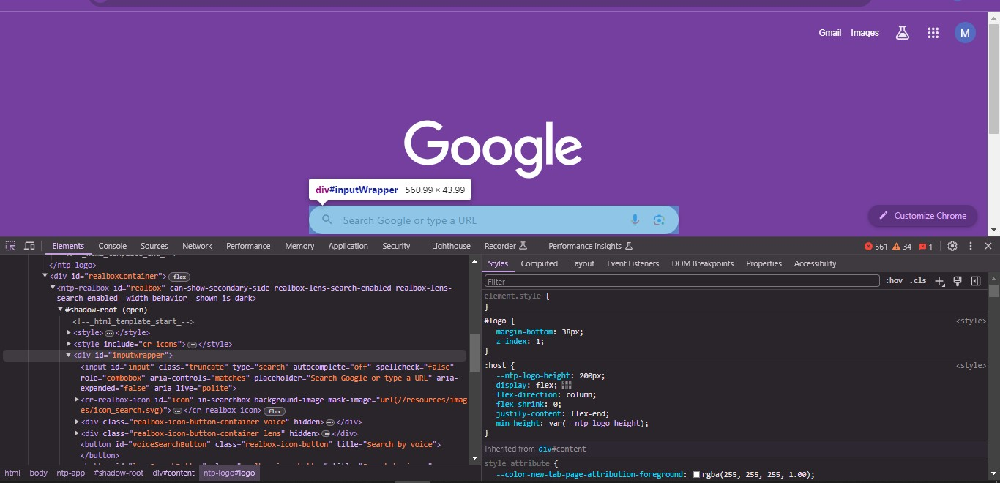

The following features are particularly useful:

- Rules applied to the current element are ordered by relevance. The more specific rules are displayed first.
- Click the checkbox next to each statement to see what happens if you delete the statement.
- Click the small arrow next to each abbreviated attribute to display the attribute's common equivalent.
- Click a property name or value to display a text box where you can type a new value to get a live preview of the style changes.
- Next to each rule is the file name and line number where the rule is defined. Clicking on the rule will cause the development tools to jump to its own view, where it can usually be edited and saved.
- You can also click the closing brace of any rule to display a text box on a new line where you can write a completely new statement for the page.

You'll notice some clickable tabs at the top of the CSS viewer:

- Calculated: Displays the calculated style of the currently selected element (the final normalized value applied by the browser).
- Box Model: This provides a visual representation of the current element's box model, so you can see at a glance what padding, borders and margins are applied, and how big its content is.
- Fonts: In Firefox, the Fonts tab displays the fonts applied to the current element.

## Check CSS

To select an element on the page, you can do the following: right-click the element and select Inspect; select the element from the HTML tree on the left side of DevTools. Try selecting the element with class box1, which is the first element on the page and has a border around it.

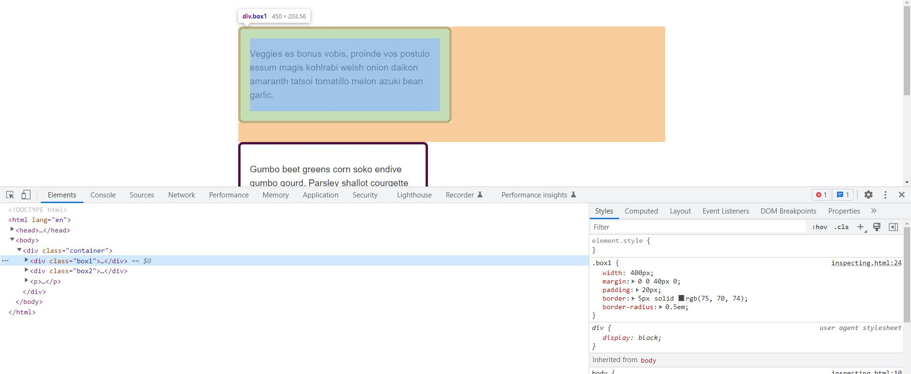

If you look at the StyleS column to the right of the HTML, you should be able to see the CSS properties and values ​​for that element. You can see the rules that apply directly to the box1 class, as well as the CSS it inherits from its ancestor (`<body>` in this case). This is helpful in a situation where you see some CSS that was not intended (perhaps they were inherited from a parent element and you didn't override it).

Another useful feature is the ability to expand abbreviated properties. In our example we use the abbreviation of margin. Click on the small arrow to expand the interface, showing the different full properties and their values.

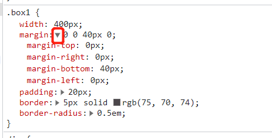

You can toggle values ​​on or off while the Styles panel is active, and checkboxes appear when you hover your cursor over them. Uncheck the checkbox of a rule, such as border-radius, and the CSS will stop being applied.

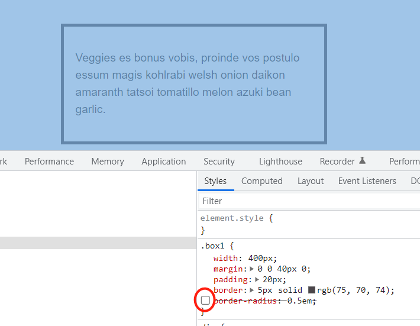

## Edit value

In addition to switch properties, you can also edit their values. After selecting box1, click on the color block (the colored circle) that shows the color applied to the border. A color picker will open, and then you can try some different colors. The display on the page will update in real time. . Similarly, you can change the width or border style this way.

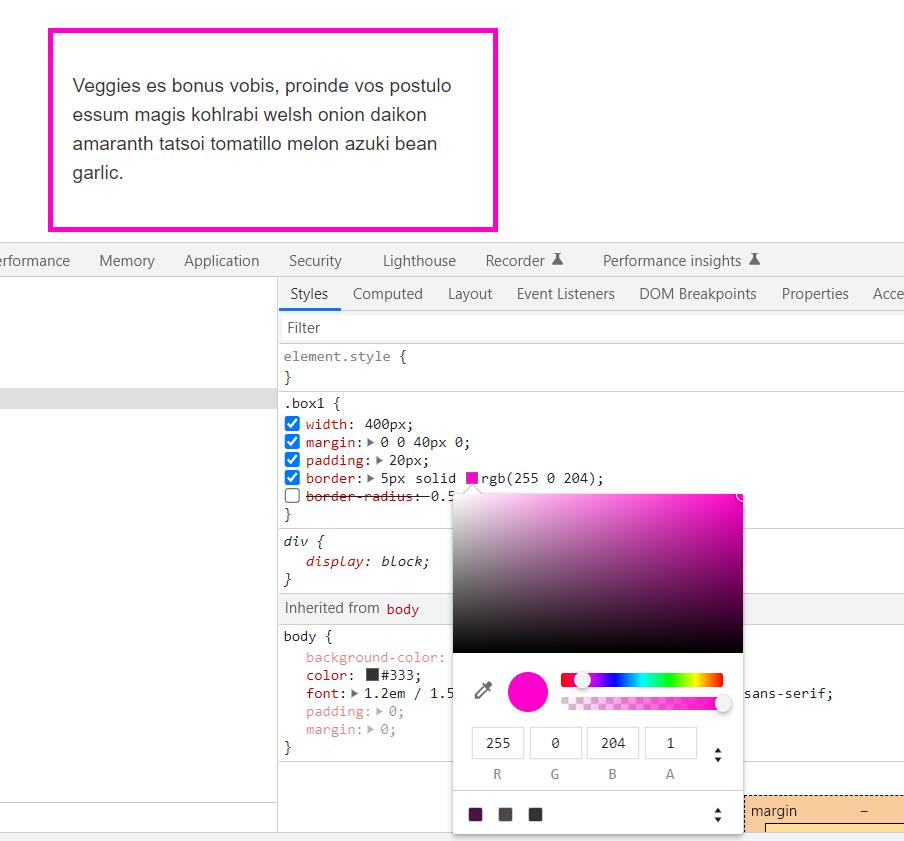

## Add a new attribute

You can add properties using the developer tools. You can click the closing curly braces in the rule and start typing a new statement inside. At this time, you can start typing new attributes, and the developer tools will show you an automatically populated list of corresponding attributes. After selecting font-size, type the value you want to try. You can also click the "+" button to add a rule corresponding to the same selector to add your new rule there.

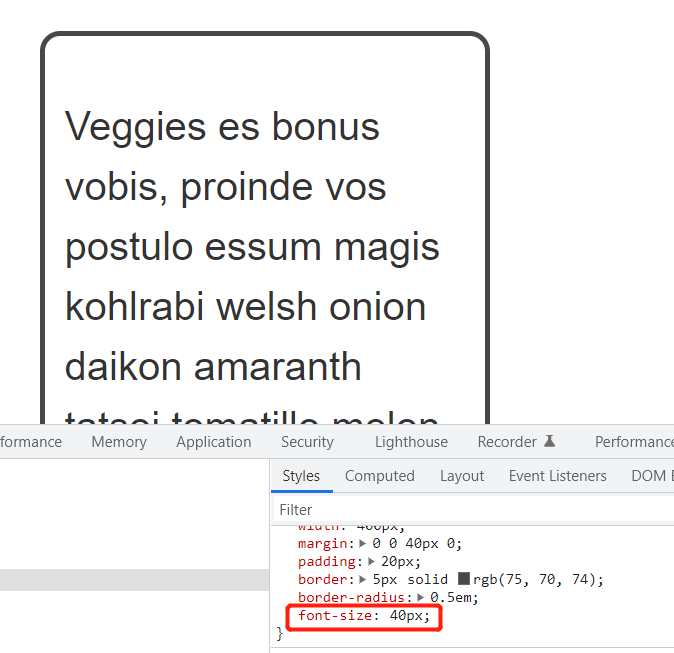

## Understanding the box model

We've discussed the box model in previous lessons, and now the developer tools can really help you understand how element dimensions are calculated.

Comparing these two boxes with classes box1 and box2, they may both have the same width applied (400 pixels), but box1 is clearly wider. You can see in the layout panel that its box-sizing is the default content-box, which is the value that takes the size you gave the element and adds padding and border width to it.

Boxes with the box2 class use border-box, so the values ​​​​of the padding and borders are subtracted from the values ​​​​that you assign to the element. In other words, the space occupied by the box on the page is what you specify. Size, in this case width: 400px.

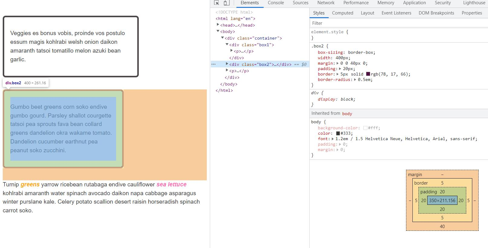

## Summary

In this lecture, we briefly introduce how to use the developer tools and use them to conduct preliminary debugging of CSS. The functions of the developer tools are very powerful, and its details in different browsers are also different. This part is left to the students to explore by themselves.
