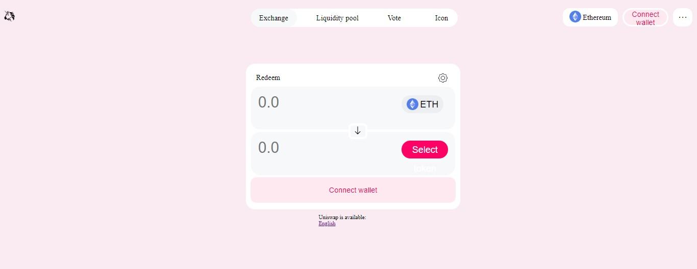

# WTF CSS minimalist tutorial: 18. Uniswap page

WTF CSS tutorial, summarized/transported from [MDN CSS tutorial](https://developer.mozilla.org/zh-CN/docs/Learn/CSS), to help newcomers get started with CSS quickly.

**Twitter**: [@WTFAcademy_](https://twitter.com/WTFAcademy_) | [@0xAA_Science](https://twitter.com/0xAA_Science)

**WTF Academy Community:** [Official website wtf.academy](https://wtf.academy) | [WTF Solidity Tutorial](https://github.com/AmazingAng/WTFSolidity) | [discord](https: //discord.gg/5akcruXrsk) | [WeChat group application](https://docs.google.com/forms/d/e/1FAIpQLSe4KGT8Sh6sJ7hedQRuIYirOoZK_85miz3dw7vA1-YjodgJ-A/viewform?usp=sf_link)

All codes and tutorials are open source on github: [github.com/WTFAcademy/WTF-CSS](https://github.com/WTFAcademy/WTF-CSS)

---

In this lecture, we will use the preprocessor less to add a CSS style sheet to UniswapHTML in Lecture 9 of WTF HTML. The final effect is as follows:



**Note**: The HTML content used in this lecture has been slightly adjusted based on the previous one. Students who want to practice please download the latest file in this lecture.

## background

First we set the color of the background. You can use the color picker to get the color and assign it directly to `background-color`

```css
body {
     background-color: #f7ebf3;
}
```

## `class="header"`

Then we deal with the style of the header. Uniswap’s native style is like this:


The header is organized with flexbox, ensuring vertical alignment of its contents. For the image within the header, its width is set to 25 pixels, with a 5-pixel margin from the top to refine its positioning. Concerning the switch page, it is fashioned as a container with a white background and rounded corners (20px border-radius), fostering a sleek appearance. 

Employing flexbox, the switch links are uniformly spaced within the container using `justify-content: space-between`, ensuring consistent distribution. The container spans 30% of its parent's width and is horizontally centered using auto margins, with a top margin of 13 pixels to refine its vertical placement.

Note that, the first link ("Exchange") has a distinct grey shade (#f7f8fa) to denote that the user is currently on that page. 

```css
.header {
    display: flex;
    align-items: center;
}

.header > img {
    width: 25px;
    margin-top: 5px;
}

.switchPage {
    background-color: white;
    border-radius: 20px;
    display: flex;
    justify-content: space-between;
    width: 30%;
    margin: 13px auto 0; /* Adjust the top margin as needed */
}


.switchPage > a {
    line-height: 40px;
    text-align: center;
    border-radius: 20px;
    background-color: white; /* Set the background color for all links to white */
    margin-right: 10px;
}

.switchPage > a:not(:first-child) {
    background-color: transparent; /* Set the background color to transparent for all links except the first one */
}

.switchPage > a:first-child {
    background-color: #f7f8fa; /* Set the grey shade for the "Exchange" link */
    width: 100px; /* Set a specific width for the "Exchange" link */
}

.switchPage > a:nth-child(3) {
    width: 70px; /* Set a specific width for the "Vote" link */
}

.switchPage > a:last-child {
    width: 50px; /* Set a specific width for the "Icon" link */
}
```

For the set of elements on the right, we set the `position` of the parent element that wraps them to `absolute`, and then set `right: 0` to position them on the right side of the page. Then set its `display` to `flex`, so that its three child elements can be placed on the same line.

The `position` of `img` in `changeNetwork` must be set to `relative` first, and then its `top` should be adjusted so that it is horizontally aligned with the text on the right.

At the same time, adjust the `margin-right` of the three child elements so that they are not crowded together.

```css
     .header > .right {
    display: flex;
    position: absolute;
    top: 20px;
    right: 0;
}

.header > .right > .changeNetwork {
    background-color: white;
    margin-right: 10px;
    width: 120px;
    border-radius: 15px;
    text-align: center;
}

.header > .right > .changeNetwork > img {
    position: relative;
    top: 5px;
    width: 25px;
}

.header > .right > .changeNetwork > .Ethereum {
    line-height: 40px;
}

.header > .right > .connect {
    background-color: #fdeaf1;
    color: #d50066;
    border: 4px white solid;
    width: 100px;
    height: 40px;
    margin-right: 10px;
    border-radius: 20px;
    font-size: 16px;
}

.header > .right > .menu {
    background-color: white;
    font-size: 20px;
    border: 4px white solid;
    width: 42px;
    height: 40px;
    margin-right: 10px;
    border-radius: 15px;
}
```

This concludes the key points in `header`. The effect is as follows:


## `class="body"`

Finally, we deal with the style of the intermediate content, which will be more complicated.

We first adjust the `margin-top` of `class="body"` to `80px` to separate it from the head.

Then there is the style of `swap-page`. After changing `position` to `relative`, you need to adjust `left` and `margin-left` at the same time to make it horizontally centered.

`padding` also needs to be assigned a value to separate `swap-page` from its children.

```css
&>.swap-page {
         position: relative;
         background-color: white;
         width: 446px;
         height: 298px;
         left: 50%;
         margin-left: -223px;
         border-radius: 20px;
         padding: 10px;
}
```

Next is `swap-page-header`. Set `margin` to `10px auto` to center it horizontally.

```css
&>.swap-page-header {
             margin:10px auto;
             width: 422px;
             height: 20px;
}
```

Then there are the common styles of `token1` and `token2`. Adjusting their `margin` and `padding` can separate them from their parent and child elements. Adjusting the `padding` of the child element `input` can make the input content not next to the border.

```css
& .token1,
         .token2 {
             background-color: #f7f8fa;
             width: 444px;
             height: 62px;
             margin: 5px auto;
             padding: 16px 0;
             border-radius: 20px;
             &>input {
                 background-color: #f7f8fa;
                 border: none;
                 line-height: 33px;
                 font-size: 33px;
                 width: 294px;
                 padding: 0 15px;
             }
         }
```

Then there are different styles of designs for `token1-btnto` and `token2-btn`.

```css
             & .token1-btn {
                 background-color: #edeef2;
                 border: none;
                 width: 91px;
                 height: 38px;
                 border-radius: 19px;
                 line-height: 38px;
                 & img {
                     position: relative;
                     top: 5px;
                     width: 25px;
                 }
                 & span {
                     font-size: 20px;
                 }
             }
             & .token2-btn {
                 background-color: #e8006f;
                 color: white;
                 border: none;
                 width: 101px;
                 height: 38px;
                 border-radius: 19px;
                 line-height: 38px;
                 & span {
                     font-size: 20px;
                 }
             }
```

Next is the arrow `button` in the middle of the two `input`. Set its `position` to `absolute` to detach it from the document flow, and then adjust its `top`, `left` and `margin-left' `Let it be between two `input`

```css
         & .arrow{
             background-color: #f7f8fa;
             border: 5px white solid;
             border-radius: 25%;
             position: absolute;
             top:130px;
             left:50%;
             margin-left:-10px;
             &>img{
                 width: 20px;
             }
         }
```

Then there is the `button` connected to the wallet at the end, which does not involve the assignment of position.

```css
         & .swap-page-footer-connect{
                  width: 100%;
                  height: 55px;
                  border: none;
                  border-radius: 13px;
                  background-color: #fdeaf1;
                  color: #d50066;
                  font-size: 16px;
         }
```

At this point, the swap style is completed, and the effect is as follows:


In the end, only the styles of `chooseLanguage` and `gasPriceAndBlockNumber` are left, these two parts are relatively simple.

First set the `display` of `chooseLanguage` to `inline-block` so that we can adjust its width. After the width is set, we can adjust it through `position`, `left`, `margin-left` and `top` s position.

```css
     &>.chooseLanguage{
         position: relative;
         display: inline-block;
         width: 130px;
         font-size: 12px;
         left:50%;
         margin-left: -65px;
         top:10px;
     }
```

`gasPriceAndBlockNumber` is located at the bottom right of the page. We can directly set its `position` to `absolute` to get it out of the document flow, and then adjust `top`, `margin-top`, `margin-right` and `right `Let it be in the lower right corner of the page.

```css
     &>.gasPriceAndBlockNumber{
         position: absolute;
         top:100%;
         margin-top: -36px;
         margin-right:20px;
         right:0;
         font-size: 10px;
     }
```

At this point, the Uniswap minimalist page is completed, and the effect is as follows:


As you can see, the minimalist page we made is very similar to the official page. But currently the page does not have any functions, which requires us to continue to add JS to it in the future.

## Summary

In this lecture, we added a style sheet based on the previous UniswapHTML, and the effect is very similar to the official page. Students do not have to write exactly the same as this tutorial when practicing on their own, as long as they can achieve the desired effect.
