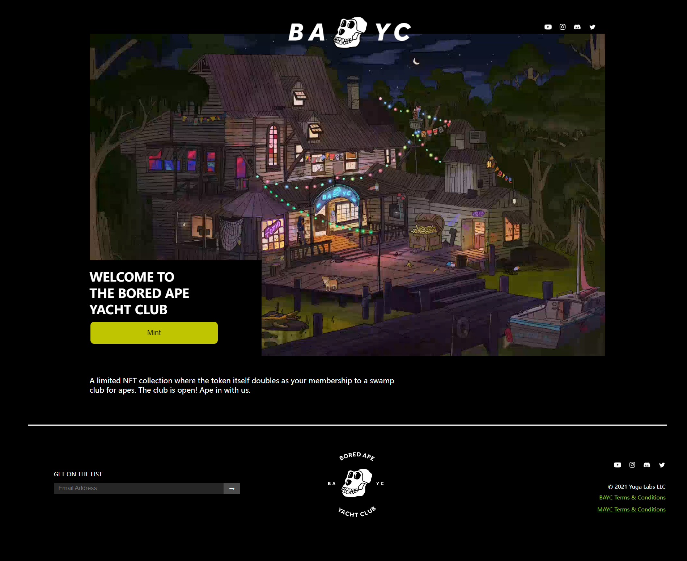
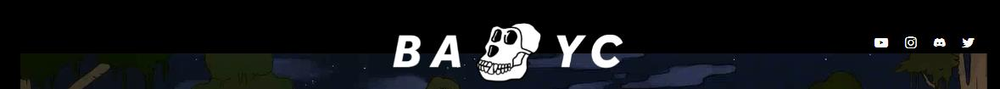
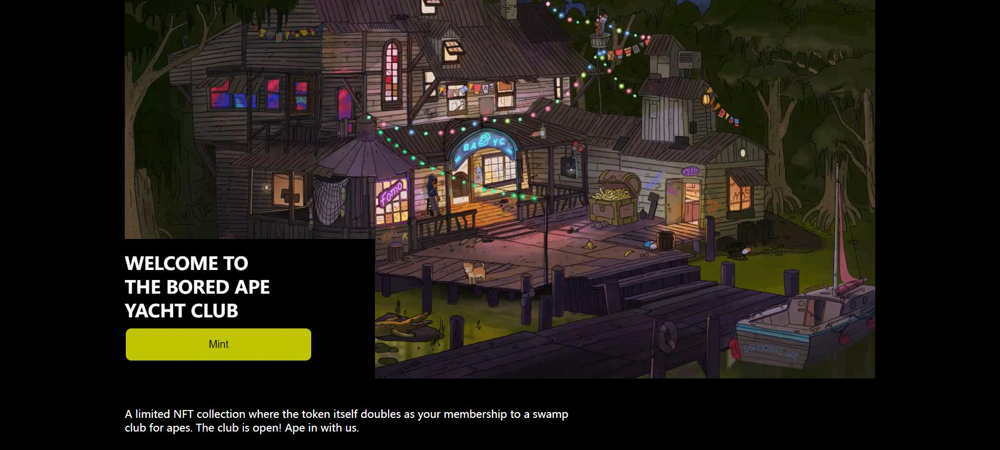
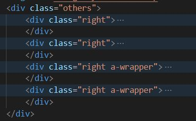

# WTF CSS minimalist tutorial: 19. BAYC page

WTF CSS tutorial, summarized/transported from [MDN CSS tutorial](https://developer.mozilla.org/zh-CN/docs/Learn/CSS), to help newcomers get started with CSS quickly.

**Twitter**: [@WTFAcademy_](https://twitter.com/WTFAcademy_) | [@0xAA_Science](https://twitter.com/0xAA_Science)

**WTF Academy Community:** [Official website wtf.academy](https://wtf.academy) | [WTF Solidity Tutorial](https://github.com/AmazingAng/WTFSolidity) | [discord](https: //discord.gg/5akcruXrsk) | [WeChat group application](https://docs.google.com/forms/d/e/1FAIpQLSe4KGT8Sh6sJ7hedQRuIYirOoZK_85miz3dw7vA1-YjodgJ-A/viewform?usp=sf_link)

All codes and tutorials are open source on github: [github.com/WTFAcademy/WTF-CSS](https://github.com/WTFAcademy/WTF-CSS)

---

In this lecture, we will use the preprocessor less to write a minimalist BAYC mint page style sheet. The HTML and img files required for production are already ready. The final effect is as follows:



## General style settings

The background of the BAYC official website is black and all fonts are white, so we can adjust it through universal styles.

```css
body {
     background-color: black;
}

* {

     color: white;
}

```

The content in the lower right corner is all to the right. We can set a general style of the `right` class and then add it to the required elements.

```css
.right {
     display: flex;
     justify-content: flex-end;
}
```

## `class="header"`

Then we deal with the style of the head. The style of the head of the BAYC official website is like this:



The content of the header is relatively small. We can use positioning to solve it. The method is similar to the previous lecture [UniswapHTML&CSS](https://github.com/WTFAcademy/WTF-CSS/tree/main/18_UniswapHTML%26CSS), which will not be discussed here. Again. Don’t forget to modify the `z-index`>=1 of `bayc-logo` so that it is above `video`.

```css
.header {
     &>img {
         position: relative;
         left: 50%;
         margin-left: -150px;
         padding-top: 24px;
         margin-bottom: -40px;
         width: 300px;
         z-index: 1;
     }

     & a {
         text-decoration: none;

         &>img {
             margin-left: 10px;
             height: 16px;
         }
     }

     &>.socialMedia {
         position: absolute;
         top: 50px;
         right: 50%;
         margin-right: -550px;
     }
}
```

## `class="body"`

Then we handle the styling of the intermediate content.

The first is the `welcome` part with the largest area. We adjust its `width`, `position`, `left` and `margin-left` to center it horizontally.

```css
.body {
     &>.welcome {
         width: 1140px;
         position: relative;
         left: 50%;
         margin-left: -570px;
     }
}
```

The width of the child element `video` is adjusted to `100%` so that it fills the parent element.

```css
& video {
             width: 100%;
         }
```

Adjust the `position` of the child element `mint` to `absolute` so that it covers the top of `video`, and then adjust its `bottom` attribute so that it is located in the lower left corner of `video`.

```css
&>.mint {
             background-color: black;
             position: absolute;
             bottom: 0px;
             width: 380px;
             height: 215px;
         }
```

The welcome style in `mint` is relatively simple. The reason why it is arranged in three lines is because there are two `<br/>` in its HTML.

```css
             &>h1 {
                 width: 285px;
                 height: 98px;
                 font-size: 27px;
             }
```

The mint button will have a slowly changing color effect when the mouse is hovered over it. You can add a `transition` to it.

```css
             &>button {
                 width: 285px;
                 height: 52px;
                 font-size: 16px;
                 color: black;
                 background-color: #bfc500;
                 border-radius: 10px;

                 &:hover {
                     background-color: white;
                     transition: 0.5s;
                 }
             }
```

Then use the same method to center the `description` under `video`, and then adjust its `margin-top` and `margin-bottom` to separate it from the upper and lower elements.

```css
&>.description {
         position: relative;
         left: 50%;
         margin-left: -570px;
         width: 700px;
         height: 48px;
         margin-top: 40px;
         margin-bottom: 60px;
}
```

This concludes the key points in `body`. The effect is as follows:



## `class="footer"`

Finally, there is the style of the tail.

The first is a dividing line. Don’t foolishly enter a long string of `————` in `div` here. We adjust its width and height to turn the entire element into a line, then adjust `margin` to `0 auto` to center it, and finally make its `background-color` to `white` to draw a dividing line .

```css
.footer {
     &>.line {
         margin: 0 auto;
         width: 93%;
         height: 2px;
         background-color: white;
     }
}
```

Then there is the arrangement of the three sub-elements in `info`. We make the width of the left and right elements the same, and then use `flex` layout to arrange the three sub-elements evenly on the same horizontal line.

```css
&>.info {
         display: flex;
         justify-content: space-between;
         width: 90%;
         height: 240px;
         margin: 30px 96px;

         &>.email {
             width: 530px;
             height: 62px;
             margin: 69px 0;
             padding: 0 15px;
         }

         &>img {
             width: 200px;
             height: 200px;
         }

         &>.others {
             width: 560px;
             height: 184px;
             padding: 20px 0;

         }
     }
```

Next is the style of the sub-element in `email`. This part is relatively simple. We use `position`, `top` and `left` to fine-tune the position of `button`.

```css
             &>.get-on-the-list {
                 font-size: 13px;
             }

             &>.getEmail {
                 width: 530px;
                 height: 28px;
                 padding-top: 10px;

                 &>input {
                     width: 376px;
                     height: 24px;
                     padding: 2px 2px 2px 10px;
                     box-sizing: border-box;
                     background-color: #272626;
                     color: white;
                     border: none;
                 }

                 &>button {
                     width: 36px;
                     height: 24px;
                     background-color: #4b4a4a;
                     position: relative;
                     top: 1px;
                     left: -5px;
                     border: none;
                 }
             }
```

Finally, there is the style in the lower right corner, which is also relatively simple. The style of `socialMedia` is the same as before. You can copy and paste it directly, or you can write a separate style for it at the front of the style sheet instead of writing it in both places.

```css
             & .socialMedia {
                 margin: 28px 0;

                 &>a {
                     text-decoration: none;

                     &>img {
                         margin-left: 10px;
                         height: 16px;
                     }
                 }
             }

             & .copyright {
                 height: 24px;
                 font-size: 12px;
             }

             &>.a-wrapper {
                 height: 26px;

                 &>a {
                     color: yellowgreen;
                     font-size: 12px;
                 }
             }
```


At the same time, we added a `right` class name written in advance to the four child elements of `other`, so that the content in its child elements will be on the right.



At this point, the BAYC minimalist page is completed, and the effect is as follows:


As you can see, the minimalist page we made is very similar to the official page. But currently the page does not have any functions, which requires us to continue to add JS to it in the future.

## Summary

In this lecture, we used the preprocessor less to write a BAYC minimalist page style sheet, and the effect was very similar to the official page. Students do not have to write exactly the same as this tutorial when practicing on their own, as long as they can achieve the desired effect.
